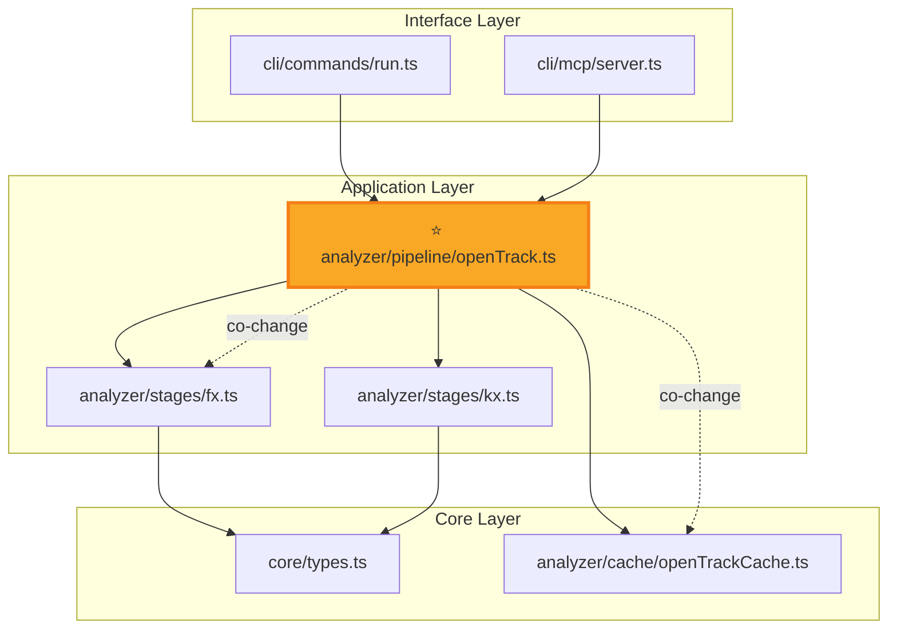
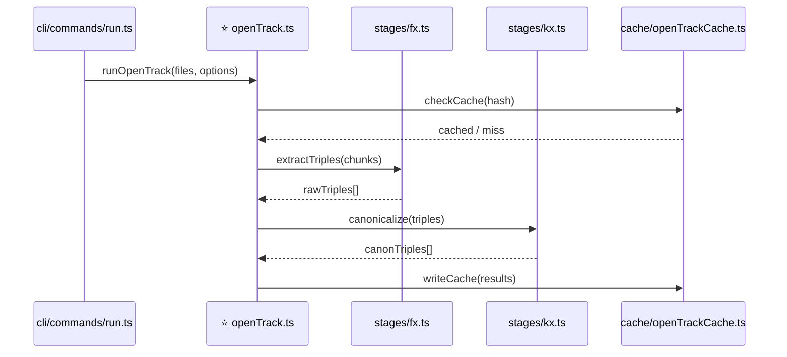
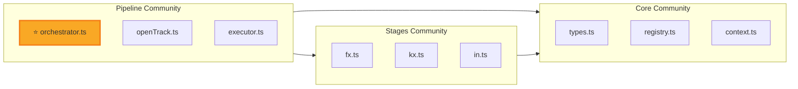
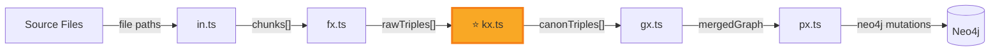
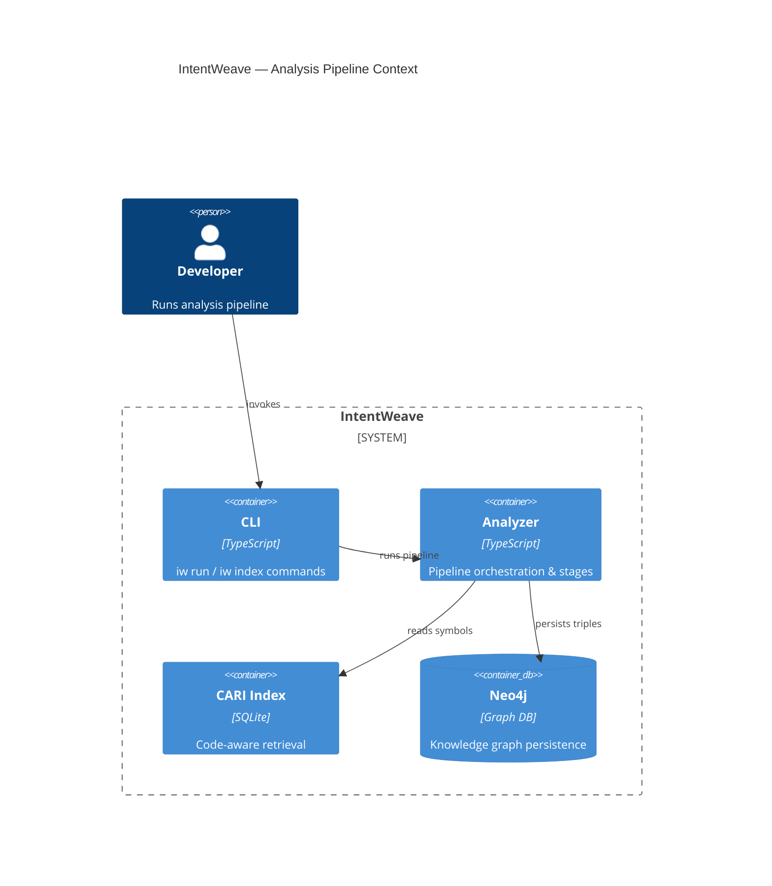

# Focused Architecture View

Generate **scoped architecture diagrams** for a specific entity (function, class, module, or feature topic).
Use the `cari_focus` tool as primary data source, supplemented by other CARI tools for richer context.

The target can be a file path, symbol name, or **natural language description** — the tool resolves
it via file paths, symbol names, annotations, and TF-IDF ranked retrieval.

## Primary Workflow (using cari_focus)

1. **Call `cari_focus`** with the target and desired scope:
   - `target`: file path, symbol name, or natural language (e.g. "Analysis Pipeline", "authentication")
   - `hops`: import-graph radius (default 2, use 1 for tight focus, 3 for broad)
   - `maxNodes`: cap on nodes (default 25)

2. **Read the structured result** — nodes with layer/community annotations, edges with types
   (import, co_change, doc_cooc), hop distances, and dependency counts.

3. **Choose the right diagram type** based on the user's question (see Diagram Types below).

4. **Optionally enrich** with additional tool calls:
   - `cari_connections` — for detailed gap analysis and cross-layer signals
   - `cari_retrieve` — for broader file discovery beyond the import graph
   - `cari_rationale` — for design decision context
   - `cari_hubs` — to identify god-nodes in the area

## Diagram Types

Choose the diagram type that best fits the user's question. When uncertain, default to Dependency.

### 1. Dependency Diagram (default)

**When**: "Show me the architecture around X", "What depends on X?", "What does X depend on?"

Shows import relationships grouped by architectural layer, with co-change and doc signals.

````markdown

````

### 2. Sequence Diagram

**When**: "How does X flow?", "What's the call chain for X?", "Walk me through the pipeline"

Shows the execution order by following the import chain from entry points to foundations.
Order nodes by hop distance (entry → target → dependencies).

````markdown

````

**Derivation**: Use hop-0 as the central actor, hop-1 imports as direct participants,
edges show message flow. Infer call order from the import direction (caller → callee).
When exact function names aren't known, use the module name as the message.

### 3. Component Diagram

**When**: "What are the main components?", "Show me the module structure", "How is X organised?"

Groups nodes by community or package, shows inter-component dependencies.

````markdown

````

**Derivation**: Group by `communityLabel` from focus result. Use inter-group edge counts to
show component-level dependencies. Collapse internal edges.

### 4. Data-Flow Diagram

**When**: "How does data flow through X?", "What transforms the data?", "Input/output of X"

Shows data transformation path, labelling edges with what flows between modules.

````markdown

````

**Derivation**: Follow the longest import chain through the target. Label edges with inferred
data types based on module names (e.g. fx → "triples", kx → "canonTriples").

### 5. C4 Container View

**When**: "Show me the high-level architecture", "System overview", "How do the packages interact?"

Groups by package/workspace, shows external systems, suitable for broad overviews.

````markdown

````

**Derivation**: Map `layerLabel` groupings to C4 containers. Use package prefixes from file paths
to identify system boundaries. Show external systems (Neo4j, LLM providers) as external entities.

## Guidelines

- **≤ 25 nodes** — keep diagrams focused and readable.
- **Target highlight**: always use `⭐` prefix and yellow fill for the target node.
- **Edge styling**: solid arrows for imports, dashed for co-change, dotted for doc co-mentions.
- **Abbreviate paths**: show `module.ts` rather than `packages/analyzer/src/stages/module.ts`
  when the context is clear.
- **Add a summary** below the diagram: layer position, community, key dependents, risk signals.
- **Combine types** when useful: e.g. dependency diagram + sequence callout for a complex feature.

## Fallback Workflow (without cari_focus)

If `cari_focus` is unavailable, chain these tools manually:

1. `cari_retrieve(target)` → find relevant files (limit 15)
2. `cari_connections(target)` → imports, co-changes, doc mentions
3. `cari_layers_infer` → architectural layer classification
4. `cari_communities` → community cluster membership

Then synthesise the diagram from the combined results.

## Example Prompts and Responses

| User asks                                              | Diagram type | Key tool calls                      |
|--------------------------------------------------------|-------------|--------------------------------------|
| "Show me the architecture around KX"                   | Dependency   | `cari_focus("KX")`                  |
| "How does the analysis pipeline flow?"                 | Sequence     | `cari_focus("Analysis Pipeline")`   |
| "What are the main components of the analyzer?"        | Component    | `cari_focus("analyzer", hops=3)`    |
| "How does data flow through the open track?"           | Data-flow    | `cari_focus("openTrack")`           |
| "High-level overview of IntentWeave"                   | C4 Context   | `cari_focus(".", hops=1, maxNodes=15)` |
| "What would break if I refactor context.ts?"           | Dependency   | `cari_focus("context.ts")` + `cari_connections("context")` |

## Export as Interactive SVG

For a high-quality interactive report (pan/zoom, tooltips), use:
```
iw index export --focus "<target>" --hops 2 --max-nodes 30 -o report.html
```

This generates a standalone HTML file with a Graphviz-rendered SVG — useful for sharing
with team members or embedding in documentation.
