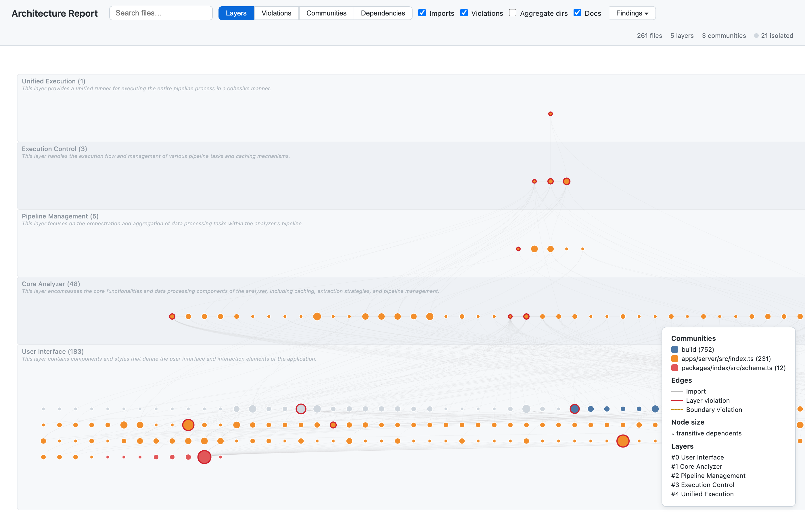
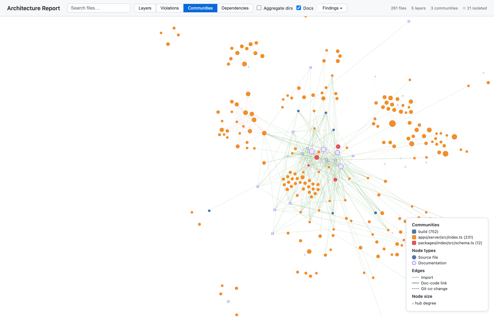
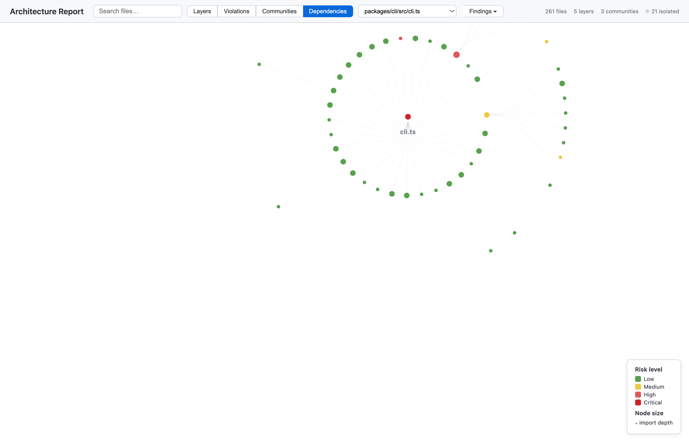

<div align="center">
  <picture>
    <source media="(prefers-color-scheme: dark)" srcset="https://raw.githubusercontent.com/intentweave/intentweave.org/main/logo-github-org-dark.svg">
    <source media="(prefers-color-scheme: light)" srcset="https://raw.githubusercontent.com/intentweave/intentweave.org/main/logo-github-org.svg">
    
  </picture>

  <h1>IntentWeave</h1>
</div>

Two engines. One platform. One deliverable.

```
CARI Evidence Engine  ──evidence──►  Intent Engine  ──violations──►  Insights Book
(observe)                            (enforce)                       (the deliverable)
```

**CARI Evidence Engine** — a zero-cost SQLite index built from your code's AST,
document keywords, and git history. No LLM, no servers, no API keys. 30+ code
intelligence queries: ranked retrieval, architecture visualization, dependency
analysis, clone detection, community detection, and more. **Always free. Always local.**

**Intent Engine** — turn your ADRs and conventions into CI rules in three domains:
_structural_ (import graphs), _behavioral_ (call sequences), and _documentary_
(coverage, staleness, terminology). Extract rules from ADR prose once with an LLM —
all subsequent enforcement runs at $0, in milliseconds.

**Insights Book** — a single self-contained HTML file that answers "is this project
OK?" at a glance. 15+ navigable chapters: Executive Summary, domain violation tables
(structural / behavioral / documentary), per-ADR flow diagrams, call-graph butterfly
view, architecture diagram, and a composite living documentation score.
Generated by `iw index export --book`.

Both products are available through CLI, MCP tools (GitHub Copilot), and
a plugin architecture that keeps the core lightweight.

[](LICENSE)

---

## Quick Start

```bash
npm install -g @intentweave/cli
cd your-project
iw init
```

**Step 1 — Observe** (CARI Evidence Engine):

```bash
iw index build                         # < 3 seconds, zero API calls
```

**Step 2 — Enforce** (Intent Engine):

```bash
iw intent check                        # check rules.yaml against the index
```

**Step 3 — Deliver** (Insights Book):

```bash
iw index export --book                 # open insights-book.html
```

That's it. The Insights Book shows your architecture, violations grouped by domain
(structural / behavioral / documentary), per-ADR flow diagrams, call graph, and a
living documentation score — all from a single local SQLite file.

---

## Agent Skill — Auto-Discovery for AI Coding Agents

`iw init` can scaffold a `SKILL.md` that teaches AI coding agents (Claude Code, GitHub
Copilot, Cursor, or any agent with shell access) to call `iw` on their own — grounding
answers in the CARI index before guessing, and checking changes against your rules
before finishing a task, instead of requiring a human to run the CLI and paste output
into chat.

```bash
iw init             # prompts interactively (auto-skipped in CI / non-TTY environments)
iw init --skill      # force-install, no prompt
iw init --skip-skill # force-skip, no prompt
```

Installed identically to `.claude/skills/intentweave/SKILL.md` and
`.github/skills/intentweave/SKILL.md`, so both Claude Code and Copilot discover it with
no extra configuration. Canonical source: [`packages/cli/assets/skill/SKILL.md`](packages/cli/assets/skill/SKILL.md).

---

## CARI Evidence Engine

```bash
# Retrieve
iw index retrieve "authentication"     # ranked file retrieval
iw index connections "AuthService"     # cross-layer connections + gaps
iw index report                        # coverage, staleness, hidden couplings

# Architecture
iw index layers-infer                  # auto-infer architectural layers
iw index layers-check                  # validate imports vs. inferred layers
iw index export --html                 # interactive architecture report

# Graph queries — ad-hoc CypherLite queries over the CARI graph projection, no Neo4j
iw index schema                        # node labels, relationship types, query templates
iw index cypher "MATCH (a:SYMBOL)-[:CALLS]->(b:SYMBOL) RETURN a.name, b.name LIMIT 10"
iw index cypher @:callers-of --param calleeName=validateToken

# Code quality
iw index clones                        # exact duplicate detection
iw index circular-imports             # import cycle detection
iw index hotspot-priority             # high-churn, low-doc files
iw index todos                         # TODO/FIXME/HACK inventory
```

Two depth modes:

- `--depth structured` (default) — headings, bold text, code spans only. Fast and precise.
- `--depth full` — adds body text scanning with IDF noise filtering. +72% more annotations.

---

## Intent Engine

```bash
# Extract rules from an ADR once (requires LLM)
iw intent extract docs/ADR-001.md --provider openai --output .iw/rules.yaml

# Enforce in CI — no LLM, < 100ms
iw intent check                        # all domains
iw intent check --domain structural    # import-graph rules only
iw intent check --domain behavioral    # Mermaid sequence / flow rules
iw intent check --domain documentary   # coverage + stale docs + terminology
iw intent check --domain all           # explicit all-domains pass

# PR mode: only changed files, only high severity
iw intent check --changed src/auth.ts --severity high --format json

# Regression gating — fail only if violations increased
iw intent check --baseline .iw/baseline.json

# Living Documentation
iw intent living                       # coverage, stale docs, terminology
iw intent score                        # composite A–F score (4 dimensions)
```

Behavioral rules use Mermaid diagrams directly in `rules.yaml`:

```yaml
- id: auth-sequence
  domain: behavioral
  severity: high
  source:
    type: mermaid_inline
  mermaid: |
    sequenceDiagram
      UI->>AuthService: login(credentials)
      AuthService->>TokenStore: issue(token)
      AuthService-->>UI: token
  forbidden: []
```

Per-domain CI thresholds live in `.iw/config.yaml`:

```yaml
version: 1
thresholds:
  documentary:
    coverage_min: 60 # flag modules with < 60% coverage
    mode: error # promote to CI-blocking
  behavioral:
    mode: warn # keep as warnings
sessionLog: true # opt-in local query log — see docs/CLI-USAGE.md#sessionlog
indexAllFiles: true # opt-in: index non-binary config/data files too — see docs/CLI-USAGE.md#indexallfiles
```

Rules live in `.iw/rules.yaml`:

```yaml
version: 1
rules:
  - id: no-ui-direct-db
    domain: structural # structural | behavioral | documentary
    mode: error # error | warn (warn = report, don't fail CI)
    severity: high
    description: "UI must not import directly from the data layer"
    forbidden:
      - type: import_pattern
        in: "src/ui/**"
        pattern: "src/db/**"
```

---

## Architecture Analysis & Visualization

```bash
iw index export --book                 # Insights Book (15+ chapters)
iw index export --html                 # standalone §10.1 architecture report
iw index export --focus "AuthService"  # focused SVG report around one entity
iw index layers-infer                  # auto-infer layers from import graph
iw index layers-check                  # validate imports against layer config
```

The HTML Insights Book renders:

- Files positioned in their inferred architectural tier (foundation at bottom, entry points at top)
- Node size proportional to transitive dependents — bigger = higher impact
- Colour-coded community clusters via label-propagation detection, with **three switchable modes**:
  structural (imports + co-changes), semantic (full co-occurrence), temporal (git co-changes only)
- Import edges with layer violations drawn as red reverse-arrows
- Three views: **Layers** (tiered layout), **Communities** (force-directed), **Dependencies** (root-focused)
- Vertical slice detection — click a community to highlight its cross-layer feature slice
- Zero server dependency — shareable as a single self-contained HTML file

#### Layers View — Auto-Inferred Architectural Tiers



Files arranged into automatically inferred layers with LLM-generated names and descriptions.
Node size reflects transitive dependents; colours indicate community clusters.

#### Communities View — Force-Directed Graph



Force-directed layout revealing community clusters, doc-code links, and import relationships.

#### Dependencies View — Root-Focused Dependency Tree



Explore the full dependency tree from any root file, colour-coded by risk level.

Two depth modes:

- `--depth structured` (default) — headings, bold text, code spans only. Fast and precise.
- `--depth full` — adds body text scanning with IDF noise filtering. +72% more annotations.

### Knowledge Graph — Neo4j Query (via MCP)

For teams with a running Neo4j instance, the KG MCP tools connect directly:

```bash
# Set credentials, then start the MCP server
export NEO4J_PASSWORD=intentweave
export OPENAI_API_KEY=sk-...
iw mcp --session my-project
```

Use `kg_query`, `kg_context`, `kg_entities`, `kg_impact`, `kg_doc_health`, and `kg_schema`
from GitHub Copilot to query the graph once populated.

### From source (development)

```bash
git clone https://github.com/intentweave/intentweave.git
cd intentweave
pnpm install && pnpm build

# Use the dev wrapper (no build needed for changes)
./iw.sh index build
```

---

## Selective Semantic Enrichment (Layer 2)

The bridge between free static analysis and full KG extraction. CARI identifies the
highest-value targets so an LLM can extract semantic triples for just those files,
with the results going back into the same SQLite index.

Today this is available as the `cari_enrich` MCP tool (dry-run scoring — ranks
files by hotspot/orphan/hub signals for enrichment candidacy; full LLM extraction
isn't yet wired up to a CLI command):

```bash
# Query code structure and (once enriched) semantic relationships
iw index retrieve "authentication decisions"
iw index connections "AuthService"         # structural + semantic connections
```

**What enrichment is designed to unlock:**

| Use Case                              | How It Works                                                                                                            |
| ------------------------------------- | ----------------------------------------------------------------------------------------------------------------------- |
| **Architecture diagram validation**   | LLM reads ASCII/Mermaid diagrams in your docs, extracts component flows, CARI validates against the actual import graph |
| **Decision tracking**                 | LLM extracts decision triples from ADRs, CARI checks which decisions have code grounding                                |
| **Cross-doc contradiction detection** | LLM extracts conflicting predicates from docs that CARI flags as drifted                                                |
| **Config-to-docs sync**               | LLM maps config parameters to docs, CARI detects value mismatches                                                       |
| **Setup instruction validation**      | LLM extracts step sequences from CONTRIBUTING.md, CARI validates commands exist                                         |

All stored in the same `index.db` — no second database.

---

## What's Coming

IntentWeave is built around a [feature backlog](docs/BACKLOG.md) with 80+ specced
features. Here's what's already shipped and what's next:

### Shipped (60+ features)

| Area                      | Features                                                                                                                                                                                                                                                                              |
| ------------------------- | ------------------------------------------------------------------------------------------------------------------------------------------------------------------------------------------------------------------------------------------------------------------------------------- |
| **Document Intelligence** | doc-group classification, cross-group drift, orphaned sections, module coverage, terminology inconsistency, doc completeness scoring                                                                                                                                                  |
| **Code Duplication**      | exact clone detection, structural (Type 2) clone detection, cross-layer clone analysis                                                                                                                                                                                                |
| **Dependencies**          | circular imports, unused exports, dependency depth, boundary violations                                                                                                                                                                                                               |
| **Architecture**          | layer inference, layer validation, as-is vs as-should comparison, hierarchical sub-layering, vertical slice detection, interface conformance, dead feature detection, API surface changelog, prescriptive architecture diagram (`iw index export --html`), Layer Sankey visualization |
| **Intent Engine**         | three-domain enforcement (structural / behavioral / documentary), Mermaid behavioral rules, documentary built-in checks, `--baseline` regression gating, 13+ rule types and modifiers, LLM rules extraction from ADRs, ASCII conformance diagram, per-domain CI thresholds            |
| **Call Graph**            | `symbol_calls` / `property_accesses` AST extraction, call-graph query, BFS call-path tracing, behavioral rule coverage monitor                                                                                                                                                        |
| **Signal Checks**         | `@deprecated` caller detection, `@internal`/`_` enforcement, `as any` inventory, naming conventions, comment-to-code ratio, decorator-derived layer assignment, ADR conformance trend, test description alignment, intra-function def-use chains                                      |
| **Git Intelligence**      | hotspot priority, co-change coupling, ownership tracking                                                                                                                                                                                                                              |
| **Graph Topology**        | community detection (3 modes), hub analysis, surprising connections, rationale extraction                                                                                                                                                                                             |
| **Visualisation**         | Insights Book (`iw index export --book`, 15+ chapters), interactive architecture report (layers/communities/dependencies), focused SVG reports, per-ADR Cytoscape.js flow diagrams                                                                                                    |
| **Languages**             | TypeScript/JavaScript (built-in), Python, Swift (plugins)                                                                                                                                                                                                                             |
| **Plugin System**         | registry + discovery, capability providers (LLM, persistence, language), CLI commands, dual KG backend (SQLite + Neo4j)                                                                                                                                                               |
| **Intent Verification**   | living documentation score — 4 dimensions (`iw intent score`), spec-to-code grounding, architecture diagram validation (`iw index arch-check`), full three-domain intent check (`iw intent check`), internal/deprecated enforcement                                                   |
| **Integration**           | CariIndex facade, entity bridge, **58 MCP tools**                                                                                                                                                                                                                                     |
| **CI & Automation**       | watch mode (`iw index watch`), doc-health GitHub Action (`intentweave/doc-health-action@v1`), git hooks (`iw hook install/uninstall/status`)                                                                                                                                          |

### Next Up

| Feature                               | Description                                                                                            |
| ------------------------------------- | ------------------------------------------------------------------------------------------------------ |
| **Semantic Clone Detection** (Type 3) | LLM-powered similarity scoring to catch behaviourally equivalent but structurally different snippets   |
| **Decision Lifecycle Tracking**       | Track ADRs through state changes (proposed → accepted → deprecated) and detect unimplemented decisions |
| **Ecosystem Integrations**            | Native plugins and exports for Docusaurus, Starlight, and Obsidian                                     |
| **More languages**                    | Go, Rust, Java via tree-sitter plugins                                                                 |
| **Rust Indexer**                      | 10-20× speedup for the KWX+COX pipeline stages on large repos (> 1 000 files)                          |

---

## CLI

```bash
# Documentation health check (CARI default — no Neo4j needed)
iw intent living
iw doc-health --neo4j -s my-project   # full KG mode (requires Neo4j)

# Living Documentation Score (no Neo4j needed)
iw intent score                       # composite 0-100/A-F: freshness + arch conformance
iw intent score -f json               # JSON output for CI integration

# --- CARI (no LLM, no Neo4j) ---

# Build the lightweight index
iw index build
iw index build --depth full    # include body text with IDF filtering

# Query the index
iw index retrieve "authentication"         # ranked file retrieval
iw index connections "AuthService"         # cross-layer connections + gaps
iw index check --changed src/auth.ts       # CI drift detection
iw index report                            # corpus-wide health dashboard

# Incremental update (only changed files)
iw index update
```

Additional CARI queries are available as CLI subcommands, MCP tools, and via the programmatic API:

| CLI Command                                | MCP Tool                      | What It Does                                                     |
| ------------------------------------------ | ----------------------------- | ---------------------------------------------------------------- |
| `iw index clones`                          | `cari_clones`                 | Exact code clone detection (identical body hash)                 |
| `iw index structural-clones`               | `cari_structural_clones`      | Type 2 clones (same control flow, different identifiers)         |
| `iw index circular-imports`                | `cari_circular_imports`       | Detect import cycles (A → B → C → A)                             |
| `iw index unused-exports`                  | `cari_unused_exports`         | Exported symbols never imported anywhere                         |
| `iw index hotspot-priority`                | `cari_hotspot_priority`       | High-churn + low-doc files ranked by documentation urgency       |
| `iw index todos`                           | `cari_todos`                  | TODO/FIXME/HACK/XXX inventory with file, line, and kind          |
| `iw index module-coverage`                 | `cari_module_coverage`        | Documentation coverage % per directory                           |
| `iw index orphaned-sections`               | `cari_orphaned_sections`      | Doc sections where all mentions are unresolved                   |
| `iw index doc-completeness`                | `cari_doc_completeness`       | Per-doc score: covered vs. total exports from referenced files   |
| `iw index cross-group-drift`               | `cari_cross_group_drift`      | Entity coverage conflicts between doc groups                     |
| `iw index mentions-of <id>`                | `cari_mentions_of`            | Find doc mentions of a code or external entity                   |
| `iw index annotations-for <file>`          | `cari_annotations_for`        | List all annotations for a documentation file                    |
| `iw index test-coverage`                   | `cari_test_coverage`          | Map test files to source files, find untested exports            |
| `iw index hubs`                            | `cari_hubs`                   | God-node / hub analysis (degree centrality)                      |
| `iw index communities`                     | `cari_communities`            | Community detection (structural / semantic / temporal modes)     |
| `iw index surprises`                       | `cari_surprises`              | Surprising connection ranking (composite score)                  |
| `iw index rationale`                       | `cari_rationale`              | WHY/NOTE/IMPORTANT/DESIGN rationale inventory                    |
| `iw index terminology`                     | `cari_terminology`            | Terminology inconsistency detection                              |
| `iw index dep-depth`                       | `cari_dep_depth`              | Transitive import depth + fan-in/fan-out risk                    |
| `iw index boundary-violations`             | `cari_boundary_violations`    | Cross-package internal import detection                          |
| `iw index layers-infer`                    | `cari_layers_infer`           | Auto-infer architectural layers from import graph                |
| `iw index layers-check`                    | `cari_layers_check`           | Validate imports against layer configuration                     |
| `iw index layers-check --compare`          | —                             | As-is vs. as-should layer comparison (three-column delta view)   |
| `iw index conformance`                     | —                             | Interface conformance drift (missing methods, mismatches)        |
| `iw index dead-features`                   | —                             | Dead feature detection (unused + undocumented + stale)           |
| `iw index api-surface`                     | —                             | API surface changelog (additions, removals, signature changes)   |
| `iw index focus <target>`                  | `cari_focus`                  | Focused architecture view around a target entity                 |
| `iw index arch-check`                      | `cari_arch_check`             | Validate architecture diagrams against CARI import evidence      |
| `iw index scan-diagrams`                   | —                             | Discover and extract component flows from ASCII/Mermaid diagrams |
| —                                          | `cari_resolve`                | Ground a diagram component name to code symbols + doc files      |
| —                                          | `cari_arch_diff`              | Validate diagram entity flows against CARI evidence              |
| —                                          | `cari_component_evidence`     | All CARI evidence for a single architecture component            |
| `iw intent score`                          | `cari_living_score`           | Composite living documentation score (A-F grade)                 |
| `iw index export --book`                   | —                             | Generate Insights Book (15+ chapters, self-contained HTML)       |
| `iw index export --html`                   | —                             | Generate standalone interactive architecture report              |
| `iw index export --html --provider openai` | `cari_layers_name`            | LLM-generated layer & directory names for the report             |
| `iw index export --focus <target>`         | —                             | Focused Graphviz SVG architecture report                         |
| `iw index calls`                           | `cari_calls`                  | Query symbol_calls call graph (caller file / callee name)        |
| `iw index trace`                           | `cari_trace`                  | BFS call-path trace from an entry-point file (forward/backward)  |
| `iw index rule-coverage`                   | —                             | Flag packages with zero behavioral rules                         |
| `iw index deprecated-callers`              | `cari_deprecated_callers`     | Calls to `@deprecated`-annotated symbols                         |
| `iw index internal-violations`             | `cari_internal_violations`    | `@internal` / `_`-prefixed symbol boundary violations            |
| `iw index type-assertions`                 | `cari_type_assertions`        | `as any` and forced type-assertion inventory                     |
| `iw index naming-violations`               | `cari_naming_violations`      | Configurable naming-convention enforcement                       |
| `iw index comment-code-ratio`              | `cari_comment_code_ratio`     | Comment-to-code ratio per file                                   |
| `iw index layers-from-decorators`          | `cari_layers_from_decorators` | Derive layer assignment from class decorators                    |
| `iw index rules-trend`                     | `cari_rules_trend`            | ADR conformance trend over git history                           |
| `iw index test-intent`                     | `cari_test_intent`            | Test descriptions that reference no matching symbol              |
| `iw claims discover`                       | —                             | Persist deterministic findings as non-governing Claim Candidates |
| `iw claims discover --semantic`            | —                             | Opt in to grounded model-backed correlation for ambiguous finds  |
| `iw claims candidates list`                | —                             | Inspect the Candidate inbox and lifecycle state                  |
| `iw claims candidates triage`              | —                             | Move selected Candidates into explicit relevance review          |
| `iw claims candidates review`              | —                             | Promote, reject, suppress, or defer a triaged Candidate          |
| `iw claims check`                          | —                             | Evaluate promoted Claims without requiring model access          |
| `iw claims explain`                        | —                             | Explain Candidate inference or active Claim dependencies         |
| `iw intent check`                          | `intent_check`                | Three-domain enforcement: structural + behavioral + documentary  |
| `iw intent check --domain behavioral`      | —                             | Mermaid-based behavioral rules only                              |
| `iw intent check --domain documentary`     | —                             | Built-in documentary checks + documentary rules.yaml entries     |
| `iw intent check --baseline <file>`        | —                             | Regression gating — fail only if violations increased            |

> See [docs/CLI-USAGE.md](docs/CLI-USAGE.md) for the full command reference, workflows, and troubleshooting.

### MCP (GitHub Copilot Integration)

IntentWeave exposes MCP tools for use in VS Code Copilot:

| Tool            | Purpose                          | Key Parameters                  |
| --------------- | -------------------------------- | ------------------------------- |
| `kg_query`      | Natural language or Cypher query | `question`, `cypher?`, `limit?` |
| `kg_context`    | Build RAG context from graph     | `topic?`, `entity?`, `hops?`    |
| `kg_entities`   | List/search entities             | `type?`, `search?`, `limit?`    |
| `kg_impact`     | Semantic impact analysis         | `files`, `hops?`                |
| `kg_doc_health` | Documentation freshness          | `files?`                        |
| `kg_schema`     | Graph schema description         | _(none)_                        |

**CARI tools** (no Neo4j needed; most also need no LLM — a few, like `cari_layers_name`,
optionally call one for naming):

| Tool                          | Purpose                                                      | Key Parameters                         |
| ----------------------------- | ------------------------------------------------------------ | -------------------------------------- |
| `cari_retrieve`               | Ranked file retrieval by topic or symbol                     | `query`, `scope?`, `limit?`            |
| `cari_connections`            | Cross-layer connection discovery + gaps                      | `entity`, `include?`, `limit?`         |
| `cari_check`                  | CI drift detection for changed files                         | `changed`, `severity?`                 |
| `cari_clones`                 | Exact code clone detection                                   | _(none)_                               |
| `cari_structural_clones`      | Type 2 clone detection                                       | _(none)_                               |
| `cari_circular_imports`       | Import cycle detection                                       | _(none)_                               |
| `cari_unused_exports`         | Unused exported symbols                                      | `limit?`                               |
| `cari_hotspot_priority`       | High-churn low-doc file ranking                              | `limit?`                               |
| `cari_todos`                  | TODO/FIXME/HACK/XXX inventory                                | `kind?`, `limit?`                      |
| `cari_module_coverage`        | Documentation coverage % per directory                       | _(none)_                               |
| `cari_orphaned_sections`      | Doc sections with all-ungrounded mentions                    | _(none)_                               |
| `cari_doc_completeness`       | Per-doc completeness vs. referenced exports                  | _(none)_                               |
| `cari_cross_group_drift`      | Cross-group entity coverage conflicts                        | _(none)_                               |
| `cari_mentions_of`            | Entity → doc mentions                                        | `entityId`, `minConfidence?`           |
| `cari_annotations_for`        | File → all annotations                                       | `filePath`, `minConfidence?`           |
| `cari_test_coverage`          | Test→source mapping + gaps                                   | `limit?`                               |
| `cari_hubs`                   | God-node / hub analysis                                      | `limit?`                               |
| `cari_communities`            | Community detection (3 modes)                                | `mode?`, `resolution?`, `limit?`       |
| `cari_surprises`              | Surprising connection ranking                                | `limit?`                               |
| `cari_rationale`              | WHY/NOTE/IMPORTANT/DESIGN inventory                          | `kind?`, `limit?`                      |
| `cari_terminology`            | Terminology inconsistency detection                          | `limit?`                               |
| `cari_dep_depth`              | Transitive import depth analysis                             | `limit?`                               |
| `cari_boundary_violations`    | Package boundary violation detection                         | _(none)_                               |
| `cari_layers_infer`           | Auto-infer architectural layers                              | _(none)_                               |
| `cari_layers_check`           | Validate imports against layer config                        | `allowSkipLayer?`                      |
| `cari_layers_name`            | LLM-generated layer & directory names                        | `provider`, `model?`, `api_key?`       |
| `cari_focus`                  | Focused architecture view around a target                    | `target`, `hops?`, `maxNodes?`         |
| `cari_arch_check`             | Validate diagrams against import evidence                    | `paths?`, `provider?`                  |
| `cari_resolve`                | Ground diagram component to code + docs                      | `name`, `limitSymbols?`                |
| `cari_arch_diff`              | Validate diagram flows against CARI evidence                 | `paths?`, `provider?`, `refresh?`      |
| `cari_component_evidence`     | All CARI evidence for one component                          | `name`, `limit?`                       |
| `cari_living_score`           | Composite living documentation score                         | `minConfidence?`, `allowSkipLayer?`    |
| `intent_check`                | Three-domain enforcement (structural/behavioral/documentary) | `domain?`, `severity?`, `changed?`     |
| `cari_calls`                  | Query the call graph by caller file / callee name            | `callerFile?`, `calleeName?`, `limit?` |
| `cari_trace`                  | BFS call-path trace from an entry-point file                 | `entry`, `hops?`, `direction?`         |
| `cari_deprecated_callers`     | Calls to `@deprecated` symbols                               | `limit?`                               |
| `cari_internal_violations`    | `@internal` / `_` boundary violations                        | _(none)_                               |
| `cari_type_assertions`        | `as any` and forced type-assertion inventory                 | `limit?`                               |
| `cari_naming_violations`      | Naming-convention enforcement                                | `limit?`                               |
| `cari_comment_code_ratio`     | Comment-to-code ratio per file                               | `limit?`                               |
| `cari_layers_from_decorators` | Layer assignment from class decorators                       | _(none)_                               |
| `cari_rules_trend`            | ADR conformance trend over git history                       | `limit?`                               |
| `cari_test_intent`            | Test descriptions vs. symbol alignment                       | `limit?`                               |
| `cari_verify`                 | Spec-to-code grounding verification                          | _(none)_                               |
| `cari_consistency`            | Constraint consistency check                                 | _(none)_                               |
| `cari_rules_check`            | Rules check (structural domain, direct)                      | `severity?`, `changed?`                |
| `cari_skipped_files`          | Files excluded from CARI analysis                            | _(none)_                               |
| `cari_slices`                 | Vertical slice detection (feature cohorts spanning layers)   | `minLayers?`, `limit?`                 |
| `cari_enrich`                 | Score + optionally trigger selective LLM enrichment          | `budget?`, `dryRun?`, `provider?`      |
| `cari_cypher`                 | Custom graph queries via CypherLite                          | `query`, `limit?`                      |
| `cari_graph_schema`           | CARI graph schema — node/rel types, query templates          | _(none)_                               |
| `cari_capsule`                | Architecture snapshot / capsule export                       | `format?`                              |

Start the MCP server:

```bash
iw mcp --session my-project -v
```

VS Code auto-discovers via `.vscode/mcp.json`:

```json
{
  "servers": {
    "intentweave-kg": {
      "command": "npx",
      "args": ["@intentweave/cli", "mcp", "--session", "my-project", "-v"]
    }
  }
}
```

---

## Architecture

```
┌─────────────────────────────────────────────────────────────────────┐
│                        Layer 3: Intent Verification                 │
│  "Does the code match what the docs say?"                           │
│  Spec-to-code verification · constraint checking · living doc score │
│                                  (planned)                          │
├─────────────────────────────────────────────────────────────────────┤
│                        Layer 2: Semantic Enrichment                 │
│  Budget-controlled LLM extraction on CARI-selected targets          │
│  Decision tracking · diagram validation · contradiction detection   │
│  plugin-llm (OpenAI) · plugin-kg-lite (SQLite) · plugin-kg (Neo4j) │
├─────────────────────────────────────────────────────────────────────┤
│                        Layer 1: CARI Index (always $0)              │
│  AST · keywords · git history · annotations · co-occurrences        │
│  30+ queries · architecture viz · communities · layers · drift      │
│  @intentweave/index · @intentweave/ast-extractor · @intentweave/cli │
└─────────────────────────────────────────────────────────────────────┘
```

### Packages

```
packages/
  core/                → shared types, plugin registry, capability interfaces
  index/               → CARI SQLite index (annotator, IDF, 30+ queries, HTML export)
  analyzer/            → pipeline engine (AX, KWX, COX, TCG), language registry
  cli/                 → `iw` commands + MCP server (58 tools)
  ast-extractor/       → tree-sitter TS/JS extraction (built-in)
  cypher-lite/         → zero-dep Cypher→SQL transpiler for SQLite KG
  python-parser/       → tree-sitter Python extraction
  swift-parser/        → tree-sitter Swift extraction

plugins/                                        # install only what you need
  plugin-llm/          → LLM provider (OpenAI) — enables --explain, --provider
  plugin-kg-lite/      → SQLite KG persistence via CypherLite (zero config)
  plugin-kg/           → Neo4j KG persistence (production graph database)
  plugin-swift/        → Swift language support via tree-sitter
  plugin-python/       → Python language support via tree-sitter
```

### Plugin Architecture

Plugins are npm packages discovered automatically at startup. Install only
what you need:

```bash
iw plugin list                         # see installed plugins
iw plugin add llm                      # adds LLM capability (--explain, --provider)
iw plugin add kg                       # adds Neo4j persistence backend
iw plugin add swift                    # adds Swift language support
```

The core CLI ships with CARI + KG-Lite (SQLite) — zero external dependencies.
Each plugin provides a typed capability (LLM, persistence, language) that core
features consume without knowing which plugin is active.

---

## Pipeline

### Open Track (IN → FX → KX → GX)

Schema-free knowledge extraction:

1. **IN** — Chunk documents (semantic markdown splitting, ~16k chars/chunk)
2. **FX** — Free extraction (LLM extracts raw triples per chunk, parallel)
3. **KX** — Canonicalization (normalize entities + predicates, batch of 40)
4. **GX** — Global merge (cross-document entity deduplication)

### Features

- **Incremental caching** — SHA-256 content-addressed, skip unchanged files
- **Fast keyword scanning** — parallel file I/O (64 concurrent reads), combined regex pre-filter, single-pass `indexOf` matching, early termination. Scans 3500+ files in seconds, not minutes
- **Batch failure detection** — 3 consecutive failures = abort
- **Network resilience** — two-phase retry, batch cooldown
- **Token/cost estimation** — before committing to LLM calls
- **Delta persistence** — only write changes to Neo4j
- **Profile packs** — domain-specific extraction rules

---

## Configuration

### Environment Variables

| Variable            | Default                 | Description                           |
| ------------------- | ----------------------- | ------------------------------------- |
| `NEO4J_URI`         | `bolt://localhost:7687` | Neo4j bolt URI                        |
| `NEO4J_USERNAME`    | `neo4j`                 | Neo4j username                        |
| `NEO4J_PASSWORD`    | _(required)_            | Neo4j password                        |
| `NEO4J_DATABASE`    | `neo4j`                 | Neo4j database name                   |
| `IW_SESSION`        | `default`               | Default session ID                    |
| `IW_WORKSPACE_ROOT` | _(optional)_            | Workspace root (enables run/persist)  |
| `OPENAI_API_KEY`    | _(optional)_            | OpenAI key (enables NL query + topic) |
| `IW_LLM_MODEL`      | `gpt-4o-mini`           | LLM model for NL queries              |
| `PORT`              | `3000`                  | Server port                           |
| `HOST`              | `0.0.0.0`               | Server host                           |
| `LOG_LEVEL`         | `info`                  | Log level                             |
| `CORS_ORIGIN`       | `*`                     | CORS origin(s), comma-separated       |

---

## Development

```bash
pnpm install          # Install all packages
pnpm build            # Build all (uses Turbo)
pnpm test             # Run all tests (1200+ tests)
pnpm dev              # Dev mode with hot reload
pnpm typecheck        # Type check all packages
pnpm format           # Format with Prettier
pnpm format:check     # Verify formatting
```

### Publishing

All `@intentweave/*` packages are publishable to npm:

```bash
# Build everything first
pnpm build

# Publish all packages (pnpm resolves workspace:* → real versions)
pnpm -r publish --access public

# Or publish individual packages
pnpm --filter @intentweave/cli publish --access public
```

### Project Stats

- **18 packages** + 1 app (including 6 plugins)
- **1375+ tests**, all passing
- **TypeScript 5.6**, ESM, strict mode
- **Plugin architecture** — registry + auto-discovery, 3 capability types (LLM, persistence, language)
- **Dual KG backend** — SQLite via CypherLite (zero config) or Neo4j (production)
- **Fastify 5**, Neo4j 5, SQLite (`node:sqlite` — zero native compilation), Turbo, pnpm workspaces
- **30+ CARI query modes** + interactive HTML architecture report with multi-view community modes
- **58 MCP tools** for GitHub Copilot integration

---

## License

Apache-2.0 — see [LICENSE](LICENSE)

## Contributing

See [CONTRIBUTING.md](CONTRIBUTING.md). All contributions require signing the [CLA](CLA.md).
