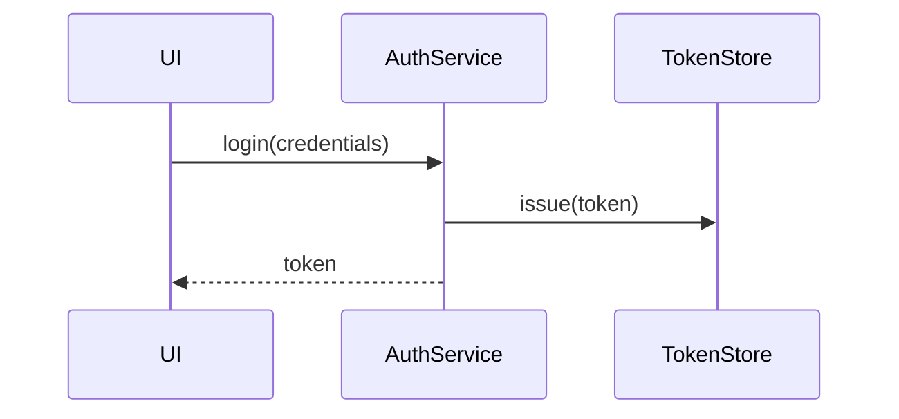
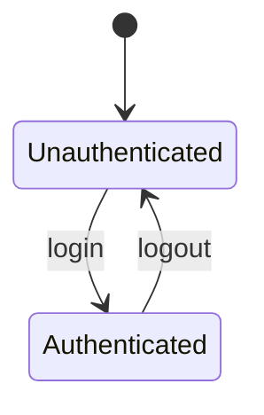
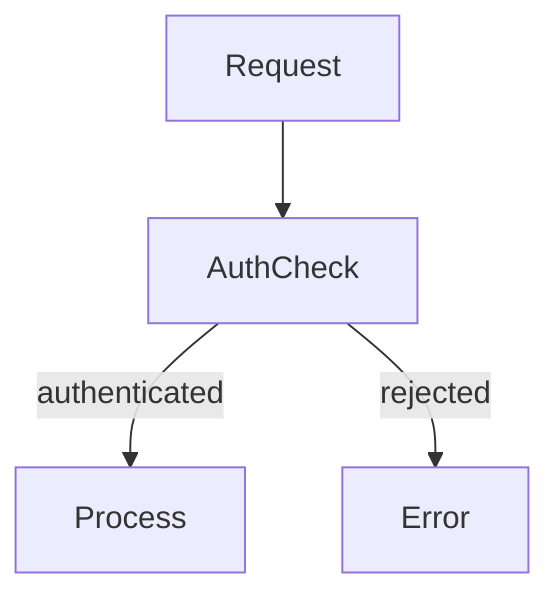

# ADR-001 — Unified Intent Engine Architecture

| Field          | Value      |
| -------------- | ---------- |
| **Status**     | Draft      |
| **Date**       | 2026-05-10 |
| **Deciders**   | Core team  |
| **Supersedes** | —          |

---

## Context

IntentWeave started with two separate enforcement concepts:

1. **Intent Guardrails** — structural rule checking against ADR prose (import violations,
   forbidden symbol access, taint propagation)
2. **Living Documentation** — documentation health queries (coverage, freshness,
   terminology, orphaned sections)

These were presented as separate products with separate commands (`iw guardrails *`,
`iw living *`) and separate output channels. As the design evolved, it became clear
that both systems answer the same question — _"is the code honouring its intent?"_ —
using the same evidence layer (CARI), the same rule format (`rules.yaml`), and the
same enforcement model (deterministic check → violations table → CI exit code).

A third behavioral dimension — enforcing that runtime call flows match the flows
described in ADR sequence/state/flow diagrams (Mermaid) — was identified as a natural
extension of the same model.

The question: should these be three separate subsystems, or one unified engine?

---

## Decision

**One unified Intent Engine with three rule domains.**

All rule types — structural, behavioral, and documentary — share:

- One rule format (`rules.yaml` with a `domain` field)
- One checker (`iw intent check`, formerly `iw guardrails check`)
- One violations table (domain-grouped) in the Insights Book
- One exit code in CI

The three **domains** are not separate products. They are enforcement perspectives on
the same CARI evidence, expressed in the same rule schema.

---

## Rule Schema

### Domain field

```yaml
rules:
  - id: <rule-id>
    domain: structural | behavioral | documentary
    description: "..."
    severity: low | medium | high | critical
    mode: warn | error # warn: Insights Book only; error: CI exit code
    confidence_threshold: 0.0–1.0
    source: # optional: links rule to the intent artifact
      type: adr_prose | bdd_scenario | mermaid_sequence | mermaid_state | mermaid_flow | manual
      file: docs/ADR-001.md
      block_id: auth-login-flow # optional: named block within the file
    checks:
      - type: <check-type>
        # ... check-specific parameters
```

### Structural check types (existing, high confidence)

```yaml
checks:
  - type: forbidden_import # ~0.99 — AST exact
    from_layer: packages/ui
    import_pattern: "packages/domain/**"

  - type: forbidden_symbol_access # ~0.95 — AST exact
    pattern: "item.resource.path"
    in_layer: packages/ui

  - type: taint_source # ~0.80 — graph traversal
    pattern: "req.body.password"
    must_reach: AuthService
    must_not_bypass: true
```

### Behavioral check types (new, Mermaid-derived)

```yaml
checks:
  - type: must_call # ~0.70 now, ~0.90 with calls table
    from: UI
    to: AuthService

  - type: must_not_call # ~0.85 now (import absence)
    from: UI
    to: TokenStore

  - type: layer_order # ~0.90 — imports table
    before: packages/providers
    after: packages/adapters

  - type: valid_transition # ~0.50 — requires state analysis (future)
    entity: OrderState
    from: Unauthenticated
    to: Authenticated
    via: login # only this call may cause the transition

  - type: must_precede # ~0.30 — requires CFG (future)
    node: AuthCheck
    before: Process
```

### Documentary check types (new)

```yaml
checks:
  - type: doc_coverage # ~0.75 — annotation confidence
    min_confidence: 0.6

  - type: doc_cooccurrence # ~0.70 — keyword matching
    entity: AuthService
    requires_terms: ["security", "token", "session"]

  - type: doc_structure # ~0.97 — Markdown AST exact
    file_pattern: "docs/ADR-*.md"
    requires_heading: "Status"

  - type: doc_freshness # ~0.85 — git + annotation staleness
    max_staleness_days: 90

  - type: doc_terminology # ~0.80 — cross-file annotation comparison
    entity: AuthService
    disallow_aliases: ["auth-service", "authSvc"]
```

---

## Mermaid Diagram Integration

Mermaid diagrams embedded in ADR files are parseable as zero-cost behavioral rule
sources (via `@mermaid-js/parser`). No LLM is required when diagram node names
match code symbol names directly.

### Sequence diagram → `must_call` + `must_not_call` rules



Auto-extracted checks:

- `must_call { from: UI, to: AuthService }`
- `must_call { from: AuthService, to: TokenStore }`
- `must_not_call { from: UI, to: TokenStore }` (implied: bypasses AuthService)

### State diagram → `valid_transition` rules



Auto-extracted checks:

- `valid_transition { from: Unauthenticated, to: Authenticated, via: login }`
- `valid_transition { from: Authenticated, to: Unauthenticated, via: logout }`
- Any other transition → violation

### Flowchart → `must_precede` / layer order rules



Auto-extracted checks:

- `must_precede { node: AuthCheck, before: Process }`
- `must_not_call { from: Request, to: Process }` (direct bypass)

### LLM fallback for semantic node mapping

When diagram node names do not match code symbols verbatim (e.g., "Login Flow" →
`AuthController.login`), `iw intent extract` uses LLM-assisted annotation matching
to resolve the mapping. The resolved mapping is written to `rules.yaml` alongside
the checks so it is frozen and auditable.

---

## CARI Extension — The `calls` Table

To lift behavioral rule confidence from ~0.70 (co-occurrence) to ~0.90 (directed
edges), a `calls` table is added to the CARI SQLite schema:

```sql
CREATE TABLE IF NOT EXISTS calls (
  id            INTEGER PRIMARY KEY,
  caller_file   TEXT NOT NULL,          -- absolute path
  caller_symbol TEXT NOT NULL,          -- name of the calling symbol
  caller_line   INTEGER NOT NULL,
  callee_file   TEXT,                   -- NULL if external / unresolved
  callee_symbol TEXT NOT NULL,          -- name of the called symbol
  callee_line   INTEGER,
  call_kind     TEXT NOT NULL           -- 'direct' | 'method' | 'constructor' | 'dynamic'
);

CREATE INDEX IF NOT EXISTS calls_caller ON calls(caller_symbol);
CREATE INDEX IF NOT EXISTS calls_callee ON calls(callee_symbol);
```

**Population:** tree-sitter already visits every call expression during AST extraction.
The `AX` stage (ast-extractor) will be extended to emit `calls` rows alongside
`symbols` rows. `call_kind = 'dynamic'` is emitted for calls through interface
references or dependency injection — these are not used for `mode: error` checks.

**Confidence model:**

- `call_kind = 'direct'` → ~0.95 confidence for `must_call` / `must_not_call`
- `call_kind = 'method'` → ~0.85
- `call_kind = 'dynamic'` → ~0.60 (dynamic dispatch, used for `mode: warn` only)

---

## Confidence Model

Every violation emitted by the Intent Runtime carries a `confidence` score inherited
from the check type. CI thresholds are configurable per domain:

```yaml
# .iw/config.yaml
enforcement:
  structural:
    min_confidence: 0.90
    mode: error
  behavioral:
    min_confidence: 0.75
    mode: warn # promote to error after call graph ships
  documentary:
    min_confidence: 0.65
    mode: warn
```

Violations below `min_confidence` are surfaced in the Insights Book but do not
contribute to the CI exit code regardless of `mode`.

---

## Intent Extraction Pipeline

```
Intent artifact                      Extraction method         Output
─────────────────────────────────────────────────────────────────────
ADR prose (markdown)           →     LLM (one-time)       →   rules.yaml (structural)
BDD scenario (Gherkin)         →     LLM (one-time)       →   rules.yaml (behavioral)
Mermaid sequence diagram       →     AST parse (zero cost) →  rules.yaml (behavioral)
Mermaid state diagram          →     AST parse (zero cost) →  rules.yaml (behavioral)
Mermaid flowchart              →     AST parse (zero cost) →  rules.yaml (behavioral)
Living doc intent (prose)      →     LLM (one-time)       →   rules.yaml (documentary)
Manual authoring               →     Human                →   rules.yaml (any domain)
Future: Intent Chat            →     LLM + human review   →   rules.yaml (any domain)
─────────────────────────────────────────────────────────────────────
```

Rules are frozen after extraction, versioned in `.iw/rules.yaml`, and human-reviewed
before promotion to `mode: error`. The LLM is never invoked during CI enforcement.

---

## CLI Migration Plan

| Current command          | Target command                         | Notes                          |
| ------------------------ | -------------------------------------- | ------------------------------ |
| `iw index rules-check`   | `iw intent check`                      | Alias kept for backward compat |
| `iw index rules-extract` | `iw intent extract`                    | Alias kept                     |
| `iw guardrails check`    | `iw intent check`                      | Alias kept                     |
| `iw guardrails extract`  | `iw intent extract`                    | Alias kept                     |
| `iw living verify`       | `iw intent check --domain documentary` | Alias kept                     |
| _(new)_                  | `iw intent check --domain behavioral`  | Mermaid + BDD rules            |
| _(new)_                  | `iw intent review --rule <id>`         | LLM-assisted rule review       |
| _(future)_               | `iw intent chat`                       | Conversational rule authoring  |

All existing commands remain functional. No breaking changes in v0.x.

---

## Alternatives Considered

### Alt A — Three separate products with separate pipelines

Rejected. Duplicates the violation reporting layer, makes cross-domain contradiction
detection impossible without a join, and increases CLI surface area without benefit.

### Alt B — LLM enforcement (check with LLM on every PR)

Rejected. Non-deterministic: same code can pass or fail depending on model version
or prompt temperature. Expensive at CI scale. Audit trail unclear. The IDD principle
is: extract with LLM once, enforce deterministically forever.

### Alt C — Separate `calls` table per language parser

Considered for isolation. Rejected in favour of a unified `calls` table with a
`language` column — the query interface is the same regardless of source language.

---

## Consequences

### Positive

- One violations table, one exit code, one Insights Book chapter per domain
- Cross-domain contradiction detection is a standard SQL query on the same schema
- Mermaid diagrams in ADR files become enforceable without any new authoring step
- Confidence model is honest and configurable — no silent false confidence
- Chat client is a natural extension of the extraction pipeline, not a new system

### Negative / Risks

- `calls` table adds build time to `iw index build` (estimate: +20–40% for large repos;
  tree-sitter visit overhead is low, SQLite write is the bottleneck)
- Behavioral confidence ceiling (~0.80) means behavioral domain stays `mode: warn`
  until call graph + optional CFG analysis ships
- Documentary contradiction without LLM (research question 3) may never reach
  deterministic confidence — must be honestly surfaced as `mode: warn` / `~0.50`

---

## Implementation Order

See `PRODUCT-CONCEPT.md` § Next Implementation Steps for the full prioritised list.

Within this ADR's scope, the order is:

1. `domain` field in `rules.yaml` schema + violations output (0.5 day)
2. `iw intent` command namespace (alias layer, 1 day)
3. Documentary domain check types wired to existing CARI queries (1–2 days)
4. Mermaid AST parser + rule extraction for sequence + state diagrams (2–3 days)
5. `calls` table in CARI schema + AX stage extension (1–2 weeks)
6. Behavioral domain checks using `calls` table (1 week)
7. `iw intent chat` — future, design separately
