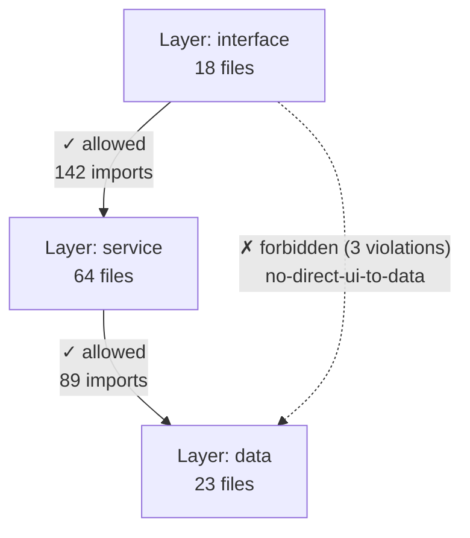

# IntentWeave — Feature Backlog

> Checks, discoveries, and intelligence features — prioritised by value and effort.

---

## Sprint Theme: _"Ensure the intent in the code"_

> The vision behind IntentWeave is bridging **intent** and **implementation** — confirming
> that what the team decided is actually what the code does. Every feature in this backlog
> serves one of four intent-enforcement dimensions:

```
         INTENT SOURCES                   ENFORCEMENT MECHANISM
         ──────────────                   ─────────────────────

  ┌─────────────────────────┐
  │  Document-side intent   │   ADRs, specs, architecture docs
  │  (Sections 12, 13)      │──► rules-extract → .iw/rules.yaml → rulesCheck
  └─────────────────────────┘
  ┌─────────────────────────┐
  │  Structural intent      │   Import topology, clone patterns, dependency depth
  │  (Sections 3, 5, 9)     │──► layers-check, boundary-violations, arch-check
  └─────────────────────────┘
  ┌─────────────────────────┐
  │  Code-annotation intent │   @deprecated, @internal, decorators, visibility
  │  (Section 14 — new)     │──► assertionCheck → CI violations
  └─────────────────────────┘
  ┌─────────────────────────┐
  │  Behavioral intent      │   Test descriptions, interface contracts, type assertions
  │  (Sections 6, 12, 14)   │──► test-intent-alignment, as-any inventory
  └─────────────────────────┘
```

**Sprint delivery path:**

```
Foundation                 Signal layer                  Trend & zero-config
───────────                ────────────                  ───────────────────
6.5  File skip warning     14.1  @deprecated callers     14.5  ADR conformance trend
13.1 symbol_calls +        14.2  @internal enforcement   14.4  Decorator-derived layers
     property_accesses     14.6  Test–symbol alignment   13.4  rules-extract from ADR
13.2 rulesCheck + CI gate  14.3  as any inventory
```

---

## Legend

| Tag       | Meaning                       |
| --------- | ----------------------------- |
| **CARI**  | SQLite-only, $0, no LLM       |
| **KG**    | Requires Neo4j + LLM pipeline |
| **AX**    | Extends AST extractor         |
| **INT**   | Integration / embedding mode  |
| **PLT**   | Platform / plugin infra       |
| **Docs**  | Documentation only            |
| **S/M/L** | T-shirt size effort           |

---

## 1. Documentation Intelligence

### 1.1 Doc-Group Classification _(CARI, S)_ ✅

Add `doc_group` column to `files` table. Auto-classify by path convention
(`docs/api/**` → "api-reference", `docs/decisions/*` → "architecture", `README*` → "readme")
with optional `.iw/doc-groups.yaml` override. Foundation for all cross-group checks below.

### 1.2 Cross-Group Drift Detection _(CARI, M)_ ✅

Compare entity coverage across doc groups. Flag when two groups describe the same entity
with conflicting qualifiers or divergent detail level. Surface: _"ARCHITECTURE.md and
API.md diverge 42% on AuthService — check for stale cross-references."_

### 1.3 Orphaned Documentation Sections _(CARI, S)_ ✅

Detect heading sections in docs where **none** of the mentioned entities resolve to symbols
in the codebase. Likely: outdated feature descriptions, removed API docs, dead tutorials.

### 1.4 Documentation Coverage by Module _(CARI, S)_ ✅

Roll up symbol coverage per directory/package. Show: `packages/analyzer/: 72% documented,
packages/cli/: 45% documented`. Identify under-documented modules at a glance.

### 1.5 Terminology Inconsistency Detection _(CARI, M)_ ✅

Detect when docs use different names for the same code symbol (e.g., "auth service",
"AuthService", "authentication module" all referring to `AuthService` class). Surface
a suggested canonical name per entity.

### 1.6 Decision Lifecycle Tracking _(KG, M)_

Track decisions through states: proposed → accepted → superseded → deprecated.
Flag decisions that were accepted but never implemented (no code symbol reference),
and decisions that were superseded but still referenced in active docs.

### 1.7 Doc Completeness Scoring _(CARI, S)_ ✅

Per-file completeness score: does the doc cover all exported symbols from the files it
references? A doc about `AuthService` that covers 3/7 public methods scores 43%.

---

## 2. Code Duplication & Similarity

### 2.1 Exact Clone Detection _(AX + CARI, S)_ ✅

Add `body_hash` (SHA-256 of normalised body, whitespace/comments stripped) to `symbols`
table during AX. Query: self-join on `body_hash` where `body_lines > 5`. Surface:
_"formatDate() in utils/date.ts is identical to formatDate() in helpers/format.ts"_.

### 2.2 Structural Clone Detection — Type 2 _(AX + CARI, M)_ ✅

Add `structure_hash` (hash of AST node-type sequence, ignoring identifiers/literals).
Catches renamed-variable copies. Surface: _"validateEmail() and validatePhone() share
identical control flow — consider extracting a generic validator."_

### 2.3 Semantic Clone Detection — Type 3/4 _(KG, L)_

Use LLM embeddings on function-level summaries. Compare cosine similarity across all
function pairs. Catches behaviourally equivalent but structurally different implementations.

### 2.4 Copy-Paste Lineage Tracking _(AX + CARI, M)_

When exact clones exist, track which was created first (git blame). Surface the original
and its copies so teams can decide which to keep and which to eliminate.

---

## 3. Dependency & Import Intelligence

### 3.1 Circular Import Detection _(AX + CARI, S)_ ✅

Build import graph from `ExtractedImport` data already captured by AX. Run cycle detection
(Tarjan/Johnson). Surface: _"Circular dependency: auth.ts → user.ts → permission.ts → auth.ts"_.

### 3.2 Unused Export Detection _(AX + CARI, S)_ ✅

Cross-reference exported symbols against all import statements. Flag exports that are
never imported anywhere in the workspace. Distinguish: truly unused vs. entry-point exports.

### 3.3 Dependency Depth Analysis _(AX + CARI, S)_ ✅

For each file, compute transitive import depth. Flag files with excessive fan-in (many
dependents — high-risk to change) or fan-out (many dependencies — fragile).

### 3.4 Package Boundary Violations _(AX + CARI, M)_ ✅

In monorepos, detect when a file imports from another package's internal modules
(not the package's public API). Surface: _"analyzer/src/stages/fx.ts imports from
cli/src/drift/docDocDrift.ts — should go through @intentweave/cli public exports."_

---

## 4. Git & Temporal Intelligence

### 4.1 Ownership Drift _(CARI, S)_

Detect when the git-blame owner of a code file differs from the last doc editor.
Surface: _"auth.ts now owned by @alice but AUTH.md last edited by @bob (6 months ago)"_.

### 4.2 Change Coupling Anomalies _(CARI, S)_

Files that historically co-change but haven't recently — either the coupling broke
(refactor) or one side is silently drifting. Surface: _"auth.ts and user.ts co-changed
in 12/15 commits but diverged 3 months ago."_

### 4.5 Co-Change Coupling as Shared-Utility Signal _(CARI, S)_

> **Derived from ARC-372:** `iw index focus` on SignalView revealed a **0.60 Jaccard
> co-change score** with EventView. Both files were later found to contain identical
> ADR-003 violations (`refToFqn`, `entityByFqn`, `$ref` parsing). High co-change
> coupling between files with similar violation patterns is a strong signal that the
> shared logic should be extracted to a utility — but currently `focus` only reports
> the score, not the implication.

**Problem:** High co-change coupling between two files in the same layer (both at Layer 3
UI, both containing duplicated resolver logic) hints that the repeated pattern should
become a shared utility. No current tool surfaces this inference.

**Solution:** Extend `co_changes` analysis with a **shared-utility signal**:

- When two files have co-change Jaccard ≥ 0.5 **and** share ≥2 structurally cloned
  symbols (from 2.2), emit:
  ```
  ⚠ Shared-utility candidate:
    SignalView.tsx  ←→  EventView.tsx  (co-change: 0.60)
    3 shared structural clones: refToFqn, entityByFqn, useParamRows
    → Consider extracting to a shared utility module
  ```
- Combine with layer data (5.1a): if both files are in the same layer, the signal is a
  DRY extraction candidate. If they're in different layers, the clone is an architectural
  violation (one copy is misplaced).

CLI: `iw index co-change-signals` (or extend `iw index surprises`). MCP: extend
`cari_surprises` to include this class of signal.

Depends on: `co_changes` table (exists), 2.2 (structural clones), 5.1a (layers).

### 4.3 Hotspot → Documentation Priority _(CARI, S)_ ✅

Combine churn rate (change frequency) with documentation coverage. High-churn,
low-doc files are the highest-priority documentation targets. Output a ranked list.

### 4.4 Bus Factor per Module _(CARI, M)_

Count distinct committers per file/directory. Flag modules where only 1 person has
ever committed. Cross-reference with documentation coverage — low bus factor +
low docs = critical knowledge risk.

---

## 5. Architecture & Design Intelligence

### 5.1 Layer Architecture Analysis

Layer analysis is split into three phases so that auto-inference ($0) comes first,
validation second, and optional LLM naming last.

#### 5.1a Layer Inference _(CARI, M)_ ✅

Auto-infer architectural layers from existing import graph data. Uses import directionality
(topological sort of the file dependency graph), community detection (from 9.1), and
fan-in/fan-out metrics (from 3.3) to cluster files into tiers. Outputs a draft
`.iw/layers.yaml` as the "as-is" architecture — users review and commit as the
"as-should" definition.

Algorithm:

1. Build the import DAG (same as 3.3's `dependencyDepth`)
2. Topological-sort the DAG → assign each file a depth rank
3. Bucket depth ranks into layers (e.g., 0–1 = "foundation", 2–3 = "core", etc.)
4. Cross-reference with communities (9.1) — files in the same community at similar
   depth form one named layer
5. Emit `.iw/layers.yaml` with layer definitions and file→layer assignments

CLI: `iw index layers-infer`. MCP: `cari_layers_infer`.

#### 5.1b Layer Check _(CARI, S)_ ✅

Validate all imports against a committed `.iw/layers.yaml` config. Detect:

- **Reverse imports**: lower layer importing from higher layer
- **Skip-layer imports**: layer N importing from layer N+2 (skipping N+1)

Each violation includes source file, target file, source layer, target layer, and a
human-readable reason.

CLI: `iw index layers-check`. MCP: `cari_layers_check`.

#### 5.1c Layer Naming Suggestions _(KG, S)_ ✅

Optional LLM pass to name inferred layers based on their file contents and symbol types.
E.g., a layer containing `server/`, `routes/`, `middleware/` gets named "HTTP Layer".
Depends on 5.1a output. Not needed for validation — pure ergonomics.

### 5.2 Interface Conformance Drift _(AX, M)_ ✅

Track when a class claims to implement an interface but the method signatures have
diverged (missing methods, changed parameters). More precise than tsc for cross-package
scenarios.

### 5.3 Dead Feature Detection _(CARI + AX, M)_ ✅

Combine: (a) code symbols never called from tests or entry points, (b) doc sections
with zero code references, (c) git: no commits in 6+ months. When all three align,
flag as likely dead feature.

### 5.4 API Surface Changelog _(AX + CARI, M)_ ✅

Track exported symbols over time (git history). Detect additions, removals, signature
changes per release. Auto-generate: _"v0.2.0: +3 exports, -1 export, 2 signature changes
in @intentweave/cli"_.

### 5.5 Hierarchical Sub-Layering _(CARI, M)_ ✅

**Problem:** Flat layer inference treats the entire workspace as one graph. In monorepos,
this causes internal sub-layers of a single package (e.g., the analyzer's pipeline
orchestration) to appear as top-level peers of much larger layers (e.g., "User Interface").

**Solution:** Two-level layer inference — macro layers at the package boundary, then
sub-layers within each package:

1. Build a **package-level** import graph (collapse each `packages/*` into a supernode)
2. Run topological depth on the package graph → **macro layers**
3. For each package with >N files (configurable, default 10), run a second topological
   sort on its internal import subgraph → **sub-layers**
4. HTML report renders nested bands (a layer band with lighter sub-bands inside)

```
┌─────────────────────────────────────────────────────────┐
│ Macro Layer 3: apps/ui, apps/server  (entry)            │
├─────────────────────────────────────────────────────────┤
│ Macro Layer 2: packages/cli          (interface)         │
│   ├── Sub-layer 2: commands/                             │
│   ├── Sub-layer 1: mcp/                                  │
│   └── Sub-layer 0: doc-health/, impact/                  │
├─────────────────────────────────────────────────────────┤
│ Macro Layer 1: packages/analyzer     (core)              │
│   ├── Sub-layer 2: pipeline/ (openTrack, buildFull)      │
│   ├── Sub-layer 1: stages/, cache/                       │
│   └── Sub-layer 0: kwg/, extractors                      │
├─────────────────────────────────────────────────────────┤
│ Macro Layer 0: packages/core, packages/index             │
└─────────────────────────────────────────────────────────┘
```

Also supports scoped inference: `iw index layers-infer --scope packages/analyzer` runs
only on that package's internal graph — useful for deep-diving into one module.

CLI: `iw index layers-infer --hierarchical`. MCP: `cari_layers_infer` (new `hierarchical` param).

Depends on: 5.1a (existing flat inference), 3.4 (package boundary detection).

### 5.6 As-Is vs. As-Should Comparison _(CARI, M)_ ✅

**Problem:** Users can infer layers (as-is) and define a should-architecture in
`.iw/layers.yaml`, but there's no way to see both simultaneously and identify drift
between intent and reality.

**Solution:** A `--compare` mode that runs inference, loads the config, and outputs a
three-column delta view showing where files are vs. where they should be:

```bash
iw index layers-check --compare
iw index layers-check --compare --config .iw/layers-should.yaml
```

```
File                       │ Inferred Layer  │ Should Layer     │ Status
───────────────────────────┼─────────────────┼──────────────────┼────────
packages/cli/src/cli.ts    │ 4 (entry)       │ 3 (interface)    │ ⚠ DRIFT
packages/index/src/...     │ 0 (foundation)  │ 0 (foundation)   │ ✓ OK
packages/analyzer/src/...  │ 1 (core)        │ 2 (application)  │ ⚠ DRIFT
```

In the HTML report, this renders as **two-tone layer bands** — the actual position vs.
where the config says it should be, with visual indicators for mismatches.

CLI: `iw index layers-check --compare`. MCP: `cari_layers_check` (new `compare` param).

Depends on: 5.1a (inference), 5.1b (config validation).

### 5.7 Vertical Slice Detection _(CARI, M)_ ✅

**Problem:** Layers show horizontal stratification but not vertical feature cohorts.
"Which files form the auth feature end-to-end?" requires cross-referencing layers
with communities.

**Solution:** Identify communities whose members span ≥3 layers as **vertical slices**
(feature cuts through the architecture). Communities spanning only 1 layer are
horizontal modules.

```
         │ Auth Slice │   │ Pipeline Slice │
─────────┼────────────┼───┼────────────────┼──── Entry
         │ auth/route │   │ cli/run.ts     │
─────────┼────────────┼───┼────────────────┼──── Interface
         │ auth/svc   │   │ openTrack.ts   │
─────────┼────────────┼───┼────────────────┼──── Core
         │ auth/model │   │ fx.ts, kx.ts   │
─────────┼────────────┼───┼────────────────┼──── Foundation
         │ auth/types │   │ types.ts       │
```

In the HTML report, clicking a community in the legend highlights its slice as a
**coloured vertical column** overlaying the layer bands. Non-member nodes dim.

CLI: `iw index slices`. MCP: `cari_slices`.

Depends on: 5.1a (layers), 9.1 (communities).

### 5.8 Architecture Diagram Validation _(CARI, L)_ ✅

**Problem:** Teams document intended architectures as diagrams (pipeline flows, component
boundaries, data-flow graphs), but nothing validates whether the code actually conforms
to the documented design.

**Solution:** A `diagram-as-config` format (`.iw/architecture.yaml`) that defines
components (file globs), allowed flows (directed edges), and constraints (forbidden
dependencies). CARI validates the real import graph against this config.

> **See also 11.8:** With selective semantic enrichment, the LLM can parse ASCII art and
> Mermaid diagrams directly — no manual YAML authoring needed. The diagram in your docs
> becomes the architecture spec automatically.

```yaml
# .iw/architecture.yaml
components:
  - name: "AX Stage"
    files: ["packages/ast-extractor/**", "packages/analyzer/src/stages/ax*.ts"]
  - name: "KWX Stage"
    files: ["packages/analyzer/src/kwg/**"]
  - name: "Annotate"
    files: ["packages/index/src/annotator.ts"]
  - name: "SQLite Writer"
    files: ["packages/index/src/writer.ts"]

flows:
  - from: "AX Stage"
    to: "Annotate"
  - from: "KWX Stage"
    to: ["Annotate", "COX Stage"]

constraints:
  - type: no-direct-dependency
    from: "AX Stage"
    to: "SQLite Writer"
    reason: "AX output should flow through Annotate, not directly to Writer"
```

```bash
iw index arch-check --config .iw/architecture.yaml

# ✓ AX Stage → Annotate: confirmed (annotator.ts imports axStage)
# ⚠ KWX Stage → Annotate: MISSING — no direct import path found
# ✗ Undocumented: writer.ts imports from idf.ts — not in diagram
# ✓ No constraint violations
```

Validates: expected flows exist, no undocumented flows, constraint compliance.
Closes the loop: documentation describes architecture → CARI validates code matches.

CLI: `iw index arch-check`. MCP: `cari_arch_check`.

Depends on: `imports` table (exists), file glob resolution (exists).

### 5.9 Cross-Layer Clone Analysis _(CARI, S)_ ✅

> **Derived from ARC-372:** `iw index clones` found 24 exact clone groups (58 symbols)
> and `structural-clones` found 91 groups (255 symbols). The results were useful for
> finding `extractShortId` / `generateYAML` duplicates, but didn't distinguish between
> two qualitatively different problems: DRY violations (copies within the same layer) and
> architectural violations (copies that span layers, meaning the same logic is
> reimplemented at multiple tiers).

**Problem:** A `refToFqn()` clone appearing in 4 UI view components is a DRY violation
— it should be extracted to a shared utility. The same helper appearing in _both_ the UI
layer and the resolver layer is a more severe architectural violation — one layer is
reimplementing logic that belongs exclusively to the other.

Current clone output lists groups without layer context.

**Solution:** Extend `iw index clones` and `iw index structural-clones` with layer
annotations. For each clone group, report:

- **Within-layer copies** (DRY violations): all members at the same layer depth →
  suggestion: extract to shared utility
- **Cross-layer copies** (architectural violations): members span ≥2 layers →
  suggestion: the higher-layer copy is a forbidden reimplementation

```
iw index clones --layer-analysis

Clone group: refToFqn (4 copies)
  ARCHITECTURAL ⚠  — members span 2 layers:
    Layer 3 (UI):        apps/ui/views/SignalView.tsx:51
    Layer 3 (UI):        apps/ui/views/EventView.tsx:31
    Layer 3 (UI):        apps/ui/views/ServiceInterfaceView.tsx:62
    Layer 2 (resolver):  packages/resolver/src/fqn-utils.ts:12
  → The 3 UI copies are unauthorized reimplementations of resolver logic.
    Reference: packages/resolver/src/fqn-utils.ts:12

Clone group: extractShortId (3 copies)
  DRY ⚠  — all members in same layer (Layer 3, UI):
    apps/ui/components/EntityCard.tsx:44
    apps/ui/components/EntityList.tsx:91
    apps/ui/views/PduView.tsx:670
  → Extract to shared UI utility.
```

CLI: `iw index clones --layer-analysis`. MCP: extend `cari_clones` + `cari_structural_clones`
with `layerAnalysis` boolean parameter.

Depends on: 2.1 (exact clones), 2.2 (structural clones), 5.1a (layer inference).

### 5.10 `arch-check` UX — LLM Requirement Clarity _(CARI, S)_ ✅

> **Derived from ARC-372:** Running `iw index arch-check --from-scan docs/ADR-003.md
--provider smart-mock` produced an empty result without any error. The user had no way
> to know whether the ADR contained no relevant architecture info, or whether the
> smart-mock provider was simply incapable of interpreting diagram content. The evaluation
> noted: "smart-mock couldn't extract components from the diagrams (it's a mock LLM, not
> a real one)."

**Two concrete UX improvements:**

1. **Upfront capability check.** When `--from-scan` is invoked with a provider that
   cannot perform content understanding (smart-mock, or no provider configured), emit:

   ```
   ✗ arch-check --from-scan requires a real LLM provider.
     smart-mock cannot interpret diagram content.
     Configure a provider: --provider openai
     Or set in .iw/config.yaml: provider: openai
   ```

   Exit with code 2 (config error) rather than producing an empty success result.

2. **`architecture.yaml` format documentation.** The `arch-check` config format is not
   documented in `--help` output or on the website. Users who want to encode rules
   manually (without LLM scan) have no guide. Add:
   - `iw index arch-check --help` should include the full YAML schema with examples
   - A worked example in the docs showing how to encode one ADR constraint as YAML

Depends on: `arch-check` command (exists).

---

## 6. Quality & Consistency Checks

### 6.1 Naming Convention Violations _(AX, S)_ ✅

Check symbol names against configurable patterns (camelCase functions, PascalCase classes,
UPPER_SNAKE constants). Flag violations per file. No new dependencies — regex on existing
symbol data.

### 6.2 Test Coverage Mapping _(AX + CARI, M)_ ✅

Map test files to their targets via naming convention (`foo.test.ts` → `foo.ts`) and
import analysis. Surface untested exported symbols: _"12 exported functions in
packages/analyzer/ have no corresponding test file."_

### 6.3 TODO/FIXME/HACK Inventory _(AX, S)_ ✅

Extract inline markers from source during AX. Store in index with file, line, age
(git blame). Surface: _"47 TODOs, 12 older than 6 months, 3 reference deleted functions."_
Cross-reference with doc coverage — undocumented TODOs are invisible technical debt.

### 6.4 Comment-to-Code Ratio Anomalies _(AX, S)_ ✅

Flag files with unusually low or high comment ratios compared to workspace average.
Very low → complex undocumented code. Very high → possibly stale comments describing
old behaviour.

### 6.5 AX File Skip Warning + Configurable Size Threshold _(AX, S)_ ✅

> **Derived from ARC-372:** `PduView.tsx` (84KB, 2325 lines) was silently excluded from
> the CARI index. This was the single largest violating file in the audit — and it was
> invisible to all `iw index` commands. The user only discovered the gap via direct
> `sqlite3` inspection.

**Problem:** When AX extraction skips a file due to size or line-count limits, the skip
is completely silent. Queries return results as if those files don't exist.

**Solution:**

1. **Warning at build time:** After `iw index build`, emit a summary:

   ```
   ⚠  4 files exceeded the size threshold and were not indexed:
      PduView.tsx         84KB  (2,325 lines)
      ServiceInterfaceView.tsx  61KB  (1,841 lines)
      SignalView.tsx      42KB  (1,203 lines)
      EventView.tsx       38KB  (1,094 lines)

   These files will not appear in symbol queries, clone detection, or rules checks.
   Raise the limit with: iw index build --max-file-size 200000
   ```

2. **`--max-file-size <bytes>` flag** on `iw index build`. Default: 65536 (64KB).
   Store in `.iw/config.yaml` so incremental builds respect it.

3. **`files` table row with `indexed=false`:** Store skipped files in the `files` table
   with an `indexed` boolean column. This lets `iw index report` surface
   "N files too large to index" in the health dashboard without code changes to
   individual queries.

Dependends on: AX extractor size check (already exists, just needs surfacing).

### 6.6 `.iwignore` Scope for Insights Book _(CARI, S)_

**Problem:** The Insights Book's Executive Summary, Recommendations, and Documentation
chapters surface violations for every file in the workspace — including meta-docs like
`CONTRIBUTING.md`, `CODE_OF_CONDUCT.md`, `NOTICE`, and `CHANGELOG.md` that are not
meaningful targets for coverage or completeness checks.

`.iwignore` already gates what enters the SQLite index at build time
(`packages/index/src/facade.ts`), so the right fix is ensuring the Insights Book
data pipeline and the documentary check query both respect the same pattern list.

**Solution:**

1. **`documentaryCheckFromDb()`** reads `.iwignore` (via the exported `loadIwIgnore()`
   helper) and filters out matched file paths before emitting violations.
2. The `buildPrescriptiveReportData()` book collector passes the ignore list so that
   `analyticsDocumentation` also filters orphaned sections, completeness, and terminology
   results from ignored paths.
3. Surface the count of ignored files in the Insights Book footer:
   _"N files excluded by .iwignore"_

**Typical `.iwignore` additions for documentation checks:**

```
CONTRIBUTING.md
CODE_OF_CONDUCT.md
SECURITY.md
NOTICE
CHANGELOG.md
LICENSE
```

CLI: no new commands — the fix is transparent to the user.

Depends on: `loadIwIgnore()` (exists in `facade.ts`), `documentaryCheck.ts` (Phase 1).

---

## 7. Language Support

### 7.1 Python AST Extractor _(AX, M)_ ✅ Done

Create `packages/python-parser/` using `tree-sitter-python`. Extract: functions, classes,
methods, decorators, imports (`import X`, `from X import Y`), module-level variables,
type hints. Map to the existing `ExtractedSymbol` / `ExtractedImport` interfaces so all
downstream stages (KWX, COX, Annotate, CARI queries) work without changes.

**Current language dispatch** (in `packages/analyzer/src/stages/ax.ts`) is hardcoded:
TS/JS files → `ast-extractor`, `.swift` → `swift-parser`. Adding Python requires a
third branch — or better, the generic dispatch in 7.2.

### 7.2 Language-Agnostic AX Dispatch _(AX, M)_ ✅ Done

Replaced the hardcoded if/else in the AX stage with a **language registry**:

```typescript
// .iw/languages.ts or built-in registry
const languages: LanguageAdapter[] = [
  {
    extensions: [".ts", ".tsx", ".js", ".jsx"],
    extractor: "@intentweave/ast-extractor",
  },
  { extensions: [".swift"], extractor: "@intentweave/swift-parser" },
  { extensions: [".py"], extractor: "@intentweave/python-parser" },
];
```

Each adapter implements a common `LanguageExtractor` interface:

```typescript
interface LanguageExtractor {
  extractFile(filePath: string): Promise<FileExtractionResult>;
  supportedExtensions(): string[];
}
```

This makes adding new languages a single package + one registry line.

### 7.3 Go / Rust / Java Extractors _(AX, M each)_

With the registry from 7.2, each new language is a self-contained package:

- `packages/go-parser/` — `tree-sitter-go` (functions, structs, interfaces, imports)
- `packages/rust-parser/` — `tree-sitter-rust` (fn, struct, impl, trait, mod, use)
- `packages/java-parser/` — `tree-sitter-java` (class, method, interface, import)

Each maps to `ExtractedSymbol` + `ExtractedImport`. Downstream pipeline unchanged.

---

## 8. Embedded / Integration Mode

IntentWeave's packages (`@intentweave/index`, `@intentweave/core`, `@intentweave/ast-extractor`)
already export programmatic APIs — but the **query** side is library-ready while the
**build** side is not. The pipeline orchestration (AX → KWX → COX → TCG → annotate → write)
lives inside the CLI's `.action()` handler, requiring consumers to either shell out or
re-implement ~200 lines of stage wiring. This section restructures the embedding story
around a proper **library facade** first, then builds integrations on top.

### Current API Surface

| Layer                                        | Status                                                            | Package              |
| -------------------------------------------- | ----------------------------------------------------------------- | -------------------- |
| Query (retrieve, check, connections, …)      | ✅ Library-ready — 14 dual-signature functions                    | `@intentweave/index` |
| Build (full pipeline orchestration)          | ❌ Locked in CLI `.action()` handler                              | `@intentweave/cli`   |
| Incremental (detectChanges, applyChanges)    | ⚠️ Exported but requires pre-computed stage outputs               | `@intentweave/index` |
| Entity bridge (external entity → annotation) | ✅ `registerEntities()` + `mentionsOf()` + `annotationsForFile()` | `@intentweave/index` |

### 8.0 `CariIndex` Facade + Orchestration Extraction _(CARI, M)_ ✅

Extract the pipeline orchestration from `indexBuild.ts` into an exported, consumer-friendly
facade. This is the **prerequisite** for all embedded use cases.

**Step 1 — Extract `buildFromPaths()`:** Move the ~200-line pipeline
(file discovery → AX → KWX → COX → TCG → IDF → annotate → write) out of the Commander
`.action()` into an exported async function in `@intentweave/index` (or a new
`@intentweave/embed` package). The CLI handler becomes a thin wrapper.

**Step 2 — `CariIndex` class:** Stateful wrapper that manages the DB lifecycle and
exposes typed query methods. Consumers open one handle at startup and query throughout.

```typescript
import { CariIndex } from "@intentweave/index";

// High-level build (runs AX → KWX → COX → TCG → annotate → SQLite)
const index = await CariIndex.build({
  paths: ["docs/", "packages/", "apps/"],
  exclude: ["**/node_modules/**"],
  depth: "full",
  workspaceRoot: process.cwd(),
});

// Or load existing index
const index = CariIndex.load(".iw/index.db");

// Typed queries — no raw SQL, no dbPath juggling
const results = index.retrieve({ query: "authentication", limit: 10 });
const findings = index.check({ changed: ["src/auth.ts"] });
const conns = index.connections({ entity: "AuthService" });
const health = index.report();

// Incremental update — consumer passes file paths, facade runs stages internally
await index.updateFiles(["src/auth.ts", "docs/AUTH.md"]);

// Partial build modes — trade completeness for speed
const symbols = await CariIndex.buildSymbolsOnly({ workspaceRoot: "." });
```

**What this unlocks:** Any Node.js consumer (`npm install @intentweave/index`) gets
full CARI capability with a single `build()` call — no subprocess spawning, no stdout
parsing, no raw SQL. The CLI becomes a thin shell over this facade.

### 8.0a Entity Bridge _(CARI, M)_ ✅

The **killer feature** for pipeline integration. Today CARI only knows about
`AxSymbol` (AST-extracted code entities). The entity bridge lets consumers inject
arbitrary entities (domain concepts, pipeline entities, third-party models) so that
annotation matching and `mentionsOf()` work across both code symbols and external
entities.

```typescript
import { CariIndex, type ExternalEntity } from "@intentweave/index";

const index = CariIndex.load(".iw/index.db");

// Inject external entities alongside AST-extracted symbols
index.registerEntities([
  {
    id: "entity:auth-service",
    name: "AuthService",
    type: "component",
    aliases: ["auth service", "authentication module"],
  },
  {
    id: "entity:adr-005",
    name: "ADR-005",
    type: "decision",
    aliases: ["token rotation decision"],
  },
]);

// Now annotations link doc mentions to external entities, not just code symbols
const mentions = index.mentionsOf("entity:auth-service");
// → [{ docPath: 'docs/AUTH.md', line: 52, text: 'AuthService', confidence: 0.95 },
//    { docPath: 'copilot-instructions.md', line: 172, text: 'authentication module', confidence: 0.82 }]

// File-level annotation lookup
const annotations = index.annotationsForFile("docs/AUTH.md");
// → [{ mention: 'AuthService', entityId: 'entity:auth-service', line: 52, confidence: 0.95 }]
```

**Implementation:** New `external_entities` table in SQLite. New annotation source type
`"external"`. The `annotate()` function gains an optional `externalEntities` parameter.
`mentionsOf(entityId)` is a new query function that joins annotations on entity ID.

**Why this matters:** Consumers operating on entities (not files) — like pipeline workers,
domain-driven tools, or AI agents — can bridge _"this entity is mentioned in these docs"_
without building their own mention scanner. The integration analysis shows this cuts
effort from ~3d to ~1.5d for a typical pipeline consumer.

### 8.1 Programmatic CARI API Documentation _(Docs, S)_ ✅ ✅

Write a guide showing how to use the `CariIndex` facade (from 8.0) and the raw
query functions. Cover three usage patterns:

1. **Facade mode** (recommended): `CariIndex.build()` → typed methods
2. **Low-level mode**: `openIndex()` + `retrieveFromDb()` / `checkFromDb()` etc.
3. **Incremental mode**: `detectChanges()` + `applyChanges()` for CI/CD pipelines

```typescript
// Pattern 1: Facade (high-level, depends on 8.0)
import { CariIndex } from "@intentweave/index";
const index = await CariIndex.build({ paths: ["docs/"], depth: "full" });
const drift = index.check({ changed: ["src/auth.ts"] });

// Pattern 2: Low-level (works today)
import { openIndex, retrieveFromDb, checkFromDb } from "@intentweave/index";
const db = openIndex(".iw/index.db");
const results = retrieveFromDb(db, { query: "authentication", limit: 10 });
const findings = checkFromDb(db, { changed: ["src/auth.ts"] });
db.close();

// Pattern 3: Incremental (works today)
import { detectChanges, applyChanges } from "@intentweave/index";
const changes = detectChanges(".iw/index.db", process.cwd(), currentFiles);
await applyChanges(
  ".iw/index.db",
  changes,
  { ax, kwxOutputs, annotations },
  opts,
);
```

### 8.2 Docusaurus / Starlight Plugin _(INT, M)_

A plugin that runs `CariIndex.build()` + `index.report()` during the doc build and:

- **Warns** on stale references (symbol renamed / deleted but doc still mentions it)
- **Blocks** the build on critical drift (configurable threshold)
- **Injects** a coverage badge per page: _"This page covers 8/12 exported symbols"_
- **Sidebar widget** showing documentation health score

Depends on **8.0** for the build facade. Without it, this plugin would need to shell
out to `iw index build` (slow, untyped) or re-implement the pipeline internally.

```js
// docusaurus.config.js
plugins: [
  [
    "@intentweave/docusaurus-plugin",
    {
      indexPath: ".iw/index.db",
      failOnCritical: true,
      badge: true,
    },
  ],
];
```

### 8.3 Sphinx / MkDocs Integration _(INT, M)_

Same concept for Python-ecosystem doc tools:

- **Sphinx extension**: `iw_health` directive renders inline drift warnings
- **MkDocs plugin**: runs `check` on build, injects admonitions into pages
- Particularly valuable combined with 7.1 (Python AST support)

### 8.4 CI Artifact Validation Action _(INT, M)_ ✅

GitHub Action / GitLab CI template that:

1. Runs `iw index build` (or `iw index update` incrementally)
2. Runs `iw index check --changed $(git diff --name-only HEAD~1)` on PR files
3. Posts a PR comment with drift findings and coverage delta
4. Optionally fails the build on critical severity

```yaml
# .github/workflows/doc-health.yml
- uses: intentweave/doc-health-action@v1
  with:
    severity-threshold: warning # fail on warning+
    post-comment: true
```

Already partially possible with `iw index check` — this wraps it for CI ergonomics.
CI mode uses CLI (not library) — no dependency on 8.0.

### 8.5 REST API for External Doc Systems _(INT, S)_ ✅

The server (`@intentweave/server-core` + `@intentweave/server-open`) already exposes
REST endpoints for queries, context, health. Document and version-stamp the API so
external doc systems (Confluence, Notion, custom wikis) can call it:

- `POST /api/doc-health` — check specific files
- `POST /api/query` — answer questions about documented entities
- `GET /api/entities?type=component` — list entities for navigation

### 8.6 Webhook-Triggered Re-Index _(INT, M)_

Listen for git push / doc-system save events and rebuild the index incrementally.
Enables: _doc saved in Confluence → webhook → re-index → updated drift status_.
Compose with `@intentweave/index` `detectChanges` + `applyChanges` (already exported).

---

## 9. Graph Topology & Structure _(inspired by [graphify](https://github.com/safishamsi/graphify))_

### 9.1 Community Detection _(CARI, M)_ ✅

Run Leiden community detection on the combined co-occurrence + import + co-change graph.
Automatically discover natural module clusters without user-defined layers. Surface:
_"5 communities detected — auth cluster (12 entities), data layer (8 entities), ..."_.
Visualise in the React UI as colour-coded groups. Use an existing JS implementation
(e.g., `graphology-communities-louvain`) to keep this $0/no-LLM.

**Data sources** (all in SQLite already):

- `co_occurrences` — doc co-mention edges
- `imports` — structural code edges
- `co_changes` — temporal coupling edges

CLI: `iw index communities`. MCP: `cari_communities`.

### 9.2 God-Node / Hub Analysis _(CARI, S)_ ✅

Compute degree centrality across all edge types (annotations, imports, co-occurrences,
co-changes). Rank entities by total degree. Surface: _"Top hubs: AuthService (42 edges),
DatabasePool (28 edges), AppConfig (19 edges)"_. God nodes are the entities everything
connects through — highest architectural risk and highest documentation priority.

CLI: `iw index hubs`. MCP: `cari_hubs`.

### 9.3 Surprising Connection Ranking _(CARI, M)_ ✅

Extend the existing hidden-couplings analysis with a composite surprise score. Rank
by: (a) cross-layer weight (code↔doc edges score higher than code↔code), (b) community
distance (connections spanning different communities from 9.1 rank higher),
(c) inverse frequency (rare co-occurrences are more surprising). Each result includes
a plain-English _why_ explanation.

Builds on: 9.1 (communities), existing `co_occurrences` + `co_changes` data.

CLI: `iw index surprises`. MCP: `cari_surprises`.

### 9.4 Rationale Extraction _(AX, S)_ ✅

Extract `// WHY:`, `// NOTE:`, `// IMPORTANT:`, `// DESIGN:` comments during AX as
first-class knowledge nodes (alongside existing TODO/FIXME/HACK extraction). Store in
a `rationale` table with file, line, kind, text, and linked symbol. Surface: _"14
rationale comments found — 3 explain architectural decisions, 2 document workarounds."_

Not just _what_ the code does — _why_ it was written that way.

CLI: `iw index rationale`. MCP: `cari_rationale`.

---

## 10. Output & Export

### 10.1 Standalone HTML Architecture Report _(CARI, M)_ ✅

Generate a self-contained `architecture.html` that renders a **layered, spatial**
architecture view rather than a generic node-and-edge graph. Combines outputs from
multiple CARI analyses into a single interactive visualization:

- **Layout**: Layer bands from 5.1a/b — files positioned in their inferred or declared
  tier (foundation at bottom, UI at top)
- **Node size**: Proportional to transitive dependents (3.3) — bigger = higher impact
- **Node colour**: Community membership (9.1) — coloured clusters
- **Edges**: Import arrows, with layer violations (5.1b) drawn in red as reverse-arrows,
  boundary violations (3.4) as dashed cross-zone edges
- **Interactivity**: Click to expand/collapse layers, search files, filter by community,
  hover for metrics (fan-in/fan-out, depth, risk)

Uses D3 or vis.js bundled inline — zero server dependency, shareable as a single file.
Complements the full React UI with a zero-dependency deployment artifact.

CLI: `iw index export --html`.

Depends on: 5.1a (layers), 9.1 (communities), 3.3 (depth), 3.4 (boundary violations).

### 10.2 Focus Architecture Report _(CARI, S)_ ✅

Generate a focused Graphviz SVG report centered on a target entity with configurable
hop depth and max nodes.

CLI: `iw index export --focus <target>`. MCP: `cari_focus`.

### 10.3 Watch Mode _(CARI, M)_ ✅

Run `iw index watch` in a background terminal. On file save: code files trigger instant
AST re-extraction (no LLM), doc changes re-run annotation matching. Keeps `.iw/index.db`
continuously up to date. Compose with `detectChanges` + `applyChanges` (already exported).

CLI: `iw index watch`.

### 10.3 Git Hooks Integration _(CARI, S)_ ✅

`iw hook install` adds `post-commit` and `post-checkout` git hooks that run
`iw index update` automatically. Graph stays current without manual intervention.
`iw hook uninstall` removes them cleanly.

CLI: `iw hook install`, `iw hook uninstall`, `iw hook status`.

### 10.4 Obsidian Vault Export _(CARI, M)_

Export the knowledge graph as a set of interlinked markdown files — one per community
(from 9.1) plus an `index.md` entry point. Each file lists entities, relationships,
and links to related communities. Directly importable into Obsidian, Logseq, or any
markdown-based knowledge base.

CLI: `iw index export --obsidian`.

---

## 11. Plugin Architecture & Platform

### 11.1 Plugin Interface & Registry _(CARI, M)_ ✅

Define the `IWPlugin` interface and `PluginRegistry` class in `@intentweave/core`. A
plugin is an npm package (`@intentweave/plugin-<name>`) that exports a default object
implementing `IWPlugin`:

```typescript
export interface IWPlugin {
  name: string;
  version: string;
  description: string;
  dependencies?: string[]; // other plugin names required
  capabilities?: string[]; // capability identifiers this plugin provides

  registerCommands?(program: Command): void;
  registerMcpTools?(server: McpServer, context: McpContext): void;
  getApi?(): Record<string, unknown>;
}
```

The registry auto-discovers installed `@intentweave/plugin-*` packages via dynamic
`import()` with try/catch — no custom loader, no configuration file needed.

CLI entry point and MCP server call `registry.discover()` at startup, then
`registry.registerAllCommands(program)` / `registry.registerAllMcpTools(server, ctx)`.

### 11.2 Capability Provider System _(CARI, M)_ ✅

Generic provider interfaces that plugins can implement and core features can consume
**without depending on a specific plugin**. Core defines the interface, plugins supply
implementations.

Initial capabilities:

| Capability    | Interface                                  | Used By                                 |
| ------------- | ------------------------------------------ | --------------------------------------- |
| `llm`         | `generate(prompt, opts?) → string`         | `--explain`, `--provider`, layer naming |
| `vcs`         | `log()`, `blame()`, `diff()`               | TCG stage, staleness detection          |
| `persistence` | `persist(entities, rels)`, `query(cypher)` | KG plugin only                          |

When core needs an LLM (e.g., `iw index export --focus X --explain`), it asks the
registry: `registry.getCapability<LlmCapability>("llm")`. If no plugin provides it,
the command prints: _"No LLM provider installed. Run: iw plugin add llm"_.

This decouples reports from the KG plugin. A lightweight `plugin-llm` can provide
just the LLM capability (~50 lines + `openai` dep) without Neo4j, the analyzer pipeline,
or any KG infrastructure.

```typescript
// @intentweave/core/src/capabilities.ts
export interface LlmCapability {
  name: "llm";
  generate(
    prompt: string,
    options?: { model?: string; maxTokens?: number },
  ): Promise<string>;
}

export interface VcsCapability {
  name: "vcs";
  log(file: string, limit?: number): Promise<CommitInfo[]>;
  blame(file: string): Promise<BlameInfo[]>;
}

export type Capability = LlmCapability | VcsCapability;
```

### 11.3 KG Plugin Extraction _(KG, L)_ ✅

Decouple all KG-related code from the core CLI via a **dual-backend** persistence
architecture. A lightweight CypherLite engine translates the Cypher subset used in
IntentWeave to SQL, so the consuming code (query, context, persist, impact) speaks
Cypher regardless of backend.

#### 11.3a CypherLite Engine (`@intentweave/cypher-lite`, M) ✅

A zero-dependency Cypher subset parser + SQLite transpiler (~800 lines).

**Supported Cypher subset** (covers 100% of existing queries):

- `MATCH (n:Label) WHERE n.prop = $param` → `SELECT ... FROM ... WHERE`
- `MATCH (a)-[r:REL]->(b)` → `JOIN kg_relationships`
- `MATCH (a)-[r*1..N]-(b)` → Recursive CTEs
- `OPTIONAL MATCH` → `LEFT JOIN`
- `MERGE ... ON CREATE SET ... ON MATCH SET` → `INSERT OR REPLACE`
- `CREATE` / `DELETE` / `DETACH DELETE` → `INSERT` / `DELETE`
- `UNWIND $list AS x` → parameter expansion
- `RETURN ... ORDER BY ... LIMIT` → `SELECT ... ORDER BY ... LIMIT`
- Functions: `toLower()`, `coalesce()`, `count()`, `collect()`, `DISTINCT`
- Predicates: `CONTAINS`, `STARTS WITH`, `ENDS WITH`, `IN`, `ANY(...)`
- `WITH` clause for chaining

**Out of scope:** `SHORTEST PATH`, `APOC`, graph algorithms, `CALL`, subqueries.

**SQLite Schema:**

```sql
-- Core KG tables
CREATE TABLE kg_entities (
  id          INTEGER PRIMARY KEY,
  canon_id    TEXT NOT NULL,
  name        TEXT NOT NULL,
  type        TEXT NOT NULL,
  session_id  TEXT NOT NULL,
  aliases     TEXT,          -- JSON array
  confidence  REAL DEFAULT 1.0,
  artifact_id TEXT,
  run_id      TEXT,
  workspace_id TEXT,
  track       TEXT DEFAULT 'open',
  props       TEXT,          -- JSON for extra properties
  created_at  TEXT,
  updated_at  TEXT,
  UNIQUE(canon_id, session_id)
);

CREATE TABLE kg_relationships (
  id          INTEGER PRIMARY KEY,
  from_id     INTEGER NOT NULL REFERENCES kg_entities(id),
  to_id       INTEGER NOT NULL REFERENCES kg_entities(id),
  predicate   TEXT NOT NULL,
  confidence  REAL DEFAULT 1.0,
  raw_predicate TEXT,
  artifact_id TEXT,
  run_id      TEXT,
  track       TEXT DEFAULT 'open',
  props       TEXT           -- JSON for extra properties
);

CREATE TABLE kg_raw_triples (
  id             INTEGER PRIMARY KEY,
  subject        TEXT,
  predicate      TEXT,
  object         TEXT,
  subject_kind   TEXT,
  object_kind    TEXT,
  confidence     REAL,
  rationale      TEXT,
  triple_index   INTEGER,
  artifact_id    TEXT,
  source_file    TEXT,
  session_id     TEXT NOT NULL,
  run_id         TEXT,
  track          TEXT DEFAULT 'open',
  created_at     TEXT,
  subject_canon_id TEXT,
  object_canon_id  TEXT
);

CREATE INDEX idx_kg_entities_session ON kg_entities(session_id);
CREATE INDEX idx_kg_entities_name ON kg_entities(name);
CREATE INDEX idx_kg_entities_type ON kg_entities(type);
CREATE INDEX idx_kg_rels_from ON kg_relationships(from_id);
CREATE INDEX idx_kg_rels_to ON kg_relationships(to_id);
CREATE INDEX idx_kg_raw_session ON kg_raw_triples(session_id);
```

#### 11.3b KG-Lite Plugin (`@intentweave/plugin-kg-lite`, M) ✅

`PersistenceCapability` backed by CypherLite + better-sqlite3. Ships with the CLI
by default — zero config, no external database.

#### 11.3c KG Plugin (`@intentweave/plugin-kg`, L) ✅

Existing Neo4j code extracted into a plugin. Passthrough to `neo4j-driver`.
Installed via `iw plugin add kg`.

#### Architecture

```
PersistenceCapability.query(cypher, params)
       │
       ├──▶ plugin-kg (Neo4j)        → pass through to neo4j-driver
       │
       └──▶ plugin-kg-lite (SQLite)  → CypherLite parser → SQL → better-sqlite3
```

**What moves to plugin-kg:**

- Commands: `iw run`, `iw query`, `iw context`, `iw persist`, `iw impact`,
  `iw doc-health --neo4j`, `iw xlink`
- MCP tools: `kg_query`, `kg_context`, `kg_entities`, `kg_impact`, `kg_doc_health`,
  `kg_schema`
- Dependencies: `neo4j-driver`

**What stays in core CLI:**

- All `iw index *` commands (CARI)
- All `cari_*` MCP tools
- `iw init`, `iw plugin *`
- `iw doc-health` (CARI mode — default)

**Result:** `npm install -g @intentweave/cli` installs CARI + KG-Lite. Full Neo4j
users run `iw plugin add kg` for the production backend. The consuming code
(query.ts, context.ts, persist.ts, impact.ts) speaks Cypher to whichever backend
is active — zero code changes needed.

### 11.4 Plugin CLI Commands _(CARI, S)_ ✅

Add `iw plugin` subcommands for plugin lifecycle management:

```bash
iw plugin list                  # show installed plugins + capabilities
iw plugin add <name>            # npm install -g @intentweave/plugin-<name>
iw plugin remove <name>         # npm uninstall -g @intentweave/plugin-<name>
iw plugin info <name>           # show plugin details, version, capabilities
```

`iw plugin list` output:

```
Plugin          Version  Capabilities    Commands Added
──────────────  ───────  ──────────────  ─────────────────────
kg              0.8.0    llm, persist    run, query, context, persist, impact
llm             0.1.0    llm             (none — enhances --explain/--provider)
swift           0.8.0    language:swift  (extends iw index build)
```

### 11.5 Lightweight LLM Plugin _(INT, S)_ ✅

A minimal plugin that provides just the `LlmCapability` — OpenAI SDK + a thin wrapper.
No Neo4j, no analyzer, no pipeline. For users who want `--explain` and `--provider`
on reports without the full KG stack.

```bash
iw plugin add llm
iw index export --html --provider openai          # now works
iw index export --focus auth.ts --explain          # now works
```

Package: `@intentweave/plugin-llm`. Dependencies: just `openai`.

### 11.6 Language Parser as Plugins _(AX, M)_ ✅

Convert existing language parsers to the plugin format. The `LanguageRegistry` from 7.2
already defines the adapter interface — plugins register their adapters at discovery time.

```bash
# Core ships with: TS/JS (built-in)
# Optional:
iw plugin add swift           # @intentweave/plugin-swift
iw plugin add python          # @intentweave/plugin-python
```

Core's `LanguageRegistry` gains a `registerFromPlugin(plugin)` method. Each language
plugin implements `IWPlugin` with a `registerLanguages?(registry)` hook.

This means `tree-sitter-swift` and `tree-sitter-python` native binaries are only
downloaded by users who need them — not everyone.

### 11.7 CLI Neo4j Migration to PersistenceCapability _(KG, L)_ ✅

Migrate CLI commands that currently import `neo4j-driver` directly to route through
`PersistenceCapability.query()` instead. This enables `query.ts`, `context.ts`,
`persist.ts`, `impact.ts`, `doc-health.ts`, `xlink.ts`, and MCP `kg_*` tools to
work against **either** backend (Neo4j or SQLite) transparently.

**Scope:**

- ~12 files in `packages/cli/src/` with direct `neo4j-driver` imports
- Move `kg_*` MCP tools to `plugin-kg`'s `registerMcpTools()`
- Remove `neo4j-driver` from CLI's direct dependencies (keep only in `plugin-kg`)
- Result: `@intentweave/cli` ships zero-Neo4j — full Neo4j via `iw plugin add kg`

### 11.8 Selective Semantic Enrichment _(CARI + KG, L)_ ✅

**Problem:** Full KG extraction (FX + KX on every file) is expensive and slow. But pure
CARI misses semantic relationships that only an LLM can extract: decisions, rationale,
cross-doc contradictions, intent-to-code links. Most files don't need semantic analysis —
only the ones CARI flags as high-value or ambiguous.

**Solution:** A budget-controlled enrichment pass that uses CARI signals to select targets,
runs LLM extraction on just those files, and writes the results back into the same
`index.db` via CypherLite's `kg_*` tables.

#### Architecture

```
iw index build                           # 1. CARI pass (free, fast)
     │
     ├─ hotspotPriority()                # high-churn, low-doc files
     ├─ orphanedSections()               # doc sections with no code grounding
     ├─ hubs()                           # god-nodes needing semantic context
     ├─ moduleCoverage() < threshold     # under-documented modules
     ├─ crossGroupDrift()                # conflicting doc groups
     │
     └──▶ enrichment candidate list (ranked by impact score)

iw index enrich [--budget 20] [--provider openai]
     │                                   # 2. Targeted LLM (budget-controlled)
     ├─ FX (extract triples for top-N files only)
     ├─ KX (canonicalize entities + predicates)
     ├─ Bridge: inject Canon entities → CARI annotation engine
     └─ Write to kg_* tables in index.db  # Same SQLite file!
     │
iw index retrieve "auth decisions"       # 3. Unified query
     └─ returns CARI annotations + semantic triples in one result
```

**Storage:** Semantic triples live in `kg_entities` / `kg_relationships` tables alongside
CARI's `symbols` / `annotations` tables — single `index.db` file, no second database.
Canonical entities are also injected via the Entity Bridge (`registerEntities()`) so CARI
queries like `retrieve`, `connections`, and `mentions_of` surface them naturally.

**Budget control:**

- `--budget N` limits to N LLM calls (default: 20)
- `--threshold 0.7` only enriches files with impact score ≥ 0.7
- `--focus "packages/auth/"` restricts to a directory subtree
- Incremental: re-enrichment skips files whose content hash hasn't changed

**Impact scoring** (composite of CARI signals):

```
impact = w₁ · hotspot_rank + w₂ · orphan_ratio + w₃ · hub_degree
       + w₄ · (1 - module_coverage) + w₅ · drift_severity
```

Default weights bias toward orphaned sections (high w₂) and hotspots (high w₁) — files
where understanding is most needed and most likely stale.

#### Use Cases for Selective Enrichment

Each use case follows the same pattern: CARI identifies the target, LLM extracts the
semantics, CARI validates the result against the code graph.

**1. ASCII / Mermaid diagram validation** _(extends 5.8)_

Instead of requiring a formal `.iw/architecture.yaml`, the LLM reads ASCII art or
Mermaid diagrams embedded in docs and extracts component-flow triples:

````
CARI detects:  README.md has a ```mermaid block mentioning 6 components
LLM extracts:  (AX Stage) -[FLOWS_TO]-> (Annotator) -[FLOWS_TO]-> (Writer)
CARI validates: import graph confirms AX→Annotator, but Writer←IDF is undocumented
````

No manual YAML authoring — the diagram **is** the architecture spec. The LLM parses it,
CypherLite stores it, CARI validates it. Closes the loop on 5.8 without requiring format
changes to existing docs.

**2. Decision-to-implementation tracking**

```
CARI detects:  docs/decisions/ has 12 ADR files, 4 mention entities with no code grounding
LLM extracts:  (ADR-007: Use JWT) -[DECIDED_FOR]-> (JWT) -[IMPLEMENTED_BY]-> (AuthService)
CARI validates: AuthService symbol exists → grounded ✓. ADR-011 mentions "Redis cache"
               → no symbol found → flagged as unimplemented decision
```

**3. Cross-document contradiction detection**

```
CARI detects:  crossGroupDrift() flags AuthService coverage conflict between API.md
               and ARCHITECTURE.md
LLM extracts:  API.md says (AuthService) -[USES]-> (session tokens)
               ARCHITECTURE.md says (AuthService) -[USES]-> (JWT stateless)
Enriched:      contradicting USES predicates on same entity → surfaced as conflict
```

**4. Config-to-docs synchronisation**

```
CARI detects:  config.ts exports 14 constants, docs reference only 6
LLM extracts:  "MAX_RETRIES controls retry count for API calls" →
               (MAX_RETRIES) -[CONTROLS]-> (API retry behaviour)
CARI validates: MAX_RETRIES=5 in code, docs say "3 retries" → value drift
```

**5. Error-path documentation**

```
CARI detects:  errorHandler.ts is a hub (high fan-in) with zero doc coverage
LLM extracts:  (RateLimitError) -[TRIGGERS]-> (429 response) -[FOLLOWS]-> (retry-after header)
CARI validates: RateLimitError class exists ✓, but retry-after header not in response builder → gap
```

**6. Onboarding / setup instruction validation**

```
CARI detects:  CONTRIBUTING.md references 8 commands, 3 don't match package.json scripts
LLM extracts:  (Step 1: pnpm install) -[PRECEDES]-> (Step 2: pnpm build) -[PRECEDES]-> (Step 3: pnpm test)
CARI validates: scripts exist ✓, but build depends on codegen step not mentioned → missing step
```

#### CLI & MCP

```bash
# Enrich top-20 highest-impact files
iw index enrich --budget 20 --provider openai

# Enrich only a specific area
iw index enrich --focus "packages/auth/" --provider openai

# Dry run — show what would be enriched and why
iw index enrich --dry-run

# Re-enrich only changed files
iw index enrich -i --provider openai

# Query enriched data alongside CARI results
iw index retrieve "authentication decisions"   # both code symbols and KG entities
iw index connections "AuthService"              # structural + semantic connections
```

MCP tools: existing `cari_retrieve`, `cari_connections` etc. return enriched results
automatically — no new tools needed. Add `cari_enrich` for triggering enrichment from
Copilot: _"Enrich the auth module with semantic analysis"_.

#### Dependencies

- CypherLite (11.3a ✅) — SQLite KG storage
- Entity Bridge (exists ✅) — inject KG entities into CARI queries
- LLM Capability (11.5 ✅) — `plugin-llm` provides the LLM calls
- FX/KX stages (exist ✅) — extraction + canonicalization
- CARI scoring queries (exist ✅) — hotspots, hubs, orphans, coverage, drift

---

## 12. Intent Verification (Future Vision)

> _The "weave" in IntentWeave — bridging what you said you'd build with what you actually built._

### 12.1 Spec-to-Code Verification _(KG + CARI, L)_ ✅

Given a specification document (requirements, user stories, ADRs), verify that each
stated intent has a corresponding implementation in the codebase:

1. **KG** extracts requirements/decisions/constraints from the spec as entities
2. **CARI** maps those entities to code symbols via the annotation engine
3. **Verification** checks: is each requirement entity grounded in at least one code
   symbol? Are implementation constraints (max retries, timeout values, etc.) reflected
   in the actual code?

```bash
iw verify specs/auth-requirements.md

# ✓ "Rate limiting on all endpoints" → found: rateLimiter middleware in routes/*.ts
# ✗ "Max 3 retries on token refresh" → code has MAX_RETRIES=5 (constraint mismatch)
# ✗ "Audit logging for all admin actions" → no code references found (unimplemented)
# ⚠ "OAuth2 PKCE flow" → mentioned in auth.ts but no test coverage
```

Depends on: `plugin-kg` (entity extraction), CARI (code grounding), entity bridge (8.0a).

### 12.2 Constraint Consistency Check _(KG, M)_ ✅

Verify that constraints stated across different spec documents don't contradict each
other. Uses KG entity relationships to find constraint entities and checks for conflicts:

```bash
iw verify --consistency specs/

# ✗ ARCHITECTURE.md says "stateless services" but AUTH-SPEC.md requires "session store"
# ⚠ API-SPEC.md says "max 100 items per page" but PERF-SPEC.md says "max 50 items"
# ✓ 14/16 constraints are internally consistent
```

Depends on: `plugin-kg` (constraint extraction with relationship types).

### 12.3 Living Documentation Score _(KG + CARI, M)_ ✅

A composite score per project combining:

- **Spec coverage** (12.1): % of requirements with code grounding
- **Constraint consistency** (12.2): % of constraints without contradictions
- **Documentation freshness** (existing `doc-health`): % of docs up to date
- **Architecture conformance** (5.1b, 5.8): % of imports respecting boundaries

```bash
iw verify --score

# Living Documentation Score: 78/100
#   Spec coverage:           85% (17/20 requirements grounded)
#   Constraint consistency:  94% (15/16 consistent)
#   Doc freshness:           72% (18/25 docs current)
#   Architecture conformance: 60% (3 layer violations, 2 boundary violations)
```

---

## 13. Semantic Rule Checking (ADR Enforcement)

> **Motivation:** CARI's architecture checks all operate on the import graph — they detect
> _which_ files import _which_. ADR-level violations often live inside syntactically-correct
> imports: a UI component imports the right API but then accesses raw internal fields or
> re-implements resolver logic. No import-graph tool can detect this class of violation.
>
> See the full concept in [SEMANTIC-RULES-SPEC.md](SEMANTIC-RULES-SPEC.md), derived from a
> the real-world ADR failure report.

### 13.1 `symbol_calls` + `property_accesses` Tables _(AX, M)_ ✅ Done

Extend the AX (AST extractor) tree-sitter traversal to capture two new facts per symbol:

- **`symbol_calls`** — every function call expression within each symbol's body
  (`callee_name`, `caller_file`, `caller_symbol`, `line`)
- **`property_accesses`** — property access chains of depth ≥ 2
  (`chain`, `root`, `file`, `symbol_name`, `line`)

Write these to new SQLite tables during the `iw index build` pipeline. Both tables are
incremental: recomputed only when a file's `body_hash` changes.

**Why this matters:** These are the raw facts that all semantic rule checks (13.2+) query.
Without them, any usage-pattern check requires re-parsing source files at query time.

Depends on: AX AST traversal (exists), `symbols` table (exists).

### 13.2 `rulesCheck` Query + `.iw/rules.yaml` Config _(CARI, M)_ ✅ Done

New CARI query: `rulesCheck()`. Loads `.iw/rules.yaml` and validates the index against
four rule types:

| Rule type         | Detects                                          | Table                      |
| ----------------- | ------------------------------------------------ | -------------------------- |
| `property_access` | Access to a property chain matching a pattern    | `property_accesses` (13.1) |
| `call`            | Invocation of a function matching a name pattern | `symbol_calls` (13.1)      |
| `symbol_name`     | Declaration of a named symbol matching a pattern | `symbols` (existing)       |
| `import_pattern`  | Import of a path matching a pattern              | `imports` (existing)       |

Each rule has `in:` (file scope glob), `except:` (whitelist), and `severity:` fields.
Rules are linked back to ADR IDs for traceability.

```yaml
# .iw/rules.yaml
version: 1
rules:
  - id: no-source-path-parsing-in-ui
    adr: ADR-003
    severity: high
    forbidden:
      - type: property_access
        chain: "**.source.path"
        in: "apps/ui/**"
```

**Fan-in impact scoring** (derived from ARC-372 `dep-depth` finding: `api.ts` had 28
direct importers): violations in high-fan-in files are higher-risk because a fix
requires updating all dependents. Cross-reference each violation's file against the
`dep-depth` data and surface an `impact` score: `impact = fan_in * severity_weight`.
Output: violations sorted by impact descending so the riskiest ones appear first.

CLI: `iw index rules-check`. MCP: `cari_rules_check`.

Depends on: 13.1 (new tables), 3.3 (dep-depth, for impact scoring).

### 13.3 Incremental Rules CI Mode _(CARI, S)_ ✅ Done

`iw index rules-check --changed <files>` — only report violations in modified files.
Produces non-zero exit code on violations for PR gate integration.

```bash
iw index rules-check --severity high --changed apps/ui/PduView.tsx
```

Depends on: 13.2.

### 13.4 `rules-extract` — ADR to Rule Config _(KG, M)_ ✅ Done

LLM-assisted command: reads one or more ADR markdown files, identifies architectural
constraints stated in prose, and emits a structured `.iw/rules.yaml` draft:

```bash
iw index rules-extract docs/ADR-003.md --provider openai --output .iw/rules.yaml
```

Uses the existing LLM provider pipeline (same as KG extraction). Once the YAML is
committed, all CI enforcement is $0 — no further LLM calls.

Depends on: 13.2 (rule format), KG LLM pipeline (exists).

### 13.5 `--baseline` Flag — Regression Gating _(CARI, S)_ ✅ Done

> **Derived from ARC-372 v0.11.1 evaluation:** The `iw-ci-check.sh` wrapper script
> manually compares `iw index rules-check --format json` output against a
> `.iw/baseline.json` file using shell + jq. This eliminates the need for the wrapper
> — the CLI itself gates on regression.

**Problem:** CI teams must maintain a shell wrapper (`iw-ci-check.sh`) that reads a
baseline JSON, runs `rules-check`, parses both JSONs, and fails if any severity count
increases. This is boilerplate that every adopter re-implements.

**Solution:** Built-in baseline support directly in `iw index rules-check`:

```bash
# Save current state as baseline
iw index rules-check --save-baseline .iw/baseline.json

# Gate: fail if any severity count exceeds baseline
iw index rules-check --baseline .iw/baseline.json --fail-on-increase

# Gate: fail if HIGH count exceeds baseline (most common CI use case)
iw index rules-check --baseline .iw/baseline.json --fail-on-increase --severity high
```

Output when gate passes:

```
╔══════════════════════════════════════════════════╗
║  IntentWeave Semantic Rules — CI Report          ║
╠══════════════════════════════════════════════════╣
║  Severity  Current  Baseline  Delta              ║
║  HIGH         11       11        0               ║
║  MEDIUM        29       29        0               ║
║  LOW           26       26        0               ║
║  TOTAL         66       66        0               ║
╚══════════════════════════════════════════════════╝
✅ GATE PASSED — no new HIGH-severity violations (current: 11, baseline: 11)
```

Output when gate fails:

```
❌ GATE FAILED — HIGH violations increased: 11 → 14 (+3)
  New violations:
    [adr003-no-source-path-in-services] src/auth.ts:204  (HIGH)
    ...
exit code: 1
```

The baseline file is a simple JSON:

```json
{
  "high": 11,
  "medium": 29,
  "low": 26,
  "total": 66,
  "timestamp": "2026-04-30T19:56:30Z"
}
```

This eliminates the `iw-ci-check.sh` wrapper entirely. The `--save-baseline` command
is run once on the main branch after accepting current violations; subsequent CI runs
compare against it.

CLI: `iw index rules-check --baseline <file>`, `--save-baseline <file>`, `--fail-on-increase`.

Depends on: 13.2 (rules-check), 13.3 (CI mode).

### 13.6 `import_pattern` Glob Fix — `**` Across `/` in Module Specifiers _(CARI, S)_ ✅ Done

> **Derived from ARC-372 v0.11.1 bug #1:** `node:fs**` did not match `node:fs/promises`
> — the `**` wildcard does not expand across `/` in import module specifiers. This is
> surprising behavior: teams expect `node:fs**` to be a prefix-match covering all `node:fs`
> sub-paths.

**Problem:** In file-system globs, `**` matches path separators. But `import_pattern`
rules match against module specifier strings, not file paths. The `/` in `node:fs/promises`
is a specifier separator (not a directory separator), yet teams expect `**` to match it.

**Solution:** In `rulesCheck`, when evaluating `import_pattern` rules, treat module
specifier patterns as **prefix-aware**: `**` matches any characters including `/`, and
a trailing `**` acts as a prefix match. Optionally support a `regex: true` flag:

```yaml
# All these should match `node:fs/promises`:
- type: import_pattern
  pattern: 'node:fs**'       # prefix match (fixed)
  pattern: 'node:fs*'        # single-star prefix (disambiguated)
  pattern: '/^node:fs/'      # regex alternative
  regex: true
```

The single-star `*` continues to not match `/` (standard glob), so `node:*` matches
`node:path` but not `node:fs/promises`. Only `**` (or explicit regex) crosses `/`.

Depends on: 13.2 (rulesCheck, `import_pattern` matching logic).

### 13.7 Import Violations Line Numbers _(CARI, S)_ ✅ Done

> **Derived from ARC-372 v0.11.1 bug #2:** All `import_pattern` violations report
> `"line": null`. Other violation types (call, property_access, symbol_name) report
> correct line numbers.

**Problem:** The `imports` table stores `(from_file, to_module, kind)` but not the
source line number of the import statement. This means `import_pattern` violations
can only report the file name, not the exact line — making them harder to locate and
fix in large files with many imports.

**Solution:** Add a `line` column to the `imports` table during AX extraction:

```sql
ALTER TABLE imports ADD COLUMN line INTEGER;
```

The tree-sitter import traversal already visits `import_statement` nodes, which have
exact source positions. Capture `node.startPosition.row + 1` and store it. The
`rulesCheck` query then joins on this line to surface exact violation locations:

```
[adr003-no-direct-io-in-adapters] packages/@arccraft/adapters/src/arcschema/ArcSchemaAdapter.ts:3
  import of `node:fs/promises` matches forbidden pattern `node:fs/promises`
```

Depends on: 13.1 (AX traversal infrastructure), `imports` table (exists).

### 13.8 `rules-check --format json` Redirect Fix _(CARI, S)_ ✅ Done

> **Derived from ARC-372 v0.11.1 bug #3:** `iw index rules-check --format json > file.json`
> produces exit code 1 with an empty file. Must pipe to a consumer instead.

**Problem:** When stdout is redirected to a file (`> file.json`), the JSON formatter
either detects a non-TTY and behaves differently, or the process exits before the write
buffer is flushed.

**Solution:** Ensure the `--format json` path:

1. Writes to stdout synchronously (or awaits the flush before exit)
2. Does not depend on TTY detection for output routing
3. Exits with code 0 on success even when stdout is redirected

Test case: `iw index rules-check --format json > /tmp/out.json && jq . /tmp/out.json`
should produce valid JSON and exit 0.

Depends on: 13.2 (rules-check output path).

### 13.9 `symbol_name` Rule — `scope` Modifier _(CARI, S)_ ✅ Done

> **Derived from ARC-372 v0.11.1 limitation #1:** `entityByFqn` in EventView.tsx is a
> local `const` binding inside a function body — not a top-level declaration. The
> `symbol_name` rule is currently invisible to such local variables.

**Problem:** CARI's AX extractor only indexes top-level declarations (functions, classes,
exported symbols). Local `const` bindings inside function bodies are not indexed. Teams
want rules like "no variable named `entityByFqn` in view components" but `symbol_name`
only sees exported/top-level symbols.

**Solution:** Two-phase approach:

**Phase 1 (short-term):** Add `scope` modifier to `symbol_name` rules — document the
current limitation clearly:

```yaml
- type: symbol_name
  pattern: 'entityByFqn|entityById'
  scope: exported   # default — only top-level exported declarations
  scope: top-level  # top-level declarations (exported or not)
  scope: any        # includes local const/let/var (requires Phase 2)
```

**Phase 2 (medium-term):** Extend AX to extract local variable declarations within
function bodies as a new symbol kind (`local_var`), stored with `exported: false` and
`scope: local`. This enables `scope: any` rules to fire on `const entityByFqn = ...`.

The AX tree-sitter traversal already visits all AST nodes inside function bodies for
`symbol_calls` and `property_accesses` (13.1) — local variable declaration capture
is a natural extension.

CLI/MCP: no new commands — extends `rulesCheck` rule evaluation.

Depends on: 13.1 (AX traversal), 13.2 (rules.yaml evaluation).

### 13.10 `type: variable_assignment` Rule Type _(CARI, M)_ ✅ Done

> **Derived from ARC-372 v0.11.1 improvement idea #3:** Detect when view components build
> lookup maps from entity arrays — the actual ADR-003 violation pattern that `symbol_name`
> can't catch.

**Problem:** The real violation in EventView.tsx is not the name `entityByFqn` — it's the
pattern of building a lookup map from a domain entity array directly in a view component.
Neither `symbol_name` (which sees declarations) nor `property_access` / `call` (which see
usage) can detect this constructor pattern:

```typescript
const entityByFqn = new Map(entities.map((e) => [e.fqn, e]));
//                  ^^^^^^^ RHS pattern — value constructed from domain data in a UI component
```

**Solution:** New rule type `variable_assignment` that checks the right-hand side of
variable assignment expressions:

```yaml
- id: adr003-no-entity-map-in-views
  adr: ADR-003
  severity: medium
  forbidden:
    - type: variable_assignment
      value_pattern: 'new Map|reduce\(|Object\.fromEntries'
      in: "apps/**/views/**"
      except: []
```

The `value_pattern` is matched against the text of the RHS expression (normalized).
This requires storing assignment RHS expressions during AX traversal — new `assignments`
table analogous to `symbol_calls`:

```sql
CREATE TABLE variable_assignments (
  file          TEXT,
  line          INTEGER,
  symbol_name   TEXT,    -- the variable name (lhs)
  value_text    TEXT,    -- first 120 chars of rhs expression text
  context       TEXT     -- enclosing function name
);
```

Depends on: 13.1 (AX traversal infrastructure), 13.2 (rule evaluation).

### 13.11 `type: cypher` Rule Type — CypherLite-Backed Rules _(CARI, M)_ ✅ Done

> **Motivation:** The four existing CARI rule types (`property_access`, `call`, `symbol_name`,
> `import_pattern`) each query a single flat SQLite table. They cannot express
> _relationship traversal_ — multi-hop import paths, reachability between layers,
> co-occurrence clusters, or cross-entity constraints. CypherLite (11.3a ✅) already
> translates a Cypher subset to SQL against the same `index.db`. A `type: cypher` rule
> type exposes that power directly in `.iw/rules.yaml` — **no Neo4j required**.

**Key insight:** CypherLite queries the CARI SQLite tables (`symbols`, `imports`,
`co_occurrences`, `property_accesses`, `symbol_calls`, `annotations`, etc.) — the
_same_ tables that all other rule types query. A Cypher rule is just a richer query
against what's already there.

**Convention:** The rule's Cypher query must `RETURN` three columns:

| Column   | Type            | Description                          |
| -------- | --------------- | ------------------------------------ |
| `file`   | `TEXT`          | Path of the violating file           |
| `line`   | `INTEGER\|null` | Line number (null if not applicable) |
| `detail` | `TEXT`          | Human-readable violation description |

Any row returned = one violation.

**Example rules:**

```yaml
version: 1
rules:
  # 1. No component in the ui layer may reach the data layer in one hop
  - id: no-direct-ui-to-data
    description: "UI files must not import data-layer files directly"
    adr: ADR-005
    severity: high
    forbidden:
      - type: cypher
        query: |
          MATCH (a:File {layer: 'ui'})-[:IMPORTS]->(b:File {layer: 'data'})
          RETURN a.path AS file, null AS line,
                 'Direct ui→data import: ' + a.path + ' → ' + b.path AS detail

  # 2. No symbol with fan-in > 50 may have zero doc annotations
  - id: no-undocumented-hubs
    description: "High-fanin symbols must have at least one doc annotation"
    severity: medium
    forbidden:
      - type: cypher
        query: |
          MATCH (s:Symbol)
          WHERE s.fan_in > 50
          AND NOT (s)-[:ANNOTATED_BY]->(:DocSpan)
          RETURN s.file AS file, s.line AS line,
                 s.name + ' has fan_in=' + toString(s.fan_in) + ' but no doc coverage' AS detail

  # 3. Packages must not form circular import cycles of length ≤ 3
  - id: no-short-import-cycles
    description: "Circular imports within 3 hops are forbidden"
    severity: high
    forbidden:
      - type: cypher
        query: |
          MATCH path=(a:File)-[:IMPORTS*2..3]->(a)
          RETURN a.path AS file, null AS line,
                 'Circular import cycle: ' + a.path AS detail
```

**CypherLite extensions needed** (minimal, all expressible in the existing SQL schema):

| New capability                    | CypherLite addition required                             |
| --------------------------------- | -------------------------------------------------------- |
| `(a:File)-[:IMPORTS]->(b)`        | Map `imports` table as `IMPORTS` relationship            |
| `(s:Symbol)` with `.fan_in`       | Add computed `fan_in` as virtual property via subquery   |
| `(s)-[:ANNOTATED_BY]->(:DocSpan)` | Map `annotations` table as `ANNOTATED_BY` relationship   |
| `*2..3` (bounded hops)            | Already supported (recursive CTEs)                       |
| `{layer: 'ui'}` property filter   | Read from `files.doc_group` or inferred layer assignment |

**No new tables needed.** The CypherLite schema mapping simply adds aliases that point
at the existing CARI tables:

```
:File            → files table  (path = file path, layer = inferred layer)
:Symbol          → symbols table
:Annotation      → annotations table
[:IMPORTS]       → imports table (source_file → target_file)
[:ANNOTATED_BY]  → annotations table (symbol_id → doc_path)
[:CO_OCCURS]     → co_occurrences table
[:CO_CHANGES]    → co_changes table
```

**Implementation:**

1. Extend CypherLite schema mapping with CARI table aliases (above)
2. Add `type: cypher` branch to `checkForbidden()` in `rulesCheck.ts`
3. Execute the query via `cypherLite.query(db, rule.query, {})` and map rows to `RulesViolation[]`
4. Validate the `RETURN file, line, detail` contract at rule-load time (clear error if missing)
5. Add `--dry-run-query <rule-id>` to `rules-check` for testing queries interactively

**Why $0 and no Neo4j:**
CypherLite (11.3a) already exists and already targets SQLite. A `type: cypher` rule
runs entirely against `.iw/index.db` — the same file used by all other CARI commands.
The KG plugin (Neo4j) is not involved. This is a pure CARI feature.

```bash
iw index rules-check                          # cypher rules run alongside all other types
iw index rules-check --rule-id no-direct-ui-to-data   # run a single cypher rule
iw index rules-check --dry-run-query no-undocumented-hubs  # see raw query results
```

CLI: extends `iw index rules-check`. MCP: `cari_rules_check` (no change needed — just new rule type).

Depends on: 11.3a (CypherLite engine ✅), 13.2 (rules-check framework), `rulesCheck.ts` `checkForbidden()`.

---

## 14. Intent from Code Annotations

> The three previous sections extract intent from **external documents** (ADRs, specs,
> architecture diagrams). This section covers intent that teams encode **directly in the
> code itself** — via JSDoc/TSDoc tags, TypeScript decorators, visibility modifiers, test
> descriptions, and type assertion patterns. These are typically checked only by the
> compiler (or not at all). CARI can surface them as architectural signals.

### 14.1 `@deprecated` Caller Detection _(AX + CARI, S)_ ✅ Done

> **Sprint contribution:** "Ensure the intent" — the intent of `@deprecated` is that
> callers should migrate away. CARI makes that intent enforceable in CI.

**Problem:** Teams mark symbols `@deprecated` in JSDoc to signal that callers should
stop using them. TypeScript emits a soft warning at hover; nothing enforces it. Over time
deprecated APIs accumulate active callers and can never be safely removed.

**Solution:** During AX traversal, extract JSDoc `@deprecated` tags from symbol
definitions and store them in the `symbols` table (`deprecated: boolean`, `deprecated_note: text`).
Cross-reference against `symbol_calls` (13.1) to find all active callers:

```bash
iw index deprecated-callers

  ⚠ 12 symbols marked @deprecated have active callers:

  refToFqn()  [deprecated since v1.2]
    Called from:
      apps/ui/views/SignalView.tsx:51
      apps/ui/views/EventView.tsx:31
      apps/ui/views/ServiceInterfaceView.tsx:62
    Migration: use entity._resolved.fqn instead

  generateYAML()  [deprecated: use serialize()]
    Called from:
      scripts/export.ts:44

iw index deprecated-callers --fail-on-any   # non-zero exit for CI gate
```

CLI: `iw index deprecated-callers`. MCP: `cari_deprecated_callers`.

Depends on: AX JSDoc parsing (partial — exists for rationale), 13.1 (`symbol_calls`).

### 14.2 `@internal` and `_` Convention Enforcement _(AX + CARI, S)_ ✅ Done

> **Sprint contribution:** Enforces the team's visibility intent ($0, no type-system
> changes needed) — directly analogous to `boundary-violations` but at symbol level.

**Problem:** TypeScript has no built-in `@internal` enforcement. Monorepos routinely use
`_` prefixes or JSDoc `@internal` to signal "don't import this from outside the package",
but nothing checks this at scale.

**Solution:** Two enforcement modes from the same `symbols` table:

1. **JSDoc `@internal` mode** — during AX, flag symbols with `@internal` tag.
   Cross-reference against `imports` table to find external-package importers:

   ```
   ⚠ @internal symbol imported across package boundary:
     packages/resolver/src/fqn-utils.internal.ts::resolveRawRef  (@internal)
     Imported by: apps/ui/views/SignalView.tsx  (different package)
   ```

2. **`_` prefix convention mode** — treat any exported symbol starting with `_` as
   internal. Same cross-reference against `imports`. Configurable on/off per scope.

Both modes integrate with `.iw/rules.yaml` as rule type `visibility`:

```yaml
- id: no-internal-imports
  severity: high
  forbidden:
    - type: visibility
      marker: "@internal" # or "_prefix"
      in: "packages/**" # check across these packages
```

CLI: `iw index internal-violations`. MCP: `cari_internal_violations`.

Depends on: AX JSDoc parsing, `imports` table (exists). Optional: 13.2 (rules.yaml integration).

### 14.3 `as any` / Type Assertion Inventory _(AX, S)_ ✅ Done

> **Sprint contribution:** Surfaces bypasses of TypeScript's structural intent — places
> where the compiler's type-safety guarantees are deliberately overridden.

Detect and index `as any`, `as unknown as X`, and `(<Foo>bar)` cast patterns in
TypeScript files during AX traversal. Store in a new `type_assertions` table:

```sql
CREATE TABLE type_assertions (
  file        TEXT,
  line        INTEGER,
  kind        TEXT,    -- 'as_any' | 'double_cast' | 'angle_cast'
  context     TEXT,    -- enclosing function name
  target_type TEXT     -- the type being cast to (if known)
);
```

```bash
iw index type-assertions

  42 type assertions found (12 as-any, 30 double-casts)

  as-any (12 occurrences) — bypasses type safety entirely:
    apps/ui/views/PduView.tsx:892    entity as any  (in renderCommRows)
    packages/resolver/src/adapter.ts:44  response as any  (in parseResponse)
    ...

  High-risk (in high-fan-in files):
    packages/core/src/types.ts:22  as any  [fan-in: 34]
```

Cross-reference with `dep-depth` (3.3) to rank by risk. Flag `as any` in high-fan-in
files first — those bypass type-safety in the most-depended-on code.

CLI: `iw index type-assertions`. MCP: `cari_type_assertions`.

Depends on: AX traversal (new node type: `as_expression`), 3.3 (dep-depth for risk ranking).

### 14.4 Decorator-Derived Layer Assignment _(AX + CARI, M)_ ✅ Done

> **Sprint contribution:** Zero-config layering — teams using NestJS, Angular, Spring,
> or FastAPI get architectural layer assignments from decorators they've already written,
> with no manual `layers.yaml`.

**Problem:** `iw index layers-infer` derives layers from import topology. This works but
requires manual review and curation of the output. Teams using framework decorators have
already declared their architectural intent in the code:

- `@Controller`, `@Get`, `@Post` → HTTP interface layer
- `@Injectable`, `@Service` → business logic layer
- `@Repository`, `@Entity`, `@Table` → data access layer
- `@Component`, `@Directive`, `@Pipe` → UI/presentation layer

**Solution:** Extract decorator names during AX traversal. Store in `symbols` table as
`decorator: text`. New query `layersFromDecorators()` maps decorator patterns to layer
assignments via a configurable mapping (built-in presets for NestJS, Angular, Spring):

```yaml
# .iw/decorator-layers.yaml   (or use built-in preset: nestjs | angular | spring)
preset: nestjs
overrides:
  - decorator: "@ArcController"
    layer: "interface"
  - decorator: "@ArcRepository"
    layer: "data"
```

```bash
iw index layers-infer --from-decorators
# Inferred 4 layers from 312 decorated symbols:
#   Layer 3 (interface): 18 files  [@Controller, @Get, @Post, @Put, @Delete]
#   Layer 2 (business):  64 files  [@Injectable, @Service]
#   Layer 1 (data):      23 files  [@Repository, @Entity]
#   Layer 0 (infra):     12 files  [@Module, @Global]
# Written to .iw/layers.yaml
```

Decorator-derived layers are more stable than topology-derived ones for DI frameworks
where everything technically imports `@Injectable` services. This replaces the inference
phase for framework projects and produces a much more semantically meaningful layer map.

CLI: `iw index layers-infer --from-decorators`. MCP: extend `cari_layers_infer`.

Depends on: AX decorator extraction (new), 5.1a (layer inference infrastructure).

### 14.5 ADR Conformance Trend _(CARI + Git, M)_ ✅ Done

> **Sprint contribution:** Answers "are we getting better or worse at enforcing our
> architectural decisions?" — the longitudinal view of semantic rule checking.

**Problem:** `iw index rules-check` reports violations at a point in time. Teams need
to know whether violation counts are improving (remediation in progress) or worsening
(new violations being introduced). Without trend data, the CI gate is a blunt instrument.

**Solution:** At each `iw index build`, record a conformance snapshot per ADR rule:

```sql
CREATE TABLE conformance_snapshots (
  snapshot_id  TEXT,         -- git commit SHA
  timestamp    INTEGER,
  rule_id      TEXT,         -- matches .iw/rules.yaml rule id
  adr          TEXT,         -- e.g. "ADR-003"
  files_in_scope INTEGER,
  files_clean    INTEGER,
  violation_count INTEGER,
  conformance_pct REAL       -- files_clean / files_in_scope * 100
);
```

```bash
iw index rules-trend

  ADR Conformance Trend (last 30 days):

  ADR-003 (no-source-path-parsing-in-ui)
  ─────────────────────────────────────
  2026-04-01  100%  ████████████████████  (0 violations)
  2026-04-08  100%  ████████████████████
  2026-04-15   67%  █████████████░░░░░░░  ← PR #342 introduced 4 new violations
  2026-04-22   67%  █████████████░░░░░░░  (unresolved)
  2026-04-27   67%  █████████████░░░░░░░

  ADR-005 (no-direct-db-in-services)
  ─────────────────────────────────────
  2026-04-01   80%  ████████████████░░░░
  2026-04-27   92%  ██████████████████░░  ← improving ✓
```

Also surfaced in `iw verify --score` as a trend indicator in the Living Documentation Score.

CLI: `iw index rules-trend`. MCP: `cari_rules_trend`.

Depends on: 13.2 (rules-check), `conformance_snapshots` table (new), git (TCG, exists).

### 14.6 Test Description ↔ Symbol Alignment _(CARI, S)_ ✅ Done

> **Sprint contribution:** Detects stale tests — tests whose descriptions reference
> symbols or behaviors that no longer exist, which silently lie about coverage.

**Problem:** When a symbol is renamed or deleted, the tests that describe it often remain
intact syntactically (they import a new mock or the test still passes for other reasons),
but the `describe`/`it` text still refers to the old name. These are invisible stale
tests — they appear in coverage reports but verify something the code no longer contains.

**Solution:** During AX, extract test description strings from `describe()`, `it()`,
`test()` call arguments in test files. Store in a `test_descriptions` table. Cross-reference
against `symbols` table to find descriptions that contain symbol names that no longer exist:

```bash
iw index test-intent

  6 test descriptions reference symbols not found in the index:

  auth.test.ts:44
    describe("AuthService should validate token expiry")
    → "AuthService" not found. Renamed to "TokenValidator"?

  resolver.test.ts:12
    it("resolveRawRef converts $ref to FQN")
    → "resolveRawRef" not found. Deleted or renamed?

  3 test files describe behaviours with no matching code symbol:
    → Possible dead tests or coverage for removed features
```

Extends `iw index test-coverage` (6.2) by adding description-to-symbol grounding,
not just file-to-file mapping.

CLI: `iw index test-intent`. MCP: `cari_test_intent`.

Depends on: AX test call extraction (partial — 6.2 does file mapping), `symbols` table (exists).

---

## 15. Rule Definition Ergonomics

> These features improve the authoring experience for `.iw/rules.yaml` — reducing false
> positives, enabling more precise targeting, and closing the rule-definition feedback
> loop. All are derived from practical experience authoring 16 rules against a
> 1,297-file monorepo (ARC-372 v0.11.1 evaluation).

### 15.1 `context_import` Modifier for `call` Rules _(CARI, S)_

> **Derived from ARC-372 v0.11.1 improvement idea #4:** `split()` calls appear everywhere
> in the codebase. The rule `adr003-no-fqn-split-in-views` fires on URL-parsing and
> display-formatting split calls too, producing false positives that reduce signal quality.

**Problem:** Without context, call rules match every invocation of the callee. A rule
for `split()` in view files fires on all string splits — FQN splits, URL parsing,
display text formatting — and teams must maintain long `except` file lists.

**Solution:** A `context_import` modifier that restricts a call/property_access rule to
files that also import from a specified pattern. Only files where the import context
matches are considered in-scope:

```yaml
- id: adr003-no-fqn-split-in-views
  forbidden:
    - type: call
      callee: "split"
      in: "apps/**/views/**"
      context_import: "@arccraft/engine/src/transformers/**"
      # Only fires in view files that import from the transformer layer
```

Implementation: in `rulesCheck`, before evaluating a `call` or `property_access` rule
with `context_import`, filter the candidate file set to only those with a matching
import in the `imports` table.

Depends on: 13.2 (rules.yaml evaluation), `imports` table (exists).

### 15.2 `except_symbol` Exclusion for Rules _(CARI, S)_

> **Derived from ARC-372 v0.11.1 improvement idea #5:** The only exclusion mechanism is
> `except` on file paths. Teams need to exclude specific _functions_ that contain
> legitimate occurrences of a pattern.

**Problem:** `adr003-no-fqn-split-in-views` fires on `parseSearchQuery()` (URL parsing)
and `formatBreadcrumb()` (display text) inside view files. These are legitimate `split()`
calls. The only current workaround is listing the entire file in `except:` — but then the
file is fully excluded and actual FQN-split violations in it are missed.

**Solution:** `except_symbol` allows excluding specific enclosing function/method names
from a rule:

```yaml
- id: adr003-no-fqn-split-in-views
  forbidden:
    - type: call
      callee: "split"
      in: "apps/**/views/**"
      except_symbol:
        - "parseSearchQuery" # URL parsing — not an FQN split
        - "formatBreadcrumb" # Display text — not an FQN split
```

In `rulesCheck`, the `context` column in `symbol_calls` (the enclosing function name)
is matched against `except_symbol`. Violations where `context` is in the except list
are suppressed.

Depends on: 13.1 (`symbol_calls.context` column), 13.2 (rule evaluation).

### 15.3 `type: property_chain_length` Rule _(CARI, S)_

> **Derived from ARC-372 v0.11.1 improvement idea #6:** Detect components reaching into
> deeply nested domain data that should be flattened at transformer time.

**Problem:** `entity.properties.boardnet.ecuRef` (depth 4) in a view component indicates
the component is traversing raw nested data instead of consuming a flattened DTO. No
existing rule type can match "property chain of depth ≥ N starting from entity".

**Solution:** New rule type `property_chain_length`:

```yaml
- id: adr003-no-deep-entity-access-in-views
  adr: ADR-003
  severity: medium
  forbidden:
    - type: property_chain_length
      min_depth: 4
      root: "entity"
      in: "apps/**/components/**"
```

The `property_accesses` table already stores the full chain text and root. This rule
filters on `root = 'entity'` and `length(split('.', chain)) >= min_depth`.

Depends on: 13.1 (`property_accesses` table), 13.2 (rule evaluation).

### 15.4 `count_mode` per Rule _(CARI, S)_

> **Derived from ARC-372 v0.11.1 improvement idea #8:** A single file with two
> `node:fs` imports counts as 2 violations. For import rules, per-file counting is
> more useful: the fix is a single refactoring task per file, not per import line.

**Problem:** `adr003-no-direct-io-in-adapters` fires once per matching import per file.
A file importing both `node:path` and `node:fs/promises` shows 2 violations, but from
the team's perspective it is one task: "refactor this file to use an IO abstraction."
The inflated count skews severity totals and makes the violation list harder to triage.

**Solution:** Optional `count_mode` field per rule:

```yaml
- id: adr003-no-direct-io-in-adapters
  severity: high
  count_mode: per_file # default: per_occurrence
  forbidden:
    - type: import_pattern
      pattern: "node:fs**"
      in: "packages/@arccraft/adapters/**"
```

With `count_mode: per_file`, the rule emits at most one violation per file (the first
matching occurrence), and the severity totals reflect file counts rather than import
counts. `per_occurrence` remains the default for all other rule types.

Depends on: 13.2 (rules.yaml evaluation, violation output).

### 15.5 `autofix` Hints in Rule Definitions _(CARI, S)_

> **Derived from ARC-372 v0.11.1 improvement idea #9:** Violations in text output show
> the pattern match but no remediation guidance. Teams must consult the ADR separately.

**Problem:** When `iw index rules-check` fires a violation, the output shows what was
matched and where — but not what to do about it. Reviewers seeing CI failures must
look up the referenced ADR to understand the fix.

**Solution:** Optional `autofix` block in rule definitions, rendered in text output:

```yaml
- id: adr003-no-source-path-in-services
  autofix:
    hint: "Replace `entity.source.path` with `entity.properties.filePath`"
    reference: "packages/@arccraft/engine/src/transformers/path-normalizer.ts"
```

In `--format text` output, each violation appends:

```
  → Fix: Replace `entity.source.path` with `entity.properties.filePath`
    See: packages/@arccraft/engine/src/transformers/path-normalizer.ts
```

In `--format json` output, the `autofix` block is included in each violation object
so tools (IDEs, PR comments) can surface it programmatically.

Depends on: 13.2 (rules.yaml schema, violation output format).

---

## 16. Data-Flow Tracking _(Future Vision)_

> **Derived from ARC-372 v0.11.1 limitation #3:** If `entity.source.path` is assigned
> to a local variable (`const p = entity.source.path`) and then used later (`p.split('/')`),
> only the assignment line is detected — not downstream usage. All current rules operate
> on **static** property chains and call sites, not taint analysis.

**Problem:** Static analysis misses violations that flow through intermediate variables:

```typescript
// In a view component — rule fires here (assignment)
const sourcePath = entity.source.path;

// But NOT here — p is a string variable, not a property chain
const parts = sourcePath.split("/"); // ADR-003 violation — undetected
```

This is the fundamental limitation of pattern-based static analysis without data-flow.
Taint analysis requires building a def-use chain across the function body.

### 16.1 Intra-Function Def-Use Chains _(AX, L)_ ✅ Done

Extend AX to build **intra-function def-use chains** for local variables within function
bodies. When a `property_access` or `call` rule fires on an assignment target, propagate
the taint to all downstream reads of that variable within the same function.

```sql
CREATE TABLE def_use_chains (
  file          TEXT,
  function      TEXT,
  def_line      INTEGER,   -- line where variable is defined
  var_name      TEXT,
  use_line      INTEGER,   -- line where variable is used
  use_context   TEXT       -- how it's used (call arg, property access, return, etc.)
);
```

This table enables the `taint_propagation` rule modifier:

```yaml
- id: adr003-no-source-path-in-views
  forbidden:
    - type: property_access
      chain: "**.source.path"
      taint_propagation: true # also fire on downstream uses of the assigned variable
      in: "apps/**/views/**"
```

**Scope limitation:** Intra-function only (no inter-procedural analysis). Covers the
most common case (local variable assigned from forbidden pattern, used in same function)
without the complexity of full inter-procedural taint analysis.

**Effort:** L (large) — requires non-trivial AX extension, def-use extraction for all
JS/TS assignment patterns, and a new query path in `rulesCheck`.

Depends on: 13.1 (AX traversal), 13.2 (rule evaluation), 13.9 (local var extraction).

---

## 17. Prescriptive Architecture Visualization

> **The "should-be" counterpart to `iw index export --html`.**
>
> The existing HTML report (10.1) shows the _actual_ architecture — what the import graph
> looks like today. This section covers the _prescriptive_ view: what the architecture is
> supposed to look like, derived from `layers.yaml` and `rules.yaml`, with the current
> violation state overlaid. The two views together form a complete conformance picture:
> _"this is the target, this is where you are, these are the gaps."_

### 17.1 Prescriptive Architecture Diagram _(CARI, M)_

Generate a `should-be` architecture diagram from the combination of:

- **`layers.yaml`** — declared or inferred layer assignments (5.1a/b, 14.4)
- **`rules.yaml`** — forbidden patterns (13.2) + explicit `allowed:` entries (17.2)
- **live violation data** — from `rulesCheck()` overlaid as current deltas

The result: a diagram where layers are containers, edges represent permitted flows (green),
forbidden flows (red/dashed), and edge labels show current violation counts. Clicking
an edge reveals the specific rules that govern it and the files currently in violation.

**Implementation direction (first iteration):**

- Start with **SVG rendering** (not Canvas, no external graph/flow lib).
- Deterministic **top-down layout**: consumers and entrypoints at the top, foundations at
  the bottom.
- Visualize every declared element: layers, declared components within layers, and
  rule-derived flows/hops.
- Add an optional **rule-elements overlay** mode: render entities expressed by rules
  (components/classes/methods) inside their assigned layer container.
- Overlay live violations from `rulesCheck` directly on edges and participating components.

**Layout model:**

```
┌─────────────────────────────────────────────────────────────┐
│ Layer: interface  (18 files)                                │
│  @Controller, @Get, @Post                                   │
└──────────────┬──────────────────────────────────────────────┘
               │ ALLOWED: 142 imports
               │ FORBIDDEN: no-direct-ui-to-data (0 violations ✓)
               ↓
┌─────────────────────────────────────────────────────────────┐
│ Layer: service  (64 files)                                  │
│  @Injectable, @Service                                      │
└──────────────┬──────────────────────────────────────────────┘
               │ ALLOWED: 89 imports

┌─────────────────────────────────────────────────────────────┐
│ Layer: data  (23 files)                                     │
│  @Repository, @Entity                                       │
└─────────────────────────────────────────────────────────────┘
  ↑ FORBIDDEN: no-direct-ui-to-data  ← 3 violations ✗
     [apps/ui/DataView.tsx → packages/db/adapter.ts]
```

**Two output modes (phased):**

1. **Interactive SVG (first)** — extends the existing `architecture.html` (10.1) with a
   prescriptive mode that renders an SVG scene. In prescriptive mode: layer bands are
   shown as declared (not inferred), allowed edges are drawn as solid green, forbidden
   edges as dashed red (regardless of whether violations exist), and actual violations are
   highlighted nodes + edge counts. The actual/prescriptive toggle lets teams switch
   between "what is" and "what should be" in the same view.

   SVG sub-modes:
   - **Layer-only** (default): only layer containers + flow edges.
   - **Layer + rule-elements**: includes rule-expressed elements inside layers.
   - **Layer + rule-elements + violations**: adds current violation badges/highlights.

2. **Mermaid flowchart (later)** — embeddable in GitHub READMEs, Confluence, Notion,
   any doc system that renders Mermaid. One layer per node, annotated edges, violation
   counts. Regenerate on every `iw index build` to keep it current. Drop into
   `docs/architecture.md` as a living diagram.



```bash
iw index export --prescriptive              # interactive HTML (prescriptive mode)
iw index export --prescriptive --show-rule-elements   # include rule-expressed elements in layers
iw index export --prescriptive --mermaid    # Mermaid flowchart to stdout
iw index export --prescriptive --mermaid -o docs/architecture.md   # inject into doc
```

Depends on: 5.1a/b (layers), 13.2 (rules-check), 17.2 (allowed: entries), 10.1 (HTML infra).

#### 17.1a Layer Geometry for SVG Layout _(CARI, S)_

To support same-level layers and spanning layers in the SVG layout, extend
`.iw/layers.yaml` with optional geometry metadata. This belongs to **layers.yaml** (layout
and grouping), not `rules.yaml` (constraints and policies).

```yaml
layers:
  - name: interface
    patterns: ["apps/ui/**"]
    row: 0
    column: 0

  - name: api
    patterns: ["apps/server/**"]
    row: 0
    column: 1

  - name: service
    patterns: ["packages/service/**"]
    row: 1
    column: 0
    col_span: 2

  - name: shared
    patterns: ["packages/shared/**"]
    row: 0
    row_span: 3
    side: right
```

Semantics:

- `row`: vertical ordering (smaller row value renders higher/upstream).
- `column`: horizontal placement within the same row.
- `col_span` / `row_span`: layer spans multiple grid cells.
- `side`: optional lane hint (`left` | `right`) for cross-cutting layers.

Backwards compatibility:

- If geometry fields are omitted, fallback is current ordered layer list from top to bottom.
- Existing `layers-check` logic continues to use layer order semantics; geometry is visual-only
  in the first step.

#### 17.1b Optional Rule-Expressed Elements in Layer Containers _(CARI, S)_

Some architectural elements are expressed in rules (forbidden/allowed constraints) rather
than in `layers.yaml`. Add an optional render mode that projects those elements into the
SVG layer containers.

**Goal:** If a component/class/method is named in the rule config, it can be rendered
inside its layer (optional), so the prescriptive view shows not only layer-to-layer flows,
but also which concrete elements each rule talks about.

Minimal extension in `.iw/rules.yaml`:

```yaml
version: 1
rules:
  - id: no-direct-ui-to-data
    severity: high
    expresses:
      elements:
        - name: DataView
          kind: component
          layer: interface
        - name: AdapterRepository
          kind: class
          layer: data
      flows:
        - from: DataView
          to: AdapterRepository
          kind: data
          policy: forbidden
    forbidden:
      - type: import_pattern
        pattern: "packages/db/**"
        in: "apps/ui/**"
```

Renderer behavior:

- `--show-rule-elements` off: ignore `expresses` for drawing.
- `--show-rule-elements` on: place `expresses.elements` into their layer container.
- If `layer` is missing on an element, resolve by symbol/file match from the index; if not
  resolvable, render in an "unassigned" side lane.
- Rule-derived flows (`expresses.flows`) are drawn as control/data/hop edges with policy
  style (allowed/forbidden) and optional violation counts.

Depends on: 17.1 (SVG mode), 13.2 (rules parser), 5.1a/b (layer assignment data).

### 17.2 `allowed:` Entries in `rules.yaml` — Explicit Positive Permissions _(CARI, S)_

Rules currently only define what's _forbidden_. To generate a complete prescriptive
diagram, you also need to declare what's _allowed_ — so the diagram can distinguish
between "permitted but not yet verified" and "explicitly sanctioned by the team."

**New optional `allowed:` block per rule or at the top level:**

```yaml
version: 1

# Optional: explicit positive permissions (for prescriptive visualization)
allowed:
  - from_layer: interface
    to_layer: service
    description: "Controllers may call service-layer code"
  - from_layer: service
    to_layer: data
    description: "Services may access repositories directly"

rules:
  - id: no-direct-ui-to-data
    severity: high
    forbidden:
      - type: import_pattern
        pattern: "packages/db/**"
        in: "apps/ui/**"
```

When `allowed:` is omitted, the prescriptive diagram derives permitted edges as
_"within-layer and one-step-down in the declared layer order"_ — a sensible default
for clean layered architectures. Teams can override this to express non-hierarchical
allowed flows (e.g., a `shared` layer that all layers may import from).

`allowed:` entries also feed into `cari_layers_check` — it can verify that the actual
import graph contains the expected flows (not just the absence of forbidden ones).

In SVG mode, `allowed:` can also be rendered as explicit policy edges. With
`--show-rule-elements`, these edges may terminate at element nodes (if declared via
`expresses.elements`) instead of only at layer containers.

Depends on: 13.2 (rules.yaml format), 5.1b (layer check infrastructure).

#### 17.2a Example Data + Fixtures for `allowed:` _(CARI, S)_ ✅ Done

Add canonical example inputs and expected outputs so 17.2 is testable and reproducible:

- `.iw/rules.allowed.example.yaml` with:
  - top-level `allowed:` entries
  - per-rule `allowed:` entries
  - mixed layer-level and element-level (`from_element` / `to_element`) allowed flows
- `.iw/layers.allowed.example.yaml` with 4-6 layers including one non-hierarchical shared layer
- golden export fixture for `iw index export --prescriptive` proving:
  - allowed edges render when explicitly declared
  - fallback allowed derivation is used only when `allowed:` is absent
  - with `--show-rule-elements`, allowed edges terminate on rule elements when available

Example (minimal):

```yaml
version: 1
allowed:
  - from_layer: apps/ui
    to_layer: apps/api
    description: "UI may call API boundary"
  - from_layer: apps/api
    to_layer: packages/core
    description: "API may use core domain services"
rules:
  - id: no-ui-to-db
    severity: high
    forbidden:
      - type: import_pattern
        pattern: "packages/db/**"
        in: "apps/ui/**"
```

Depends on: 17.2, 17.1.

### 17.3 LLM-Assisted Prescriptive Spec Synthesis _(KG, M)_ ✅ Done

Extend `iw index rules-extract` (13.4) to synthesize not just `forbidden:` rules but
also `allowed:` entries and layer annotations from ADR prose:

```bash
iw index rules-extract docs/ADR-003.md docs/ADR-005.md \
  --provider openai \
  --output .iw/rules.yaml \
  --with-allowed        # also synthesize allowed: entries
  --with-layer-hints    # also emit layer assignment hints
```

The LLM reads the ADR and extracts:

- Explicit prohibitions → `forbidden:` rules (existing 13.4 behaviour)
- Explicit permissions → `allowed:` entries (new)
- Layer assignment signals ("the adapter layer", "UI components", "data access") → layer
  hints that pre-populate `.iw/layers.yaml`

**Edge annotation** (LLM-generated): For each allowed/forbidden edge in the prescriptive
diagram, optionally generate a one-sentence rationale sourced from the ADR:

```
interface → service:  "Controllers are the only entry point; service logic must not
                       be reachable directly from the browser (ADR-005 §3.2)"
interface ↛ data:      "Bypassing the service layer leaks transaction boundaries;
                        all DB access must go through @Repository (ADR-005 §4.1)"
```

```bash
iw index export --prescriptive --explain --provider openai
# Adds one-sentence ADR-sourced rationale to each edge in the HTML / Mermaid output
```

Depends on: 13.4 (rules-extract LLM pipeline ✅), 17.2 (allowed: format), 11.5 (LLM capability ✅).

### 17.4 Rules Visualization in `iw index rules-check` Output _(CARI, S)_

When running `rules-check` in text mode, render a compact ASCII conformance diagram
inline — showing which layer pairs have violations and which are clean:

```
  Architecture Conformance (rules.yaml):

  interface ──✓──▶ service ──✓──▶ data
      │                               ↑
      └───────✗ 3 violations ─────────┘
                no-direct-ui-to-data [HIGH]

  Layer conformance: 2/3 flows clean (1 rule violated)
```

This gives CI logs an at-a-glance picture without requiring the full HTML export.
Only shown when `layers.yaml` (or decorator-derived layers) is available.

```bash
iw index rules-check                # includes ASCII conformance diagram if layers exist
iw index rules-check --no-diagram   # suppress the diagram
```

Depends on: 13.2 (rules-check), 5.1a/b (layers).

---

## Priority Matrix

| #     | Feature                             | Tier | Size   | Value  | Dependencies          | Status  |
| ----- | ----------------------------------- | ---- | ------ | ------ | --------------------- | ------- |
| 2.1   | Exact clone detection               | CARI | S      | High   | AX body_hash          | ✅      |
| 1.1   | Doc-group classification            | CARI | S      | High   | None                  | ✅      |
| 3.1   | Circular import detection           | CARI | S      | High   | AX imports (exists)   | ✅      |
| 3.2   | Unused export detection             | CARI | S      | High   | AX imports (exists)   | ✅      |
| 4.3   | Hotspot → doc priority              | CARI | S      | High   | TCG data (exists)     | ✅      |
| 6.3   | TODO/FIXME inventory                | CARI | S      | High   | None                  | ✅      |
| 1.4   | Coverage by module                  | CARI | S      | Medium | None                  | ✅      |
| 1.3   | Orphaned doc sections               | CARI | S      | Medium | None                  | ✅      |
| 1.7   | Doc completeness scoring            | CARI | S      | Medium | None                  | ✅      |
| 2.2   | Structural clones                   | CARI | M      | High   | 2.1                   | ✅      |
| 1.2   | Cross-group drift                   | CARI | M      | High   | 1.1                   | ✅      |
| 6.2   | Test coverage mapping               | CARI | M      | High   | AX imports (exists)   | ✅      |
| 3.3   | Dependency depth                    | CARI | S      | Medium | AX imports (exists)   | ✅ Done |
| 4.4   | Bus factor per module               | CARI | M      | Medium | TCG data (exists)     |         |
| 3.4   | Package boundary violations         | CARI | M      | Medium | 5.1 concept           | ✅ Done |
| 5.3   | Dead feature detection              | CARI | M      | Medium | 3.2, 1.3              | ✅ Done |
| 4.1   | Ownership drift                     | CARI | S      | Medium | TCG data (exists)     |         |
| 4.2   | Change coupling anomalies           | CARI | S      | Medium | TCG data (exists)     |         |
| 1.5   | Terminology inconsistency           | CARI | M      | Medium | None                  | ✅ Done |
| 5.1a  | Layer inference                     | CARI | M      | High   | 9.1, 3.3              | ✅ Done |
| 5.1b  | Layer check                         | CARI | S      | High   | 5.1a                  | ✅ Done |
| 5.1c  | Layer naming suggestions            | KG   | S      | Low    | 5.1a                  | ✅      |
| 5.5   | Hierarchical sub-layering           | CARI | M      | High   | 5.1a, 3.4             |         |
| 5.6   | As-is vs. as-should comparison      | CARI | M      | High   | 5.1a, 5.1b            | ✅ Done |
| 5.7   | Vertical slice detection            | CARI | M      | High   | 5.1a, 9.1             | ✅ Done |
| 5.8   | Architecture diagram validation     | CARI | L      | High   | imports (exists)      | ✅      |
| 6.1   | Naming convention checks            | CARI | S      | Low    | None                  | ✅ Done |
| 6.4   | Comment-to-code ratio               | CARI | S      | Low    | None                  | ✅ Done |
| 5.4   | API surface changelog               | CARI | M      | Medium | Git history           | ✅ Done |
| 5.2   | Interface conformance               | AX   | M      | Medium | None                  | ✅ Done |
| 2.4   | Clone lineage tracking              | CARI | M      | Low    | 2.1                   |         |
| 1.6   | Decision lifecycle                  | KG   | M      | Medium | Neo4j pipeline        |         |
| 2.3   | Semantic clone detection            | KG   | L      | Medium | LLM embeddings        |         |
| 7.1   | Python AST extractor                | AX   | M      | High   | tree-sitter-python    | ✅ Done |
| 7.2   | Language-agnostic AX dispatch       | AX   | M      | High   | 7.1                   | ✅ Done |
| 7.3   | Go / Rust / Java extractors         | AX   | M each | Medium | 7.2                   |         |
| 8.0   | CariIndex facade + orchestration    | CARI | M      | High   | None (refactor)       | ✅ Done |
| 8.0a  | Entity bridge                       | CARI | M      | High   | 8.0                   | ✅ Done |
| 8.1   | Programmatic CARI API docs          | Docs | S      | High   | 8.0                   | ✅ Done |
| 8.2   | Docusaurus/Starlight plugin         | INT  | M      | High   | 8.0                   |         |
| 8.3   | Sphinx / MkDocs integration         | INT  | M      | Medium | 8.0                   |         |
| 8.4   | CI artifact validation action       | INT  | M      | High   | `iw index check`      | ✅ Done |
| 8.5   | REST API for doc systems            | INT  | S      | Medium | server-core (exists)  | ✅ Done |
| 8.6   | Webhook-triggered re-index          | INT  | M      | Medium | 8.5                   |         |
| 9.1   | Community detection                 | CARI | M      | High   | co_occ + imports      | ✅ Done |
| 9.2   | God-node / hub analysis             | CARI | S      | High   | None                  | ✅ Done |
| 9.3   | Surprising connection ranking       | CARI | M      | High   | 9.1                   | ✅ Done |
| 9.4   | Rationale extraction                | AX   | S      | Medium | TODO infra (exists)   | ✅ Done |
| 10.1  | Standalone HTML architecture rpt    | CARI | M      | High   | 5.1a, 9.1, 3.3        | ✅ Done |
| 10.2  | Watch mode                          | CARI | M      | Medium | incremental (exists)  | ✅ Done |
| 10.3  | Git hooks integration               | CARI | S      | Medium | 10.2                  | ✅ Done |
| 10.4  | Obsidian vault export               | CARI | M      | Low    | 9.1                   |         |
| 11.1  | Plugin interface & registry         | CARI | M      | High   | None                  | ✅      |
| 11.2  | Capability provider system          | CARI | M      | High   | 11.1                  | ✅      |
| 11.3  | KG plugin extraction (CypherLite)   | KG   | L      | High   | 11.1, 11.2            | ✅      |
| 11.4  | Plugin CLI commands                 | CARI | S      | High   | 11.1                  | ✅      |
| 11.5  | Lightweight LLM plugin              | INT  | S      | Medium | 11.2                  | ✅      |
| 11.6  | Language parser as plugins          | AX   | M      | Medium | 11.1, 7.2             | ✅      |
| 11.7  | CLI Neo4j migration                 | KG   | L      | High   | 11.2, 11.3            | ✅      |
| 11.8  | Selective semantic enrichment       | KG   | L      | High   | 11.3a, 11.5, 8.0a     | ✅      |
| 12.1  | Spec-to-code verification           | KG   | L      | High   | plugin-kg, 8.0a       | ✅      |
| 12.2  | Constraint consistency check        | KG   | M      | High   | plugin-kg             | ✅      |
| 12.3  | Living documentation score          | KG   | M      | Medium | 12.1, 12.2            | ✅      |
| 13.1  | symbol_calls + property_accesses    | AX   | M      | High   | AX traversal (exists) | ✅ Done |
| 13.2  | rulesCheck query + rules.yaml       | CARI | M      | High   | 13.1                  | ✅ Done |
| 13.3  | Incremental rules CI mode           | CARI | S      | High   | 13.2                  | ✅ Done |
| 13.4  | rules-extract from ADR (LLM)        | KG   | M      | Medium | 13.2, KG pipeline     | ✅ Done |
| 6.5   | AX file skip warning + threshold    | AX   | S      | High   | AX (exists)           | ✅ Done |
| 5.9   | Cross-layer clone analysis          | CARI | S      | Medium | 2.1, 2.2, 5.1a        | ✅ Done |
| 5.10  | arch-check UX + format docs         | CARI | S      | Medium | arch-check (exists)   | ✅ Done |
| 4.5   | Co-change shared-utility signal     | CARI | S      | Medium | co_changes, 2.2, 5.1a |         |
| 13.5  | --baseline regression gating        | CARI | S      | High   | 13.2, 13.3            | ✅ Done |
| 13.6  | import_pattern `**` across `/`      | CARI | S      | High   | 13.2                  | ✅ Done |
| 13.7  | Import violations line numbers      | AX   | S      | Medium | 13.1, imports table   | ✅ Done |
| 13.8  | rules-check JSON redirect fix       | CARI | S      | High   | 13.2                  | ✅ Done |
| 13.9  | symbol_name scope modifier          | CARI | S      | Medium | 13.2, AX              | ✅ Done |
| 13.10 | type: variable_assignment           | CARI | M      | Medium | 13.1, 13.2            | ✅ Done |
| 13.11 | type: cypher rule type (CypherLite) | CARI | M      | High   | 11.3a, 13.2           | ✅ Done |
| 17.1  | Prescriptive architecture diagram   | CARI | M      | High   | 5.1a/b, 13.2, 17.2    | ✅ Done |
| 17.1a | Layer geometry for SVG layout       | CARI | S      | High   | 17.1, 5.1a/b          | ✅ Done |
| 17.1b | Rule-expressed element overlay      | CARI | S      | High   | 17.1, 13.2, 5.1a/b    | ✅ Done |
| 17.2  | allowed: entries in rules.yaml      | CARI | S      | High   | 13.2                  | ✅ Done |
| 17.2a | allowed example data + fixtures     | CARI | S      | High   | 17.2, 17.1            | ✅ Done |
| 17.3  | LLM prescriptive spec synthesis     | KG   | M      | Medium | 13.4, 17.2, 11.5      | ✅ Done |
| 17.4  | ASCII conformance diagram in CLI    | CARI | S      | Medium | 13.2, 5.1a/b          | ✅ Done |
| 15.1  | context_import modifier             | CARI | S      | Medium | 13.2, imports         | ✅ Done |
| 15.2  | except_symbol exclusion             | CARI | S      | Medium | 13.1, 13.2            |         |
| 15.3  | property_chain_length rule type     | CARI | S      | Medium | 13.1, 13.2            | ✅ Done |
| 15.4  | count_mode per_file                 | CARI | S      | Medium | 13.2                  |         |
| 15.5  | autofix hints in rules              | CARI | S      | Low    | 13.2                  |         |

### Sprint: _"Rule Intelligence"_

> Architecture analysis + rule checking as the core product loop.
> Fixes unblock existing adopters immediately; new types unlock new constraint classes;
> prescriptive visualization makes the whole system legible to non-CLI users.

**Bug fixes (ship first — unblock existing adopters):**

| #    | Feature                        | Tier | Size | Value | Dependencies  | Status  |
| ---- | ------------------------------ | ---- | ---- | ----- | ------------- | ------- |
| 13.5 | --baseline regression gating   | CARI | S    | High  | 13.2, 13.3    | ✅ Done |
| 13.8 | rules-check JSON redirect fix  | CARI | S    | High  | 13.2          | ✅ Done |
| 13.6 | import_pattern `**` across `/` | CARI | S    | High  | 13.2          | ✅ Done |
| 13.7 | Import violations line numbers | AX   | S    | High  | 13.1, imports | ✅ Done |

**New rule types (expand what rules can express):**

| #    | Feature                    | Tier | Size | Value  | Dependencies | Status  |
| ---- | -------------------------- | ---- | ---- | ------ | ------------ | ------- |
| 13.9 | symbol_name scope modifier | CARI | S    | Medium | 13.2, AX     | ✅ Done |

**Visualization (makes rules legible):**

| #     | Feature                           | Tier | Size | Value  | Dependencies       | Status  |
| ----- | --------------------------------- | ---- | ---- | ------ | ------------------ | ------- |
| 17.1a | Layer geometry for SVG layout     | CARI | S    | High   | 17.1, 5.1a/b       | ✅ Done |
| 17.1b | Rule-expressed element overlay    | CARI | S    | High   | 17.1, 13.2, 5.1a/b | ✅ Done |
| 17.2  | allowed: entries in rules.yaml    | CARI | S    | High   | 13.2               | ✅ Done |
| 17.2a | allowed example data + fixtures   | CARI | S    | High   | 17.2, 17.1         | ✅ Done |
| 17.4  | ASCII conformance diagram in CLI  | CARI | S    | Medium | 13.2, 5.1a/b       | ✅ Done |
| 17.1  | Prescriptive architecture diagram | CARI | M    | High   | 5.1a/b, 13.2, 17.2 | ✅ Done |
| 17.3  | LLM prescriptive spec synthesis   | KG   | M    | Medium | 13.4, 17.2, 11.5   | ✅ Done |
| 16.1  | Intra-function def-use chains     | AX   | L    | Medium | 13.1, 13.2, 13.9   | ✅ Done |

### Sprint: _"Ensure the intent in the code"_

> Items below form a coherent sprint. Foundation items must ship first; signal-layer items
> build on them; trend and zero-config items complete the intent-enforcement loop.
> All CARI items run at $0 in CI after a one-time `iw index build`.

**Foundation (ship first):**

| #    | Feature                          | Tier | Size | Value | Dependencies          | Status  |
| ---- | -------------------------------- | ---- | ---- | ----- | --------------------- | ------- |
| 6.5  | AX file skip warning + threshold | AX   | S    | High  | AX (exists)           | ✅ Done |
| 13.1 | symbol_calls + property_accesses | AX   | M    | High  | AX traversal (exists) | ✅ Done |
| 13.2 | rulesCheck query + rules.yaml    | CARI | M    | High  | 13.1                  | ✅ Done |
| 13.3 | Incremental rules CI mode        | CARI | S    | High  | 13.2                  | ✅ Done |

**Signal layer (builds on 13.1 + 13.2):**

| #    | Feature                           | Tier    | Size | Value  | Dependencies       | Status  |
| ---- | --------------------------------- | ------- | ---- | ------ | ------------------ | ------- |
| 14.1 | @deprecated caller detection      | AX+CARI | S    | High   | 13.1, AX JSDoc     | ✅ Done |
| 14.2 | @internal / \_ enforcement        | AX+CARI | S    | High   | imports (exists)   | ✅ Done |
| 14.6 | Test description ↔ symbol align   | CARI    | S    | Medium | symbols (exists)   | ✅ Done |
| 14.3 | as any / type assertion inventory | AX      | S    | Medium | AX (new node type) | ✅ Done |

**Trend & zero-config (complete the loop):**

| #    | Feature                        | Tier    | Size | Value  | Dependencies      | Status  |
| ---- | ------------------------------ | ------- | ---- | ------ | ----------------- | ------- |
| 14.5 | ADR conformance trend          | CARI    | M    | High   | 13.2, git (TCG)   | ✅ Done |
| 14.4 | Decorator-derived layer assign | AX+CARI | M    | High   | AX, 5.1a          | ✅ Done |
| 13.4 | rules-extract from ADR (LLM)   | KG      | M    | Medium | 13.2, KG pipeline | ✅ Done |

**CI gating & rule ergonomics (next sprint):**

| #    | Feature                        | Tier | Size | Value  | Dependencies  | Status  |
| ---- | ------------------------------ | ---- | ---- | ------ | ------------- | ------- |
| 13.5 | --baseline regression gating   | CARI | S    | High   | 13.2, 13.3    | ✅ Done |
| 13.6 | import_pattern `**` across `/` | CARI | S    | High   | 13.2          | ✅ Done |
| 13.7 | Import violations line numbers | AX   | S    | Medium | 13.1          | ✅ Done |
| 13.8 | rules-check JSON redirect fix  | CARI | S    | High   | 13.2          | ✅ Done |
| 13.9 | symbol_name scope modifier     | CARI | S    | Medium | 13.2, AX      | ✅ Done |
| 15.1 | context_import modifier        | CARI | S    | Medium | 13.2, imports | ✅ Done |
| 15.2 | except_symbol exclusion        | CARI | S    | Medium | 13.1, 13.2    | ✅ Done |
| 15.4 | count_mode per_file            | CARI | S    | Medium | 13.2          | ✅ Done |
| 15.5 | autofix hints in rules         | CARI | S    | Low    | 13.2          | ✅ Done |

---

## 18. Architecture Book

> **ADR-018 — Interactive Architecture Book with CARI Index Overlay**
>
> Status: 📋 Proposed  
> Tier: CARI + KG  
> Replaces/extends: §17 Prescriptive Architecture Visualization (17.1–17.4)

### Context

The §17 prescriptive diagram tries to answer three fundamentally different questions in
one SVG view:

1. **What are the layers?** — architectural topology
2. **What does each ADR mandate?** — intent, flows, forbidden patterns
3. **What is violated today?** — measured reality vs. intent

Cramming all three into a single pannable SVG produces unavoidable visual overload: glob
patterns appear as chips, flow arrows cross each other, and a new engineer cannot read
ADR intent without already knowing the domain.

The §17 work also stopped short of the most powerful insight: overlaying _live CARI index
data_ (churn, hubs, community membership, violation counts) onto the _architectural intent
graph_ expressed in `rules.yaml`. That overlay is where IntentWeave's unique value lies —
it turns static ADR diagrams into living conformance dashboards.

### Decision

Introduce a new export mode — the **Architecture Book** — as a self-contained HTML file
(single file, no server, zero runtime dependencies except inlined Cytoscape.js + dagre
layout plugin).

The book separates concerns into navigable chapters:

```
┌─ Sidebar ──────┐  ┌─ Content ────────────────────────────────────────────────┐
│                │  │                                                           │
│  Overview      │  │  ▶ Chapter title                                         │
│  ─────────     │  │  ────────────────────────────────────────────────────    │
│  ADR-003  ●3   │  │  [Cytoscape graph: intent nodes + actual import overlay] │
│  ADR-006       │  │  [Rule text panel]   [Violation list]                    │
│  ADR-013       │  │  [Cross-references to related ADRs / layers]             │
│  ─────────     │  │                                                           │
│  Violations    │  └───────────────────────────────────────────────────────────┘
│  Coverage      │
└────────────────┘
```

**Why Cytoscape.js instead of d3-dag or raw SVG:**

d3-dag (Sugiyama layout) gives better layered-graph aesthetics and is ~90 KB vs
Cytoscape's ~400 KB. However, the Architecture Book's defining feature is the CARI
overlay: dynamically adding/removing index data (churn signals, hub scores, community
colours, actual import edges) onto the ADR intent graph. This requires a full interactive
graph model — nodes and edges as live objects with data properties — not a one-shot layout
engine. Cytoscape provides:

- `dagre` layout plugin for correct Sugiyama ranking (same quality as d3-dag)
- Dynamic `cy.add()` / `cy.remove()` for overlay toggle without redraw
- Node/edge style mapping from data properties (churn → size, violations → border color)
- Built-in selection, filtering, and neighbourhood highlighting for future exploration

Raw SVG served §17 well for the layer-band diagram (fixed grid layout, no dynamic
topology). It is retained for the **Overview chapter** only. All per-ADR flow chapters use
Cytoscape.

### Chapters

#### 18.0 Overview Chapter

Renders the existing §17 layer-band SVG (unchanged). Adds:

- Violation badge per layer (red count pill) linked to the Violations chapter
- ADR coverage indicator per layer (which ADRs govern it)
- "As-is" toggle: overlays actual import edges from the `imports` table on the
  layer-band diagram (same left/right gutter routing as §17)

#### 18.1 Per-ADR Flow Chapter _(one per rule with `expresses` block)_

Each rule that has an `expresses.elements` + `expresses.flows` block gets its own chapter.
The chapter contains:

**Intent graph (Cytoscape, dagre LR layout):**

- Nodes = `expresses.elements[]` (sky-blue, numbered by `flowSeq`)
- Edges = `expresses.flows[]` (green = allowed, red dashed = forbidden, labelled by `kind`)
- Layer membership shown as node subtitle text (smaller font below name)

**CARI overlay toggles (checkboxes, off by default):**

| Toggle         | Data source                               | Visual mapping                                     |
| -------------- | ----------------------------------------- | -------------------------------------------------- |
| Churn heatmap  | `hotspotPriority()`                       | Node background: white→orange→red                  |
| Hub score      | `hubs()`                                  | Node border thickness (0–4px)                      |
| Community      | `communities()`                           | Node background color (palette)                    |
| Actual imports | `imports` table (filtered to these nodes) | Grey dashed edges, lower z-order than intent edges |
| Violations     | `rulesCheck()` byRule                     | Node badge (red count), edge turns solid red       |

**Rule panel (below graph):**

- Rule ID, severity badge, ADR reference
- Full `description` text
- Current violation count + link to Violations chapter
- YAML snippet of the `forbidden:` block (collapsed by default, expandable)

#### 18.2 Violations Chapter

Table of all current violations, grouped by rule → sorted by severity then count:

- Rule ID / ADR / severity badge
- Violation count
- Top-5 offending file pairs (from→to with line numbers)
- Link back to the owning ADR chapter

#### 18.3 Coverage Chapter

Per-layer documentation and rule coverage:

- Table: layer name | files | rules governing it | doc coverage % | hotspot files
- Driven by `moduleCoverage()` + `hotspotPriority()` + layer membership

### CLI

```bash
# New export mode (replaces --prescriptive for the book view)
iw index export --book                          # architecture book HTML
iw index export --book -o docs/architecture.html

# Existing --prescriptive is kept unchanged (layer-band overview, fast)
iw index export --prescriptive                  # unchanged
```

### Implementation Plan

The book is a new file `packages/index/src/export/architectureBook.ts`, reusing:

- `PrescriptiveReportData` type (same data shape as §17)
- `buildPrescriptiveReportData()` from `indexBuild.ts`, extended to also inject:
  - `hotspotPriority()` results keyed by element name
  - `hubs()` results keyed by element name
  - `communities()` results keyed by element name
  - actual import edges between flow element file paths

Cytoscape.js + dagre layout plugin are inlined as minified JS strings (one-time copy from
npm build output, no network dependency at runtime).

**Phases:**

| #     | Deliverable                                         | Depends on             |
| ----- | --------------------------------------------------- | ---------------------- |
| 18.0  | Overview chapter (layer SVG, violation badges)      | §17 (done)             |
| 18.1a | Per-ADR chapter: Cytoscape graph, intent edges only | 18.0, `expresses` data |
| 18.1b | Per-ADR chapter: CARI overlay toggles               | 18.1a, CARI queries    |
| 18.2  | Violations chapter                                  | 18.1a, rulesCheck      |
| 18.3  | Coverage chapter                                    | 18.2, moduleCoverage   |
| 18.4  | `--book` CLI flag + output wiring                   | 18.1b                  |

### Consequences

**Positive:**

- A new engineer can open `architecture.html` and read ADR intent + current conformance
  state without CLI access
- The CARI overlay makes drift visible at a glance: a red-bordered, orange node in an ADR
  flow means "this component is both high-churn and currently violating its rule"
- The book stays a single self-contained file — shareable, CI-artifactable, diff-friendly

**Negative:**

- File size increases (~400 KB for Cytoscape inline) vs the current ~80 KB prescriptive SVG
- Cytoscape's `dagre` layout requires the `cytoscape-dagre` plugin — two inlined scripts
  instead of one
- The Overview chapter (§17 SVG) and the per-ADR chapters (Cytoscape) use different
  rendering stacks — future contributors need to understand both

**Mitigations:**

- Use `--prescriptive` for lightweight layer overview (retained unchanged)
- Use `--book` only when the full interactive book is needed
- Compress the inlined Cytoscape bundle with gzip in the CLI (transparent to the user)

### Dependencies

| Feature                         | Section | Status  |
| ------------------------------- | ------- | ------- |
| Layer geometry (`layers.yaml`)  | 17.1a   | ✅ Done |
| Rule-expressed elements         | 17.1b   | ✅ Done |
| `expresses.flows` in rules.yaml | §17     | ✅ Done |
| `hotspotPriority()`             | 4.3     | ✅ Done |
| `hubs()`                        | 9.2     | ✅ Done |
| `communities()`                 | 9.1     | ✅ Done |
| `rulesCheck()`                  | 13.2    | ✅ Done |

### Priority Matrix Entries

| #     | Feature                         | Tier | Size | Value  | Dependencies        | Status |
| ----- | ------------------------------- | ---- | ---- | ------ | ------------------- | ------ |
| 18.0  | Overview chapter (SVG + badges) | CARI | S    | High   | §17 (done)          |        |
| 18.1a | Per-ADR Cytoscape intent graph  | CARI | M    | High   | 18.0, expresses     |        |
| 18.1b | CARI overlay toggles            | CARI | M    | High   | 18.1a, CARI queries |        |
| 18.2  | Violations chapter              | CARI | S    | High   | 18.1a, 13.2         |        |
| 18.3  | Coverage chapter                | CARI | S    | Medium | 18.2, 1.4, 4.3      |        |
| 18.4  | `--book` CLI flag + wiring      | CARI | S    | High   | 18.1b               |        |

---

## 19. Insights Book Enhancements

> Features and chapters that are **missing from the current Insights Book** despite
> the underlying CARI data already existing in the index. Every item here has data
> in `.iw/index.db` — the gap is presentation only (except 19.9 and 19.11).

### 19.1 Call Graph Chapter — Butterfly Trace Visualizer _(CARI, M)_

Phase 4 shipped `symbol_calls` and the `calls()` / `trace()` query functions — the
book gets nothing from them today. Add a dedicated **Call Graph** chapter that exposes
both forward (callee) and backward (caller) traces through an interactive
**butterfly layout**.

#### Layout: Double Tidy Tree (D3)

The [D3 tidy tree](https://observablehq.com/@d3/tree/2) algorithm gives compact,
readable hierarchies for one direction. For calls, you have two directions:

```
  callers (who calls IN)   ◀──  focused file / function  ──▶   callees (what it calls OUT)
```

The butterfly layout renders two tidy trees sharing the same root, mirrored:

```
                    ┌──── auth.ts ────┐
                    │                 │
        routes.ts ◀─┤                 ├─▶ TokenStore
                    │                 │
        server.ts ◀─┤                 ├─▶ hashPassword()
                    │                 │
         tests/ ◀───┤                 ├─▶ db.query()
                    │                 │      └─▶ pg.connect()
```

**Implementation in D3:**

```
Left subtree (callers):
  d3.tree().size([height, -depthSpacing])   ← negative x mirrors to the left
  root = focused node; children = files/functions that call it (depth-limited BFS)

Right subtree (callees):
  d3.tree().size([height, +depthSpacing])
  root = focused node; children = what it calls (forward trace)

Both trees share the same root SVG node at cx = svgWidth / 2.
```

**Cycle handling:** When a callee has already appeared on the path (recursive cycle),
render it as a `↩ <name>` leaf node with a dashed border and a link to its first
occurrence. No infinite expansion.

**DAG fan-in:** When a node is called from multiple parents (natural for utilities),
show it once in the dominant branch and add a badge `+N callers` on the node. Clicking
the badge opens a secondary panel listing all callers.

**Controls:**

| Control   | Default               | Purpose                                         |
| --------- | --------------------- | ----------------------------------------------- |
| Entry     | (first file in index) | File or function to center on                   |
| Mode      | Both                  | Forward-only / Backward-only / Both (butterfly) |
| Depth     | 3                     | Max hops to expand                              |
| Max nodes | 30                    | Cap before truncation                           |
| Filter    | ""                    | Highlight nodes matching text                   |

**Node styling (CARI data overlays):**

| Property     | Source              | Visual                                     |
| ------------ | ------------------- | ------------------------------------------ |
| Churn score  | `hotspotPriority()` | Background: white → orange → red           |
| Hub degree   | `hubs()`            | Border thickness 1–4 px                    |
| Violation    | `rulesCheck()`      | Red badge on node                          |
| Doc coverage | `moduleCoverage()`  | Green dot (covered) / grey dot (uncovered) |

**CLI data path:** `iw index calls` + `iw index trace` already produce the required
data. `buildPrescriptiveReportData()` in `indexBuild.ts` passes `calls` and `trace`
results into the book's `InsightsBookData`.

**Chapter location:** Analytics → Call Graph (after Hotspots).

CLI: existing `iw index calls` / `iw index trace`. No new queries needed.

Depends on: 13.1 (`symbol_calls` table ✅), `calls()` + `trace()` queries (✅ Phase 4).

### 19.2 Global Search _(CARI, S)_

No way to type a name and find everything about it across all book chapters —
violations, docs, source files, rules, annotations. Add a `Cmd+K` search overlay
that searches across:

- Violation `ruleId`, `filePath`, `detail`
- Doc titles and paths (Documentation chapter)
- Rule IDs and descriptions (Rules Catalog)
- Symbol names (source files loaded in the doc-map)

Results are grouped by chapter, clicking navigates and highlights the match.

Implementation: a single `<dialog>` overlay with a `<input>` that queries an
in-memory index built at book load time from `DATA.violations`, `DATA.docMap`,
`DATA.rulesCatalog`. No server, no indexing library — plain `includes()` over
JSON arrays is fast enough for book-scale data.

Trigger: `Cmd+K` / `Ctrl+K` keyboard shortcut + a search icon in the top nav bar.

Depends on: existing `DATA` global in the book client script.

### 19.3 Clickable Violations → AR Source Viewer _(CARI, XS)_

In the Violations chapter, each violation shows `filePath:line` as plain text.
When the file exists in `DATA.docMap.sourceFiles`, wrap it in a clickable element
that opens AR Evidence Glasses at that exact line.

The `openSourceFile(path, line)` function already exists inside the doc-map chapter's
closure. The fix is exposing it as a `globalThis.__openSourceFile` handle at setup time,
then wiring it in `buildViolationsHtml()`.

This is a one-liner wire-up with a massive UX payoff — the most direct path from
"there's a violation" to "here's the code causing it".

Depends on: AR Evidence Glasses (`setupARGlassesChapter` ✅), Violations chapter (✅).

### 19.4 Living Score Breakdown Chapter _(CARI, S)_

The Executive Summary shows the aggregate score (e.g., "82 / B") but clicking it
leads nowhere. Add a dedicated **Living Score** chapter (Analytics → Living Score)
that breaks down the four dimensions:

```
Living Score:  82 / 100  ▓▓▓▓▓▓▓▓▓▓▓▓▓▓▓▓▓░░░  B

  Spec coverage          91 / 100  ▓▓▓▓▓▓▓▓▓▓▓▓▓▓▓▓▓▓░░  A
    17 / 20 requirements grounded in code symbols.
    ⚠ 3 ungrounded: "rate limiting", "PKCE flow", "audit log"

  Constraint consistency  88 / 100  ▓▓▓▓▓▓▓▓▓▓▓▓▓▓▓▓▓░░░  B
    15 / 17 constraints internally consistent.
    ⚠ 2 conflicts: AUTH-SPEC vs ARCH-SPEC on session strategy

  Documentation freshness 74 / 100  ▓▓▓▓▓▓▓▓▓▓▓▓▓▓░░░░░░  C
    18 / 25 docs current. 7 stale (code changed, doc unchanged).

  Architecture conformance 72 / 100  ▓▓▓▓▓▓▓▓▓▓▓▓▓▓░░░░░░  C
    3 layer violations, 2 boundary violations.
    Drag: no-direct-ui-to-data (3 violations, HIGH severity)
```

Each dimension links to the relevant book chapter (Violations → structural, Doc Quality,
Coverage) so engineers know exactly where to go.

Depends on: `livingScore()` query (✅ Phase 1), Executive Summary (✅ Phase 2).

### 19.5 Callees / Callers in AR Source Viewer _(CARI, S)_

When reading a source file in AR Evidence Glasses, the right Evidence Links panel shows
"which docs reference this file". Extend it with a **Call Graph tab** alongside the
existing Evidence Links tab:

```
  ┌─ Evidence Links ─────────────────────────┐
  │ [Evidence Links]  [Call Graph]            │
  ├───────────────────────────────────────────┤
  │ ▲ Called by (2 files)                     │
  │   routes/auth.ts → validateToken()        │
  │   server.ts → tokenMiddleware()           │
  │                                           │
  │ ▼ Calls into (5 symbols)                  │
  │   db.query()    → packages/db/client.ts   │
  │   hashPassword()→ packages/crypto/...     │
  │   jwt.sign()    → (external: jsonwebtoken)│
  └───────────────────────────────────────────┘
```

Data source: `DATA.calls` (already in the book if 19.1 is built, or loaded on demand
via the `symbol_calls` JSON in `InsightsBookData`).

Depends on: 19.1 (call data in `InsightsBookData`), AR Evidence Glasses (✅).

### 19.6 Rule Coverage Chapter _(CARI, S)_

`ruleCoverage()` identifies packages/directories with **zero behavioral rules** — the
most structurally important code that no ADR governs. This data is computed but has no
book chapter.

Add a **Rule Coverage** chapter (Weave → Rule Coverage) showing:

```
Package                    Files   Rules Governing   Risk
packages/analyzer/           64         3             low
packages/index/              89         2             low
packages/cli/                41         0          ⚠ HIGH  ← zero behavioral rules
apps/server/                 12         0          ⚠ HIGH
apps/ui/src/views/           28         5             low
```

Sort by risk (zero-rule packages first). Each row links to the Rules Catalog filtered
to that package. A "Suggest a rule" link pre-fills a `rules.yaml` template for the package.

Depends on: `ruleCoverage()` query (✅ Phase 4).

### 19.7 Surprising Connections Chapter _(CARI, S)_

`surprises()` is the most intellectually novel CARI query — files with no declared
relationship (different layers, different communities, no documented connection) that
nevertheless co-change and co-appear in docs. Hidden architectural coupling detector.
It is currently completely invisible in the book.

Add a **Surprising Connections** chapter (Analytics → Surprising Connections):

```
  Rank 1  ★★★  (score 0.87)
  packages/analyzer/src/kwg/heuristicExtractor.ts
       ↔  packages/index/src/annotator.ts
  No import. Different communities. Co-change Jaccard: 0.71.
  They co-appear in 4 docs: ARCHITECTURE.md, PIPELINE.md, …
  Why surprising: These two files act as if they are coupled
  but no code dependency was ever declared.

  Rank 2  ★★☆  (score 0.62)
  ...
```

Each entry links to AR Evidence Glasses for both files, with the "show all" filter
pre-set to the shared doc paths.

Depends on: `surprises()` query (✅).

### 19.8 Missing Data Chapters: Rationale, TODOs, Test Coverage _(CARI, S each)_

Three query functions are fully implemented, wired in `indexBuild.ts`, have MCP tools
and CLI commands — but no book chapter:

**Rationale** (`rationale()` → `cari_rationale` → `iw index rationale`)  
`// WHY:`, `// NOTE:`, `// IMPORTANT:`, `// DESIGN:` comments extracted from source.
Chapter: Analytics → Design Rationale. Shows a table of rationale entries by kind,
file, and symbol. Clicking an entry opens AR Evidence Glasses at that line. This is
the "ambient ADR" embedded in code — invaluable for onboarding.

**TODOs** (`todos()` → `cari_todos` → `iw index todos`)  
All TODO/FIXME/HACK/XXX markers with file, line, age (git blame). Chapter: Weave →
Technical Debt. Group by kind, sort by age (oldest first). Highlight TODOs in
high-churn files or near violation hotspots as highest-priority debt.

**Test Coverage** (`testCoverage()` → `cari_test_coverage` → `iw index test-coverage`)  
Test-to-source file mapping + untested exported symbols. Chapter: Reports → Test
Coverage. Table: source file | tested? | test file | untested exports. Sort by
untested exports count descending.

Depends on: respective query functions (all ✅).

### 19.9 Impact Analysis Chapter _(CARI, M)_

"If I change `auth.ts`, what else is affected?" AR Evidence Glasses shows the reverse
direction (docs → source). This chapter shows the forward direction: source → what breaks.

**Composite impact score per file:**

```
impact(file) = w₁ · fan_in           (from dep-depth: how many files import it)
             + w₂ · doc_annotations  (how many doc spans reference it — stale risk)
             + w₃ · violation_count  (already flagged = more fragile)
             + w₄ · churn_rate       (high churn = being actively modified)
```

Chapter: Analytics → Impact Analysis. Shows a ranked file list with an interactive
"simulate change" selector: pick any file, see its impact blast radius rendered as a
Cytoscape mini-graph (using the same Cytoscape instance already loaded for ADR chapters).

Depends on: `depthDependency()` (✅), `hotspotPriority()` (✅), `rulesCheck()` (✅),
`annotationsForFile()` (✅). New: composite scoring + blast-radius subgraph query.

### 19.10 Offline-Capable Export — Inline CDN Bundles _(CARI, S)_ _(TODO 18.4)_

The book currently loads Cytoscape.js, cytoscape-dagre, and D3 from CDN (unpkg /
jsdelivr). On air-gapped networks or intranets without internet access, the book
is non-functional.

Inline the minified bundles into the generated HTML at export time — same approach
as the existing inline CSS and inline client script. One-time copy of the minified
builds from npm output into the source, then embed via template literal.

Approximate size increase: +440 KB (Cytoscape 400 KB, dagre 40 KB). Acceptable for
a deliverable artifact. D3 is already used in the arch-graph iframe which is also
self-contained.

CLI: transparent — `iw index export --book` produces an offline-capable file.

Depends on: Architecture Book (18.x), `iw index export --book` pipeline.

### 19.11 Snapshot Delta / Trend View _(CARI, M)_

The book is a snapshot. Teams cannot tell: is this better or worse than last week?
Add optional delta display when a previous snapshot exists in `.iw/history/`.

**Mechanism:**

```bash
# First run: no delta (no previous snapshot to compare against)
iw index export --book

# Subsequent runs: delta is computed against the most recent archived snapshot
iw index export --book   # auto-detects .iw/history/latest.json
```

On each `iw index export --book`, archive a small `InsightsBookSnapshot` JSON (~5 KB)
to `.iw/history/<timestamp>.json` containing: living score per dimension, violation
counts per domain/severity, coverage % per layer. Compare current run against the
most recent snapshot to compute deltas.

**In the book:**

- Executive Summary: `▲ +3 / B` or `▼ -7 / C` delta pill next to the Living Score badge
- Each metric in the Living Score Breakdown (19.4): inline `+2` / `-1` delta badge
- Violations chapter: `3 new` / `5 resolved` summary row

No server required — the delta data is embedded in the exported HTML at build time.

Depends on: `livingScore()` (✅), `rulesCheck()` (✅), `moduleCoverage()` (✅).

---

### Priority Matrix — Insights Book Enhancements

| #     | Feature                                 | Tier | Size | Value     | Dependencies          | Status |
| ----- | --------------------------------------- | ---- | ---- | --------- | --------------------- | ------ |
| 19.1  | Call Graph chapter (butterfly trace D3) | CARI | M    | Very High | 13.1 ✅, calls ✅     |        |
| 19.2  | Global search (Cmd+K overlay)           | CARI | S    | High      | DATA global ✅        |        |
| 19.3  | Clickable violations → AR source viewer | CARI | XS   | High      | AR viewer ✅          |        |
| 19.4  | Living Score breakdown chapter          | CARI | S    | High      | livingScore() ✅      |        |
| 19.5  | Call-graph tab in AR Evidence Glasses   | CARI | S    | High      | 19.1, AR viewer ✅    |        |
| 19.6  | Rule Coverage chapter                   | CARI | S    | High      | ruleCoverage() ✅     |        |
| 19.7  | Surprising Connections chapter          | CARI | S    | High      | surprises() ✅        |        |
| 19.8a | Design Rationale chapter                | CARI | S    | High      | rationale() ✅        |        |
| 19.8b | Technical Debt / TODOs chapter          | CARI | S    | Medium    | todos() ✅            |        |
| 19.8c | Test Coverage chapter                   | CARI | S    | Medium    | testCoverage() ✅     |        |
| 19.9  | Impact Analysis chapter (blast-radius)  | CARI | M    | High      | depDepth ✅, hots. ✅ |        |
| 19.10 | Offline export — inline CDN bundles     | CARI | S    | Medium    | Architecture Book ✅  |        |
| 19.11 | Snapshot delta / trend view             | CARI | M    | High      | livingScore ✅, 19.4  |        |

---

## Rust Indexer Port — Design Analysis

> Goal: replace the CARI **build path** with a native Rust binary that writes the same
> SQLite schema. The **query path** (57 TS files that read the DB) stays in TypeScript —
> those are SQL-bound, already fast, and carry no meaningful CPU cost.

### What is "the indexer"?

The build pipeline has six sequential stages, all running at `iw index build`:

| Stage        | Package / file                         | What it does                                           | Measured (595 files) |
| ------------ | -------------------------------------- | ------------------------------------------------------ | -------------------- |
| **AX**       | `packages/ast-extractor` (1 894 lines) | tree-sitter AST → symbols, imports, calls, TODOs       | **10.8 s** (23%)     |
| **KWG**      | `packages/analyzer` KWX + COX stages   | Markdown → mentions → co-occurrence scoring            | **32.4 s** (69%)     |
| **TCG**      | `packages/core/src/types/tcg.ts`       | `git log` subprocess → co-changes, hotspots, ownership | 1.4 s (3%)           |
| **Annotate** | `packages/index/src/annotator.ts`      | Match 68 850 mentions → 8 264 symbols                  | 0.1 s (<1%)          |
| **Write**    | `packages/index/src/writer.ts`         | Batch INSERT into SQLite (500/tx via better-sqlite3)   | 1.2 s (3%)           |

> **Key finding:** KWG (KWX + COX combined) is the primary bottleneck at 69% of total
> wall time. The Annotate step is fast (0.1 s) — the earlier assumption that it was
> expensive was wrong. Rust effort should be prioritised on **KWG first, then AX**.

The query path — `packages/index/src/queries/` (57 files, ~18 k lines) — is already SQL-bound
and adds no meaningful CPU overhead. It does not need to be rewritten.

---

### Measured baselines

**Run 1 — local dev machine (2026-05-16, intentweave monorepo)**

```
iw index build --depth full

  AX      10.8s  →  359 files,  8 264 symbols, 3 skipped
  KWG     32.4s  →  31 440 entities,  68 850 mentions, 19 749 co-occ edges
  TCG      1.4s  →  81 commits,  716 co-change edges
  ANNOTATE  0.1s  →  68 850 annotations (54 172 grounded)
  WRITE    1.2s  →  symbols=8 264 annotations=68 850

  Total: 47 s  ·  595 files
```

**Run 2 — CI machine, larger project (2026-04-30, --max-file-size 200000)**

```
iw index build --depth full

  AX       8.2s  →  591 files,  8 165 symbols
  KWG     25.6s  →  40 270 entities,  99 681 mentions, 25 813 co-occ edges
  TCG      4.6s  →  568 commits,  628 co-change edges
  ANNOTATE  0.1s  →  99 681 annotations (62 806 grounded)
  WRITE    9.4s  →  symbols=8 165 annotations=99 681

  Total: 52 s  ·  1 299 files  (CLI reports 48 s; 52 s includes overhead)
```

**Observations across both runs:**

| Stage    | Run 1 (595 f) | Run 2 (1 299 f) | Notes                                                                                       |
| -------- | ------------- | --------------- | ------------------------------------------------------------------------------------------- |
| AX       | 10.8 s        | 8.2 s           | Faster on CI despite 2× files — better CPU                                                  |
| KWG      | 32.4 s        | 25.6 s          | Also faster on CI — single biggest bottleneck                                               |
| TCG      | 1.4 s         | 4.6 s           | Scales with commit count (81 vs 568 commits)                                                |
| ANNOTATE | 0.1 s         | 0.1 s           | Consistently fast — not a target                                                            |
| WRITE    | 1.2 s         | **9.4 s**       | ⚠ 7.8× slower despite only 1.4× more annotations — likely containerised I/O or FTS5 rebuild |

The WRITE anomaly (1.2 s → 9.4 s) is worth investigating independently: check whether
FTS5 index population or containerised overlay FS is the cause before attributing it to
annotation volume. On bare metal WRITE should scale linearly with annotation count.

At this scale the build is already impractical in watch mode. A 3 000-file enterprise
monorepo would extrapolate to ~4–6 minutes. Rust is clearly warranted.

---

### The three options

#### Option A — NAPI-RS in-process addon

Rewrite the hot path (AX + Annotator + IDF + Writer) as a native Node.js addon using
[napi-rs](https://napi.rs). The TypeScript API (`createExtractor()`, `buildIndex()`, etc.)
is preserved unchanged — callers see no difference.

```
Node.js / TypeScript
  └─ @intentweave/ast-extractor (napi-rs addon — Rust under the hood)
       ├─ oxc_parser / tree-sitter-rust  (AST)
       ├─ rayon parallel file scan
       ├─ annotation matching (HashMap, parallel)
       └─ rusqlite (DB write)
```

- **Pros:** zero subprocess overhead; shared memory; incremental updates stay <2 s
- **Cons:** per-platform prebuilt binaries required (macOS arm64/x64, linux x64/arm64,
  win x64); complex CI matrix; N-API version pinning
- **Estimated speedup:** 10–20× AX; 8–15× KWG (rayon parallel doc processing + fast HashMap co-occ); overall 8–15× for full builds
- **Effort:** ~3 months (one Rust developer)

---

#### Option B — Standalone Rust binary (recommended)

A self-contained `cari-build` binary that takes source paths + config options, runs the
full build pipeline, and writes `.iw/index.db`. The TS CLI calls it as a subprocess.
This is the model used by `esbuild`, `biome`, `oxc`, and `swc`.

```
iw index build
  └─ spawn: cari-build --root . --output .iw/index.db --depth full
       ├─ parallel file scan (rayon walkdir)
       ├─ AX: oxc (TS/JS) + tree-sitter crate (Python/Swift/Go via plugins)
       ├─ KWX: pulldown-cmark (Markdown) + custom regex extractor
       ├─ COX: in-memory HashMap co-occurrence scoring
       ├─ TCG: gix crate (pure-Rust git, no C dependency)
       ├─ Annotate: rayon parallel HashMap matching
       ├─ IDF: single linear pass
       └─ Write: rusqlite WAL-mode batch inserts
  └─ iw continues: queries (TS, unchanged), CLI, MCP server
```

- **Pros:** independently testable, clean interface (files-in / SQLite-out), no N-API
  complexity, can be used outside Node.js, distributable as a side-binary alongside
  the npm package (same pattern as `esbuild`)
- **Cons:** subprocess startup cost per build (~50–100 ms overhead, irrelevant for
  batch); incremental update requires re-spawning (fine — process is fast)
- **Estimated speedup:** 10–20× for full builds (47 s → ~3–5 s on the measured baseline)
- **Effort:** ~3–4 months (one Rust developer familiar with SQLite and tree-sitter)

---

#### Option C — Full port including queries

Everything in Option B plus a `cari-server` long-running process that also answers
query requests (retrieve, connections, check, etc.) over HTTP or a Unix socket.
The TS CLI becomes a thin client.

- **Pros:** embeddable without Node.js (VS Code extension, Neovim plugin, IDE daemon);
  maximum performance; single binary ships the whole CARI evidence engine
- **Cons:** 57 query files (~18 k lines of SQL + TS) must be ported; the queries are
  already fast (SQL-bound); very high scope without a clear immediate user-facing win
- **Effort:** ~8–12 months. Not recommended as a first step.

---

### Recommended approach: Option B in two phases

**Phase R1 — Rust build binary** _(3–4 months)_

1. New `packages/cari-native/` workspace member — a Cargo workspace with `cari-build` binary.
2. Crate structure:
   ```
   cari-native/
     Cargo.toml
     src/
       main.rs            # CLI entry: parse args, orchestrate pipeline
       ax/                # AX stage: oxc (TS/JS) + tree-sitter (other langs)
       kwx/               # KWX stage: pulldown-cmark + heuristic extractor
       cox/               # COX stage: co-occurrence HashMap
       tcg/               # TCG stage: gix (pure-Rust git)
       annotate/          # Annotation matching (rayon parallel)
       idf/               # IDF scoring
       writer/            # rusqlite batch writer, schema init
       schema.rs          # SQLite DDL (mirrors schema.ts exactly)
       types.rs           # Shared structs (mirrors types.ts key interfaces)
   ```
3. The TypeScript `indexBuild.ts` becomes a thin shim: resolve binary path → spawn →
   wait for exit → read DB path from stdout → continue with query layer unchanged.
4. Schema is the contract: a `schema_version` table row locks the DB format; the TS
   query layer refuses to run against a mismatched version.

**Phase R2 — NAPI-RS bridge for incremental** _(optional, later)_

If incremental `iw index update` speed becomes a bottleneck, expose the Rust pipeline
as a long-running NAPI-RS worker thread so the process can be kept warm between calls.
Phase R1 subprocess is fast enough for batch; this only matters at very high update frequency.

---

### Key library choices

| Need             | Crate                  | Notes                                                                     |
| ---------------- | ---------------------- | ------------------------------------------------------------------------- |
| TS/JS AST        | `oxc_parser`           | 10–100× faster than tree-sitter for JS/TS; full CST + semantic info       |
| Other languages  | `tree-sitter` crate    | Same C grammars as the Node.js bindings; drop-in for Python/Swift plugins |
| Markdown parsing | `pulldown-cmark`       | Fast, spec-compliant, used by rustdoc                                     |
| SQLite           | `rusqlite`             | Synchronous, WAL mode, prepared statements, same API shape as sqlite3     |
| Git analysis     | `gix`                  | Pure-Rust, no libgit2 C dependency; `gix-traverse` for commit walks       |
| Parallelism      | `rayon`                | Drop-in parallel iterators; auto-scales to CPU core count                 |
| File walking     | `ignore` crate         | Respects `.gitignore` and `.iwignore`; used by ripgrep                    |
| Hashing          | `blake3`               | 10× faster than SHA-256 for content hashing                               |
| JSON I/O         | `serde_json`           | Zero-copy deserialization for config files                                |
| Binary packaging | `cargo-dist` / napi-rs | Publish prebuilt binaries via GitHub Releases; install via `optionalDeps` |

---

### What does NOT change

- **All 57 query files** (`packages/index/src/queries/`) — stay in TypeScript unchanged.
  They are SQL-bound; Rust provides no meaningful speedup here.
- **CLI** (`packages/cli/`) — stays in TypeScript. MCP server, all subcommands unchanged.
- **LLM pipeline** (`packages/analyzer/` FX/KX/GX stages) — I/O-bound, TS is fine.
- **Insights Book** (`insightsBook.ts`) — string templating, no benefit from Rust.
- **The SQLite schema** — unchanged. This is the contract between the two layers.
- **Language plugins** (`plugin-python`, `plugin-swift`) — migrate to Rust plugin trait
  in Phase R1, but the grammar assets (tree-sitter .c files) are reused as-is.

---

### Schema compatibility contract

The Rust binary and the TS query layer share one file: `.iw/index.db`. To prevent
silent breakage as both evolve independently:

```sql
-- Written by the Rust binary at end of every build:
CREATE TABLE IF NOT EXISTS cari_meta (
  key TEXT PRIMARY KEY,
  value TEXT NOT NULL
);
INSERT OR REPLACE INTO cari_meta VALUES ('schema_version', '2');
INSERT OR REPLACE INTO cari_meta VALUES ('builder',        'cari-native/0.1.0');
INSERT OR REPLACE INTO cari_meta VALUES ('built_at',       '<ISO 8601 timestamp>');
```

The TS facade (`CariIndex.load()`) reads `schema_version` on open and throws a clear
error if it mismatches the version it knows about. Both the Rust crate and `schema.ts`
must be bumped together when schema changes.

---

### Rough effort table

Ordered by measured impact (KWG first):

| Phase        | Scope                                              | Effort          | Expected speedup on baseline         |
| ------------ | -------------------------------------------------- | --------------- | ------------------------------------ |
| R1-a         | KWG: Markdown parser (pulldown-cmark) + rayon docs | 3–4 weeks       | **8–15× KWG** (32 s → 2–4 s)         |
| R1-b         | KWG: co-occurrence HashMap (rayon parallel)        | 1–2 weeks       | included in R1-a                     |
| R1-c         | AX: oxc (TS/JS) + tree-sitter crate (other langs)  | 4–5 weeks       | **10–20× AX** (11 s → 0.5–1 s)       |
| R1-d         | TCG: gix crate (or keep shell-out — already 1.4 s) | 1–2 weeks       | 1–2× (low priority)                  |
| R1-e         | Writer + schema init + IDF (already fast in TS)    | 1–2 weeks       | —                                    |
| R1-f         | CLI shim + binary packaging (cargo-dist)           | 1 week          | —                                    |
| **R1 total** | Full build binary                                  | **11–16 weeks** | **10–20× full build (47 s → 3–5 s)** |
| R2           | NAPI-RS bridge for warm incremental daemon         | 3–4 weeks       | <2 s incremental (already fine)      |

_Assumes one developer with solid Rust experience and familiarity with tree-sitter._
_Annotate (0.1 s) and Write (1.2 s) are not worth porting in isolation — they are absorbed into the R1-e writer step._

---

### Entry criteria for starting R1

- [x] **Benchmark measured:** 47 s on 595 files (intentweave monorepo, full depth).
      KWG = 32.4 s, AX = 10.8 s. Rust is clearly justified.
- [ ] Confirm `oxc_parser` covers the symbol kinds IntentWeave needs (classes, functions,
      imports, calls, property accesses, type assertions, decorators). Current tracking:
      oxc v0.x exposes all of these. Verify against `packages/ast-extractor/src/types.ts`.
- [ ] Decision on `gix` vs shell-out for TCG. `gix` removes the C dependency but its
      `gix-traverse` API is less stable than `git2`. Shell-out to `git log` is simpler
      and already works; keep it unless profiling shows it's a bottleneck.
- [ ] Lock the schema version before starting R1 (write `schema_version = 2` to `schema.ts`
      now so the TS layer already validates it; Rust binary will write the same value).

---

### Optional extension: Multi-word phrase dictionary matching _(CARI, S)_

**Current state (Rust, 84% of TS baseline):** `extract_dictionary_mentions` tokenizes body
text word-by-word. Multi-word symbol names in the dictionary (e.g. a heading "Token Store"
normalized to `"token store"`) are never matched since the tokenizer only yields contiguous
`[A-Za-z0-9_]` tokens.

**What TS does:** builds a `new RegExp(\`\\b${escapedTerm}\\b\`, 'gi')` per dictionary entry,
allowing phrase matches spanning spaces.

**Estimate:** The remaining ~11k annotation gap between Rust and TS is concentrated in the
`dictionary` source and is largely explained by this single difference. Multi-word terms are
rare in typical codebases (most symbol names are single identifiers), so IDF already handles
the impact. Only worth implementing if the grounding rate gap matters for a specific use-case.

**Implementation sketch:**

1. Build a sorted list of multi-word terms from the dictionary (terms containing a space after normalization).
2. In `extract_dictionary_mentions`, after the per-section word-token pass, run a secondary
   phrase scan using a `memchr`-based sliding window over the stripped section text.
3. Emit `MentionSource::Dictionary` with the phrase match span.

**Tags:** `CARI`, `S`, `cari-native`, optional
