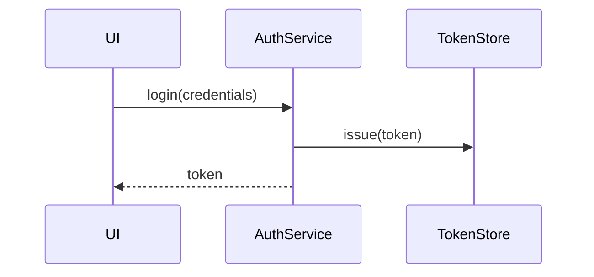
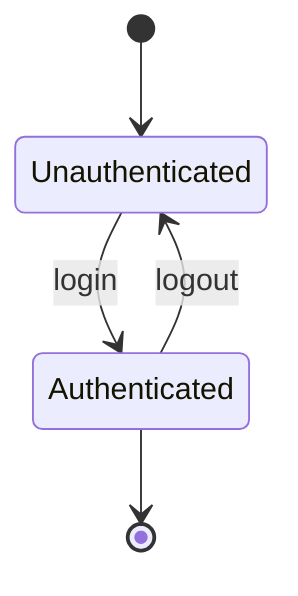
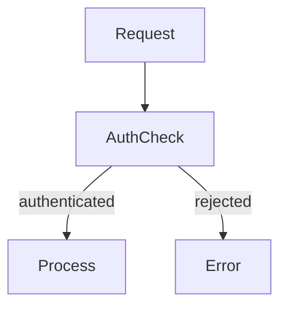

# IntentWeave — Product Design Concept

> **Status:** Design draft — not yet implemented  
> **Purpose:** Capture the three-product vision, the unified rule engine design, the
> Insights Book as unifying output, the noise-reduction strategy, and the Intent Driven
> Development (IDD) methodology before any implementation starts.

---

## The Core Problem We Are Solving

IntentWeave currently has **30+ CLI subcommands**, a three-layer internal architecture
presented as the product structure, and no clear narrative for users asking
"where do I start?" or "what do I actually get?"

The result: the product feels like a toolbox, not a tool. Technically powerful, but
confusing to evaluate and adopt.

The solution is not fewer features. It is **fewer entry points and one unified output**.

---

## Two Products, One Platform

IntentWeave is two products built on one evidence layer:

| #   | Product                  | Question it answers              | Core CLI          |
| --- | ------------------------ | -------------------------------- | ----------------- |
| 1   | **CARI Evidence Engine** | What does my codebase look like? | `iw index build`  |
| 2   | **Intent Engine**        | Does my code honour its intent?  | `iw intent check` |

**CARI** (Evidence Engine) is the evidence layer — AST, imports, call graph, annotations, git history.
No LLM, no cost, always-on.

**Intent Engine** is the enforcement layer — one rule checker, three intent domains:

| Domain          | Enforces                                         | Extracted from                         |
| --------------- | ------------------------------------------------ | -------------------------------------- |
| **Structural**  | Import rules, symbol access, layer boundaries    | ADR prose, `layers.yaml`               |
| **Behavioral**  | Call flows, state machines, sequence constraints | Mermaid diagrams, BDD scenarios        |
| **Documentary** | Coverage, freshness, terminology, structure      | Living doc intent, annotation coverage |

All three domains run under `iw intent check`. All three report into the same
violations table, grouped by domain. One CI exit code.

The Intent Engine has two components:

- **Intent Runtime** — deterministic enforcement against CARI evidence ($0, no LLM in CI)
- **Intent Extraction** — converts natural language intent into `rules.yaml` (LLM once; future: chat client)

See [ADR-001-INTENT-ENGINE.md](ADR-001-INTENT-ENGINE.md) for the full architectural decision.

---

## Product 1 — CARI Evidence Engine

**One-liner:** _"Your codebase, indexed. $0, no AI, always on."_

**What it does:**

- Builds a SQLite index from AST, keywords, and git history in < 3 seconds
- No LLM, no server, no API keys — ever
- Outputs ranked retrieval, architecture visualization, dependency graph,
  community clusters, clone detection

**New need (from Intent Engine):** a `calls` table — directed call edges persisted
from tree-sitter AST traversal. This lifts behavioral rule confidence from ~0.70
(co-occurrence) to ~0.90+ (directed call graph). CARI already visits every call
expression; the extension is persisting it as a queryable table.

**Primary customer:** every developer who wants to understand a codebase they did not
write (or a large one they did).

**Primary entry point:** `iw index build` → `iw index export --html`

**The output:** an interactive architecture HTML file. This is the deliverable.

---

## Product 2 — Intent Engine

**One-liner:** _"Your intent, enforced. Extract once, verify forever."_

### Intent Runtime (enforcement)

The deterministic enforcement layer. Reads `rules.yaml`, queries CARI evidence,
emits violations. No LLM. No cost per run.

- **Structural domain:** import violations, forbidden symbol access, layer boundaries,
  taint propagation
- **Behavioral domain:** call flow constraints (Mermaid sequence), state machine
  validity (Mermaid state), path ordering (Mermaid flowchart), BDD scenario flows
- **Documentary domain:** coverage gaps, stale references, terminology drift,
  orphaned sections, required doc structure

All domains: `iw intent check [--domain structural|behavioral|documentary]`

**Primary customer (Runtime):** teams with architectural conventions that currently
exist only in ADRs, wikis, or Confluence and are never enforced.

**The output:** a violations table. Green = conformant. Red = PR blocked.

### Intent Extraction (rule authoring)

Converts natural language intent into `rules.yaml`. LLM is used once per intent
artifact — then the rule is frozen, human-reviewed, and versioned.

```
ADR prose           → iw intent extract → rules.yaml  (LLM, one-time)
BDD scenario        → iw intent extract → rules.yaml  (LLM, one-time)
Mermaid diagram     → iw intent extract → rules.yaml  (AST parse, zero cost)
Living doc intent   → iw intent extract → rules.yaml  (LLM, one-time)
Manual              → hand-written      → rules.yaml
```

Mermaid diagrams already embedded in ADR files are the zero-cost path: sequence,
state, and flow diagrams are parsed as structured data, not prose. No LLM needed
when node names match code symbol names directly.

**Primary customer (Extraction):** the same teams, during rule authoring — not in CI.

### Intent Chat (future)

The long-term extraction UI: a conversational interface for rule authoring.
"Our auth flow should always route through AuthService" → the chat client formalises
this into a `must_call` rule, runs a preview check, and asks for confirmation before
writing to `rules.yaml`.

This is the same extraction pipeline with a conversational front-end.
The Runtime is unchanged — enforcement stays deterministic regardless of how rules
were authored.

**LLM dependency:**

- Runtime: **none** — $0, deterministic, stable
- Extraction: one-time per intent artifact
- Chat: per-session, human-in-the-loop, not in CI

---

## The Insights Book — The Unifying Output

The **Insights Book** (`iw index export --book`) is the product deliverable that
makes all three products visible in one place. Its chapter structure should map
directly to the three-product framing:

### Extended Chapter Plan

| Chapter                       | Product                     | Currently implemented         |
| ----------------------------- | --------------------------- | ----------------------------- |
| **Executive Summary**         | All                         | ❌ — new                      |
| Architecture Map              | CARI Evidence Engine        | ✅ (arch graph)               |
| Layer Structure               | CARI Evidence Engine        | ✅ (prescriptive SVG)         |
| Communities & Clusters        | CARI Evidence Engine        | ✅ (communities)              |
| Control & Data Flow (per ADR) | Intent Engine (behavioral)  | ✅ (per-ADR Cytoscape)        |
| All Violations                | Intent Engine (all domains) | ✅                            |
| Architecture Conformance      | Intent Engine (structural)  | ✅ (arch conformance)         |
| **Doc Coverage**              | Intent Engine (documentary) | ❌ — new chapter              |
| **Stale Docs**                | Intent Engine (documentary) | ❌ — new chapter              |
| **Terminology & Consistency** | Intent Engine (documentary) | ❌ — new chapter              |
| Code Health                   | CARI Evidence Engine        | ✅ (clones, imports, exports) |
| Living Score                  | All                         | ✅                            |
| **Recommendations**           | All                         | ❌ — new                      |

### The Executive Summary chapter (new, high priority)

The first page a user sees. Should show:

- Living score (A–F) + breakdown bar
- Violation count (high / medium / low)
- Top 3 most urgent actions, ranked by (severity × affected files)
- Product health indicators: CARI ✅ / Intent Engine ⚠ (structural ✅ / behavioral ⚠ / documentary ❌)

_CARI = CARI Evidence Engine (short form used in headers)_

This alone answers "is my project OK?" without reading the rest of the book.

### The Recommendations chapter (new, high priority)

The last chapter. An actionable ranked list derived from all findings:

```
1. [HIGH]    src/auth/resolver.ts — exported but never documented (Coverage)
2. [HIGH]    docs/ADR-001.md — references AuthService.validate() which no longer exists (Staleness)
3. [MEDIUM]  packages/core — 8 hotspot files with 0% doc coverage (Hotspot)
4. [MEDIUM]  3 terminology inconsistencies: "AuthService" vs "auth-service" vs "authSvc" (Terminology)
5. [LOW]     packages/cli — 2 boundary violations (Guardrails)
```

Each recommendation links to the relevant book chapter.

---

## Noise Reduction Strategy

The noise problem is real: users see a flat list of 30+ commands and don't know where
to start. Three strategies:

### Strategy 1 — Three top-level commands (highest impact)

Instead of every capability as a peer command, expose only two entry points plus the book:

```bash
iw index build       # always the first step — CARI evidence
iw intent check      # Intent Engine — all domains, one violations table
iw index export --book  # the unified deliverable
```

All other commands remain available under `iw index *` and `iw intent *` for power
users and CI scripts. Documentation leads with these entry points; reference docs
cover the rest.

### Strategy 2 — The Insights Book as the primary output

Frame `iw index export --book` not as an "export option" but as the product's main
deliverable. The three commands above populate the data; the book is what you share
with your team.

Change the primary README Quick Start from "here are 6 commands" to:

```bash
npm install -g @intentweave/cli
cd your-project
iw init
iw index build
iw index export --book
open insights-book.html   # <- this is the product
```

### Strategy 3 — Progressive disclosure in documentation

- **Homepage:** three product cards, three commands, one output (the book)
- **Getting Started:** only shows the three entry points + open the book
- **Product sections (CARI / Intent Engine — Runtime / Intent Engine — Extraction):** full capability docs
- **Reference:** `iw index *` command index for power users

Users who only need "what is in my codebase" never see the guardrails commands.
Users who want CI enforcement find them in the Intent Guardrails section.

### Strategy 4 — Opinionated defaults

The Insights Book should run a sensible default set without flags:

```bash
iw index export --book       # coverage + violations + living score + code health
```

Individual flags (`--with-score`, `--with-health`) become opt-_out_ not opt-in.
The book should be comprehensive by default — let users trim it down if needed.

---

## CLI Namespace Plan

Current state: everything under `iw index *`; guardrails under `iw guardrails *`.

Target state — two clean namespaces (additive, no breaking changes):

```
iw index build / update / retrieve / connections / …   ← CARI evidence API (unchanged)

# Intent Engine — unified namespace
iw intent extract [--domain structural|behavioral|documentary]
                        ← structural:   ADR prose → rules.yaml           (LLM once)
                        ← behavioral:   BDD scenarios, Mermaid → rules.yaml (AST or LLM once)
                        ← documentary:  living doc intent → rules.yaml   (LLM once)

iw intent check                              ← all domains, grouped violations table
iw intent check --domain structural          ← structural only
iw intent check --domain behavioral          ← behavioral only (Mermaid + BDD)
iw intent check --domain documentary         ← documentary only
iw intent review --rule <id>                 ← LLM-assisted rule review (human-in-the-loop)
iw intent report                             ← violations summary by domain
iw intent chat                               ← future: conversational rule authoring

# Backward-compatible aliases (kept indefinitely in v0.x)
iw guardrails check     ← iw intent check --domain structural
iw guardrails extract   ← iw intent extract --domain structural
iw guardrails drift     ← iw index check
iw living verify        ← iw intent check --domain documentary
iw living coverage      ← iw index module-coverage + doc-completeness
iw living stale         ← iw index check (doc staleness slice)
iw living hotspots      ← iw index hotspot-priority (doc filter)
iw living terminology   ← iw index terminology
iw living orphans       ← iw index orphaned-sections
iw living contradictions ← iw intent check --domain documentary + LLM contradiction
```

All existing `iw index rules-*` and `iw index check` commands continue to work.
No commands are removed or deprecated in v0.x.

---

## Intent Domains — Capability Map

Mapping the four dimensions from the product discussion to existing capabilities:

### A — Do public-facing APIs have documentation?

| Check                                      | Command                     | Status     |
| ------------------------------------------ | --------------------------- | ---------- |
| Exported symbols with no doc mention       | `iw index module-coverage`  | ✅ shipped |
| Per-file completeness vs. exported symbols | `iw index doc-completeness` | ✅ shipped |
| Symbols exported but never imported        | `iw index unused-exports`   | ✅ shipped |

**Gap:** no "API surface diff" — detecting when a symbol is exported and documented
but the doc describes the wrong signature. Requires LLM or type-aware analysis.

### B — Are hotspot / critical files properly documented?

| Check                             | Command                     | Status     |
| --------------------------------- | --------------------------- | ---------- |
| High-churn + low-coverage ranking | `iw index hotspot-priority` | ✅ shipped |
| Hub / god-node analysis           | `iw index hubs`             | ✅ shipped |
| Transitive dependency depth       | `iw index dep-depth`        | ✅ shipped |

**Gap:** no "criticality score" combining churn + hub degree + dependency depth into
one ranked list. Currently three separate commands. `iw docs hotspots` would combine them.

### C — Are control paths (use cases) documented?

| Check                                  | Command                         | Status     |
| -------------------------------------- | ------------------------------- | ---------- |
| Cross-layer connection flows           | `iw index connections`          | ✅ shipped |
| Focus subgraph around a component      | `iw index focus`                | ✅ shipped |
| Community detection (feature clusters) | `iw index communities`          | ✅ shipped |
| Per-ADR flow diagrams                  | Insights Book (expresses block) | ✅ shipped |

**Gap:** no entry-point tracing — "given this CLI command / API route, what code path
does it touch, and which parts of that path are documented?" This would require tracing
from `cli/src/commands/*.ts` inward via the call graph. Feasible as a new query
`iw index trace --entry src/commands/indexCheck.ts`.

### D — Are there contradictions, inconsistencies, problems?

| Check                        | Command                      | Status     | AI needed? |
| ---------------------------- | ---------------------------- | ---------- | ---------- |
| Naming inconsistencies       | `iw index terminology`       | ✅ shipped | No         |
| Orphaned doc sections        | `iw index orphaned-sections` | ✅ shipped | No         |
| Cross-group entity conflicts | `iw index cross-group-drift` | ✅ shipped | No         |
| Semantic contradictions      | `iw doc-health --neo4j`      | ✅ shipped | Yes (KG)   |

**Gap:** detecting that doc A says "X is true" and doc B says "X is false" without
Neo4j. Requires selective enrichment (`iw index enrich`) + LLM comparison of extracted
triples. Medium effort, high value. Could be `iw living contradictions --budget 10`.

---

## Intent Driven Development (IDD)

Intent Driven Development is a software engineering methodology where **architectural
and behavioral intent, expressed in natural language, is continuously enforced against
evolving code** — without requiring formal machine-readable specs.

IDD is to IntentWeave what TDD is to testing frameworks: the methodology that the
tools implement.

### BDD as the Behavioral Bridge

Behavior Driven Development (BDD) captures _what the system should do_ in structured
natural language (Given/When/Then). It was a breakthrough — business intent as
executable specification. But BDD has a fragility problem: as products evolve,
scenarios become stale, or are written too abstractly to enforce. The coupling to
step-definition code is brittle on every refactor.

IntentWeave extends BDD's model to cover _how the system should be built_ and
_whether documentation is still true_:

| Dimension          | Expresses                   | Intent Engine domain | Extraction input                           |
| ------------------ | --------------------------- | -------------------- | ------------------------------------------ |
| Behavioral intent  | What the system does        | Behavioral           | BDD scenarios, Mermaid sequence/state/flow |
| Structural intent  | How the system is organized | Structural           | ADR prose, `layers.yaml`                   |
| Documentary intent | What is explained and how   | Documentary          | Living doc intent, annotation coverage     |

All three domains are enforced by the same Intent Runtime under `iw intent check`.
The extraction step converts any intent artifact into `rules.yaml` — once, with LLM
or zero-cost Mermaid AST parse. From that point, enforcement is deterministic forever.

### The IDD Cycle

```
Write intent            →    Build code    →    Verify
(ADR + BDD + Mermaid)                      (iw intent check — all domains)
       ↑                                              |
       └────── Refine intent (or: iw intent chat) ───┘
```

The Insights Book is the IDD dashboard — one output that answers both product questions:

- **CARI:** What does my codebase look like now?
- **Intent Engine:** Are all three intent domains still honoured?

The future chat client closes the refinement loop: violations discovered in CI
can be fed back into a conversational session to update or refine the rules that
caught them.

### Contradiction Detection as a First-Class Capability

Once both behavioral intent (BDD) and structural intent (ADR rules) are in the same
rule graph, contradictions become queries — deterministic, no LLM needed after
extraction:

1. **Rule vs. scenario:** A BDD scenario requires the UI layer to call the auth service
   directly; a Guardrail rule forbids it. → Flagged immediately.

2. **Scenario vs. scenario:** Two scenarios describe the same flow with opposite
   preconditions. → Cross-group-drift applied to scenario entities.

3. **Behavioral drift:** A scenario says "user can create items" but recent code changes
   removed the entry point. → Staleness check on the scenario's annotated symbols.

4. **Structural drift over product evolution:** A rule enforced
   `packages/providers → packages/adapters` but a new feature added a direct call
   bypassing the pipeline. → Standard Guardrail violation, now traceable back to the
   original BDD scenario that expressed the intended flow.

**This is the core competitive advantage:** intent survives product evolution because
it is continuously re-verified, not written once and ignored.

### LLM Role in IDD

IDD uses LLMs in two places only — never in CI enforcement:

```
[ADR prose]       → iw intent extract  → rules.yaml  → deterministic CI check
[BDD scenario]    → iw intent extract  → rules.yaml  → deterministic CI check
[Mermaid diagram] → AST parse (free)   → rules.yaml  → deterministic CI check
[API spec / RFC]  → iw intent extract  → rules.yaml  → deterministic CI check
[Future: chat]    → iw intent chat     → rules.yaml  → deterministic CI check
```

The extracted rules are frozen, human-reviewed, and versioned in `.iw/rules.yaml`.
Enforcement costs $0 and has zero LLM latency. This is the key difference from
"just ask the LLM every time" — extracted rules are auditable, stable, and do not
drift with model updates.

### What IDD Is Not

- **Not BDD** — IDD enforces structural and documentary intent, not just behavioral
  scenarios. BDD is one possible _input_ to the Intent Extraction step.
- **Not spec-driven development** — SDD generates code from formal specs (OpenAPI,
  JSON Schema). IDD verifies existing code against informal natural language intent.
- **Not "AI code review"** — AI code review re-runs an LLM on every PR.
  IDD extracts once and enforces deterministically forever.
- **Not three products** — CARI (observe) and Intent Engine (enforce) are two products.
  Structural / behavioral / documentary are domains within the engine, not products.

---

## The Unified Rule Engine

The deepest insight in the design: **documentary intent can be expressed and enforced
with exactly the same mechanism as structural and behavioral intent.** All three
domains share one rule format, one checker, and one evidence layer.

### One Rule Format, Three Domains

```yaml
# .iw/rules.yaml

rules:
  # Structural rule (from ADR prose)
  - id: adr001-no-domain-in-ui
    domain: structural
    description: "UI components must not import domain helpers directly"
    severity: high
    checks:
      - type: forbidden_import
        from_layer: packages/ui
        import_pattern: "packages/domain/**"

  # Behavioral rule (from BDD scenario)
  - id: bdd-auth-flow
    domain: behavioral
    description: "Login must always route through AuthService, never bypass it"
    severity: high
    checks:
      - type: taint_source
        pattern: "req.body.password|req.body.credentials"
        must_reach: AuthService
        must_not_bypass: true

  # Documentary rule (from living doc intent)
  - id: doc-exports-covered
    domain: documentary
    description: "Every exported symbol must appear in at least one doc file"
    severity: medium
    checks:
      - type: doc_coverage
        min_confidence: 0.6

  - id: doc-auth-security-model
    domain: documentary
    description: "Any doc mentioning AuthService must also describe the security model"
    severity: high
    checks:
      - type: doc_cooccurrence
        entity: AuthService
        requires_terms: ["security", "token", "session"]

  - id: doc-adr-must-have-status
    domain: documentary
    description: "Every ADR file must contain a Status section"
    severity: high
    checks:
      - type: doc_structure
        file_pattern: "docs/ADR-*.md"
        requires_heading: "Status"
```

All three run under `iw guardrails check`. All three report into the same violations
table in the Insights Book, grouped by domain.

### Evidence Sources by Domain

| Domain      | Primary evidence                              | CARI table                               | Confidence ceiling                    |
| ----------- | --------------------------------------------- | ---------------------------------------- | ------------------------------------- |
| Structural  | AST import graph, symbol access               | `imports`, `symbols`                     | High (AST is exact)                   |
| Behavioral  | Call graph, taint paths, def-use chains       | `symbols`, `co_occurrences`              | Medium (dynamic dispatch not tracked) |
| Documentary | Annotation coverage, co-occurrence, staleness | `annotations`, `files`, `co_occurrences` | Medium (annotation confidence varies) |

### Cross-Domain Contradiction Detection

With all three domains in one rule graph, cross-domain contradictions become
standard queries — no LLM needed after extraction:

| Contradiction type                 | Detection mechanism                                                             |
| ---------------------------------- | ------------------------------------------------------------------------------- |
| Behavioral rule ↔ structural rule  | Two rules with conflicting `checks` on the same symbol                          |
| Documentary rule ↔ behavioral rule | A BDD flow is required but the doc coverage rule flags the path as undocumented |
| Rule vs. code (violation)          | Standard: `iw guardrails check`                                                 |
| Doc says X, code does Y            | Documentary rule + annotation staleness + structural check on same entity       |
| Two doc sections contradict        | `cross_group_drift` applied to documentary domain entities                      |

---

## Behavioral Rule Syntax — Mermaid Integration

_Mermaid diagrams are already embedded in ADR markdown files and rendered natively by
GitHub. Making them the canonical syntax for behavioral rules closes the loop between
the diagram a team draws and the rule that gets enforced._

### Why Mermaid Fits

The `expresses.flows` block already in `rules.yaml` is a hand-rolled flow graph.
Mermaid is a richer, standardised, human-readable syntax for the same concept — and
it has a parseable AST (via `@mermaid-js/parser`, zero new deps in the JS ecosystem).
Teams already draw these diagrams. The rule becomes the diagram.

### Diagram Type → Rule Type Mapping

**Sequence diagram** — call edges and optional ordering:



Extracted rule: UI must call AuthService; AuthService must call TokenStore.
Strong form: UI must not call TokenStore directly (bypasses AuthService).

**State diagram** — valid/invalid transitions:



Extracted rule: only `login` may move from Unauthenticated→Authenticated;
only `logout` may reverse it. Any other transition is a violation.

**Flowchart** — must-precede / must-not-bypass constraints:



Extracted rule: every `Request`-handling path must traverse `AuthCheck` before
reaching `Process`. Direct Request→Process edge is a violation.

### Mermaid as Rule Source in `rules.yaml`

```yaml
rules:
  - id: bdd-auth-sequence
    domain: behavioral
    description: "Login must route through AuthService, not bypass to TokenStore"
    severity: high
    source:
      type: mermaid_sequence
      diagram: docs/ADR-001-auth.md # file containing the mermaid block
      block_id: auth-login-flow # optional: named block within the file
    checks:
      - must_call: { from: UI, to: AuthService }
      - must_not_call: { from: UI, to: TokenStore } # auto-derived from diagram

  - id: adr002-order-state
    domain: behavioral
    description: "Order lifecycle must follow the defined state machine"
    severity: high
    source:
      type: mermaid_state
      diagram: docs/ADR-002-order-lifecycle.md
```

The `source` block links the rule back to the original diagram for traceability.
When the ADR is updated, `iw guardrails extract --update` re-derives the rule.

### What CARI Can Check Today vs. What Needs Extension

| Mermaid check                     | Mechanism                | Current CARI | Confidence | Gap                    |
| --------------------------------- | ------------------------ | ------------ | ---------- | ---------------------- |
| A→B edge exists                   | co-occurrences + imports | ✅           | ~0.70      | No directed call graph |
| A must NOT call B                 | imports (absence check)  | ✅           | ~0.85      | —                      |
| Layer order (A before B in stack) | `imports` table          | ✅           | ~0.90      | —                      |
| A calls B before C (ordering)     | call graph + ordering    | ❌           | ~0.30      | No CFG                 |
| State transition valid            | state variable tracking  | ❌           | ~0.50      | No state analysis      |
| Flowchart must-precede            | control flow graph       | ❌           | ~0.30      | No CFG                 |

**The key missing piece: a directed call graph.**

A `calls` table in CARI — `(caller_symbol, callee_symbol, call_site_file, call_site_line)` —
would lift sequence edge checking from ~0.70 to ~0.90+. tree-sitter already visits
every call expression; we just don't persist them as directed edges. This is a
**medium effort extension** (1–2 weeks) that unlocks the majority of Mermaid
sequence diagram enforcement at high confidence.

Control flow graphs (for ordering + state machines) are a **large extension**,
realistic confidence ceiling ~0.80 even with full implementation, due to dynamic
dispatch and closures. These belong to a later phase.

### Confidence Roadmap

| Phase            | What ships                                                          | Confidence | Mode             |
| ---------------- | ------------------------------------------------------------------- | ---------- | ---------------- |
| **Now**          | Sequence edges via co-occurrences; must-not-call via import absence | ~0.70–0.85 | `warn`           |
| **+call graph**  | Directed call edges; sequence diagram enforcement                   | ~0.90      | `error`          |
| **+CFG (later)** | Call ordering; state machine transitions; flowchart paths           | ~0.80      | `warn` → `error` |

### Implication for the `iw guardrails extract` Pipeline

```
[ADR-001.md containing mermaid block]
        ↓
  parse Mermaid AST  (zero-cost, no LLM)
        ↓
  map nodes → CARI symbols  (annotation matching, ~0.8)
        ↓
  emit behavioral rule checks  (must_call, must_not_call, valid_transitions)
        ↓
  rules.yaml  →  iw guardrails check  →  Insights Book
```

For simple sequence and forbidden-call rules: **no LLM required at all** — the
Mermaid AST is structured data, nodes map directly to code symbols via CARI
annotation. LLM is only needed if the diagram nodes use domain language that
doesn't appear verbatim in the code (e.g., "Login Flow" → `AuthController.login`).

---

## The Rule Evolution Problem

_This is the hard part. Capturing it early so it shapes implementation decisions._

Rules must evolve as codebases evolve — intentionally, not by accident. The risks:

| Risk                    | Description                                                            | Domain most affected |
| ----------------------- | ---------------------------------------------------------------------- | -------------------- |
| **Rule staleness**      | Rule enforces old intent that was deliberately superseded              | All                  |
| **Rule over-fit**       | Rule is too specific; breaks on every legitimate refactor              | Structural           |
| **Coverage gaps**       | New code patterns not covered by any rule                              | Behavioral           |
| **Rule-rule conflicts** | Two rules were consistent when written; now conflict after growth      | All                  |
| **Confidence decay**    | A rule's evidence source degrades (e.g., doc annotation quality drops) | Documentary          |

### The Core Tension

The fundamental tension: **rules must be stable enough to enforce consistently,
but flexible enough to track genuine intent change.**

Over-stable rules become noise — teams learn to ignore CI failures.
Over-flexible rules can't catch anything.

### Confidence Tiers by Check Type

Not all checks are equally certain. Implementors must be honest about ceilings:

| Check type                               | Confidence | Why                                                |
| ---------------------------------------- | ---------- | -------------------------------------------------- |
| `forbidden_import`                       | ~0.99      | AST — exact                                        |
| `doc_structure` (heading exists)         | ~0.97      | Markdown AST — exact                               |
| `taint_source` (must reach)              | ~0.80      | Graph traversal; dynamic dispatch not tracked      |
| `doc_coverage` (symbol mentioned)        | ~0.75      | CARI annotation confidence range                   |
| `doc_cooccurrence` (terms co-present)    | ~0.70      | Keyword matching; synonym blindness                |
| `behavioral_flow` (scenario → code path) | ~0.60      | Requires entry-point tracing + annotation matching |
| Semantic contradiction (doc A vs doc B)  | ~0.50      | Requires LLM; non-deterministic                    |

**Implication:** every violation should carry a `confidence` field. CI gates should let
teams set thresholds per domain: `structural: 0.9`, `documentary: 0.65`.

### Mechanisms for Safe Rule Evolution

**1. Rule coverage monitoring**
Track which code areas are not covered by any rule — analogous to uncovered lines in
test coverage. New packages with zero rules are flagged in the Insights Book.

**2. Rule dormancy alerts**
If a rule has had zero violations for N consecutive runs, flag it for human review.
Two possibilities: (a) the rule is perfectly enforced — good; (b) the rule is stale
and no longer applies — needs update or removal.

**3. Violation trend tracking**
Store violation counts per rule per run. A sudden drop to zero on a structural rule
may mean the pattern was refactored away (or the check broke). A sudden spike means
new code violated the intent.

**4. Rule versioning**
Rules have a `version` field and an `introduced` date. When a rule changes, old
violations are preserved as history. Auditors can see "this was enforced from ADR-001
revision 2 until revision 4, then relaxed."

**5. Graduated confidence thresholds**
Start strict only where confidence is high (structural domain). Introduce behavioral
and documentary rules in `warn` mode first — they fail the book but not CI — then
promote to `error` after confirming accuracy.

```yaml
- id: doc-exports-covered
  domain: documentary
  severity: medium
  mode: warn # warn = Insights Book only, not CI exit code
  # later: mode: error
```

**6. LLM-assisted rule review (not rule checking)**
The one place where LLMs remain useful post-extraction: reviewing whether a rule
still reflects current intent, given a diff of the source ADR or BDD scenario.
`iw guardrails review --rule adr001-no-domain-in-ui` diffs the original intent
source against the current rule and flags divergence. This is human-in-the-loop,
not automated enforcement.

### Open Research Questions (not yet solved)

1. **Semantic grounding gap:** A rule references "AuthService" by name. CARI maps it
   to `packages/auth/service.ts` via annotation matching (~0.8 confidence). If the
   file is renamed or the class split, the rule silently loses its grounding.
   Solution direction: rule symbols should pin to CARI symbol IDs, not names.

2. **Behavioral coverage ceiling:** Taint propagation through dynamic dispatch
   (virtual methods, dependency injection) cannot reach ~1.0 confidence without
   full type inference. Current ceiling: ~0.80. This means behavioral rules will
   always have more false negatives than structural ones.

3. **Documentary contradiction without LLM:** Two docs can contradict without any
   structural or annotation signal — pure semantic contradiction. Deterministic
   detection may be impossible without comparing extracted propositions.
   Honest framing: this check is LLM-assisted and carries confidence ~0.50.

4. **Rule learning:** Can CARI detect patterns that are _systematically violated_
   and suggest a rule candidate? (i.e., "packages/ui imports packages/domain in
   47 files — you might want a rule for this.") Medium-term research item.

---

## What Is Not the Product

To reduce noise, we should be explicit about what IntentWeave does _not_ try to do:

- **Not a linter** — ESLint, Biome, and similar tools handle style/syntax. IntentWeave
  handles architectural intent and documentation health.
- **Not a test coverage tool** — Istanbul/V8 cover line/branch coverage. IntentWeave
  covers _documentation_ coverage and _architectural_ coverage.
- **Not a full documentation generator** — TypeDoc/JSDoc generate API docs.
  IntentWeave checks whether _existing_ docs are accurate and complete.
- **Not a knowledge base** — Confluence, Notion, and wikis store docs.
  IntentWeave validates them against the code.

This framing also helps define what goes in the "What You Get" section of the homepage:
only things that fit the three-product definition.

---

## Next Implementation Steps (priority order)

1. **`iw intent` command namespace** — alias layer over existing `iw guardrails *` and
   `iw index rules-*`; additive, no breaking changes (1 day)

2. **Rule `domain` field** — add `domain: structural|behavioral|documentary` to
   `rules.yaml` schema and violations output; violations grouped by domain (0.5 day)

3. **Documentary domain check types** — wire the five Living Documentation queries
   as documentary-domain rule checks; unify into `iw intent check --domain documentary` (1–2 days)

4. **Violation `confidence` + `mode` fields** — every violation carries confidence;
   CI exit code respects `mode: warn|error`; configurable thresholds per domain (1 day)

5. **Mermaid extraction pipeline** — parse Mermaid AST from ADR files; emit
   `must_call` / `must_not_call` / `layer_order` checks into `rules.yaml` (2–3 days)

6. **CARI `calls` table** — extend AX stage to persist directed call edges from
   tree-sitter; lift behavioral confidence to ~0.90 (1–2 weeks)

7. **Insights Book: Executive Summary chapter** — living score + top-3 actions,
   violations grouped by domain, product health indicators per domain (1 day)

8. **Insights Book: Documentary domain chapters** — Coverage, Stale Docs, Terminology
   as documentary-domain violations (1–2 days)

9. **Insights Book: Recommendations chapter** — ranked actionable list from all
   three domains, linking back to chapters (1–2 days)

10. **Rule dormancy + coverage monitoring** — flag areas with no rules; alert on
    rules with zero violations for N runs (2–3 days)

11. **Entry-point tracing** (`iw index trace`) — behavioral domain use-case path
    coverage; feeds Insights Book behavioral chapter (3–5 days)

12. **`iw intent chat`** — conversational rule authoring; design as separate ADR
    when steps 1–6 are stable (future)
